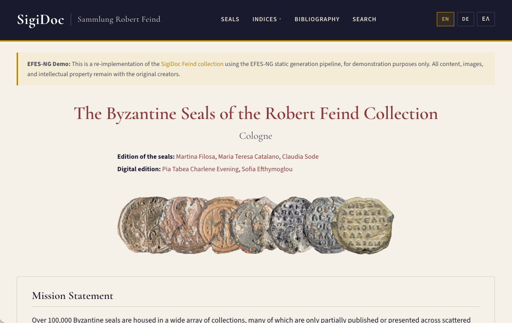
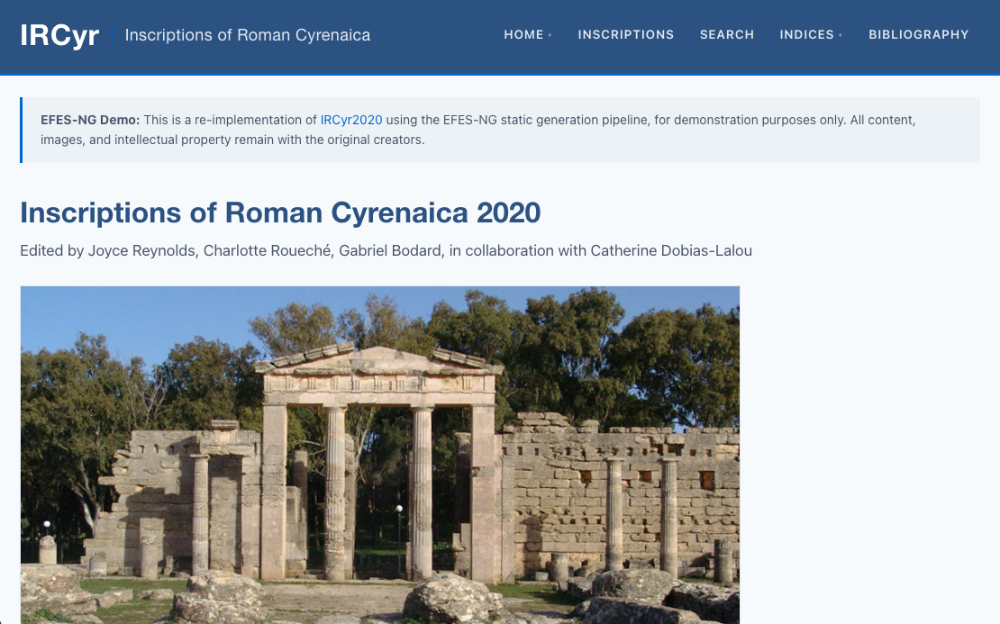

# Example Projects

Two example projects demonstrate the EFES-NG Prototype with real-world EpiDoc/SigiDoc collections, both deployed to GitHub pages.

## SigiDoc Feind Collection

A trilingual (English, German, Greek) digital edition of Byzantine seals from the Robert Feind Collection.

- **Repository:** [olvidalo/efes-ng-sigidoc-feind](https://github.com/olvidalo/efes-ng-sigidoc-feind)
- **Live site:** [olvidalo.github.io/efes-ng-sigidoc-feind](https://olvidalo.github.io/efes-ng-sigidoc-feind/)
- **Collection:** ~320 SigiDoc-encoded seals
- **Languages:** English, German, Greek
- **Stylesheets:** [SigiDoc/Stylesheets](https://github.com/SigiDoc/Stylesheets) (submodule)

This is a re-implementation of the [original SigiDoc Feind collection](https://feind.sigidoc.cceh.uni-koeln.de) for demonstration purposes.



It showcases:

- Multi-language support with per-language metadata, indices, and search
- Five entity indices (persons, places, dignities, offices, invocations)
- Bibliography with detail pages and cross-referencing
- Faceted search with 12+ facets and date range filtering
- Structured entity index fields with linked external resources (Pleiades, GeoNames, TIB)
- Authority file integration (geography, dignities, offices, invocations, bibliography)

This is an expanded version of the project built step-by-step in the [Tutorial](/tutorial/).

## Inscriptions of Roman Cyrenaica (IRCyr)

A single-language digital edition of Greek and Latin inscriptions from Roman Cyrenaica.

- **Repository:** [olvidalo/efes-ng-ircyr](https://github.com/olvidalo/efes-ng-ircyr)
- **Collection:** ~900 EpiDoc inscriptions
- **Languages:** English
- **Stylesheets:** [EpiDoc/Stylesheets](https://github.com/EpiDoc/Stylesheets) (submodule)

This is a re-implementation of [IRCyr2020](https://ircyr2020.inslib.kcl.ac.uk) for demonstration purposes.



It showcases:

- Large collection processing (~900 documents with 14 index types)
- TEI text pages (non-inscription content rendered alongside the collection)
- Complex entity indices including genealogical person records, findspot hierarchies, age-at-death data, and numerals, with entity index extraction based on the original EFES project's XSLT.
- Abbreviation index with multiple expansions per entry
- Full-text search across Greek and Latin inscriptions

## Using the Examples

To run an example project locally:

1. Clone the repository (with submodules):
   ```bash
   git clone --recurse-submodules https://github.com/olvidalo/efes-ng-sigidoc-feind.git
   ```

2. Open the project folder in the EFES-NG desktop application, or run from the command line:
   ```bash
   cd efes-ng-sigidoc-feind
   efes-ng run
   ```

The example projects are good starting points for understanding how EFES-NG projects are structured. Compare their `pipeline.xml` and `metadata-config.xsl` files to see how different collections configure the same framework.
