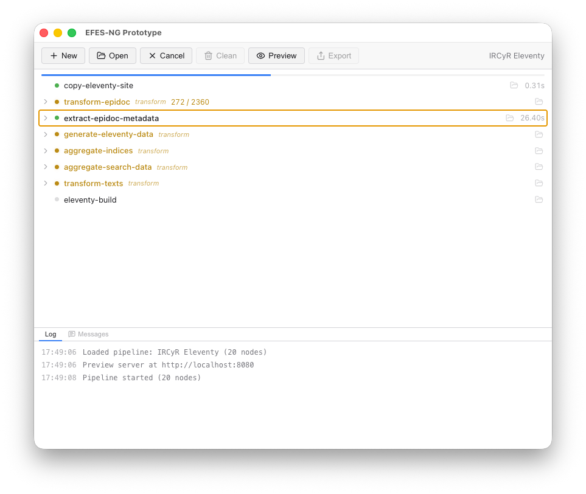

# Desktop Application

The EFES-NG Prototype includes an Electron-based desktop application for managing and previewing projects without the command line.

> Download the latest version of the EFES-NG Prototype desktop application from [here](https://github.com/olvidalo/efes-ng-prototype/releases) by expanding *Assets* and choosing the installer for your operating system (`-setup.exe` for Windows, `.dmg` for Mac, `.AppImage` or `.deb` for Linux). See the GitHub repository's [`README`](https://github.com/olvidalo/efes-ng-prototype#installing) for complete instructions.

## Creating a New Project

Click **New** in the toolbar to open the project creation wizard. Enter a project name, choose your XSLT stylesheets (EpiDoc, SigiDoc, or custom), and select a location. The wizard generates a ready-to-use project with all configuration files.

## Opening a Project

Click **Open** in the toolbar and select your project folder (the one containing `pipeline.xml`). The app loads the pipeline and displays the node list.

## Building & Watching

The toolbar buttons change based on the current state:

| State | Available Actions |
|-------|-------------------|
| **Ready** | **Start**: runs the pipeline and enters watch mode |
| **Building** | **Cancel**: aborts the current build |
| **Watching** | **Stop**: stops the file watcher |

**Clean** removes all generated files and caches (available when not building).

## Node List

The left panel shows all pipeline nodes with real-time status:

- **Gray dot**: pending (not yet started)
- **Yellow dot** (pulsing): currently running
- **Green dot**: completed successfully
- **Red dot**: failed (error message shown inline)
- **Dimmed**: cached (skipped because inputs haven't changed)

A progress bar at the top shows overall build completion.

### Composite Nodes

Nodes that contain sub-steps (like `xsltTransform` which auto-compiles stylesheets) are shown as collapsible groups. Click the chevron to expand and see individual child nodes. The parent shows a summary. If a child is running, the parent displays which one; if a child errors, the error bubbles up.

### Item Progress

Nodes processing multiple files show a counter (e.g., `42 / 128`) that updates in real time.

## Node Inspector

Click any node to open the inspector panel on the right. It shows:

- **Node type**: e.g., `xsltTransform`, `copyFiles`
- **Cache stats**: how many items were cached vs. rebuilt (e.g., `120/128 cached`)
- **Description**: what the node does
- **Configuration**: all node settings with special rendering for input references (`from`, `files`, `dir`, `collect`)
- **Dependencies**: upstream nodes (clickable to navigate)
- **Outputs**: declared output keys with file lists (expandable)
- **Output directory**: path to the node's output folder

The inspector panel is resizable by dragging its left edge.

## Live Preview

Click **Preview** to open your site in a browser. The preview includes status overlays:

- **"No build output yet"**: shown when the output directory is empty
- **"Building..."**: blue animated banner during builds
- **"Pipeline stopped"**: amber banner when the watcher is inactive
- **Error toast**: bottom-right notification with error details

The page automatically reloads after each successful build.

## Exporting

Click **Export** to build your site and save it to a folder for deployment to static hosting. The export dialog lets you choose a destination folder and optionally set a path prefix for subdirectory deployment (e.g., `/my-project/`).

## Log Panel

The bottom panel has two tabs:

- **Log**: timestamped log messages from the pipeline (node starts, completions, errors, watcher events)
- **Messages**: user-facing messages from pipeline nodes (e.g., `xsl:message` output from XSLT stylesheets), grouped by node

A badge on the Messages tab shows the count of new messages. Nodes that produced messages also show a badge in the node list; clicking it opens the Messages tab filtered to that node.

## Log Files

The application writes log files to the default system location for troubleshooting:

- **macOS**: `/Users/yourname/Library/Logs/EFES-NG Prototype/`
- **Windows**: `C:\Users\yourname\AppData\Roaming\EFES-NG Prototype\logs\`
- **Linux**: `/home/yourname/.config/EFES-NG Prototype/logs/`

Replace `yourname` with your system username.
