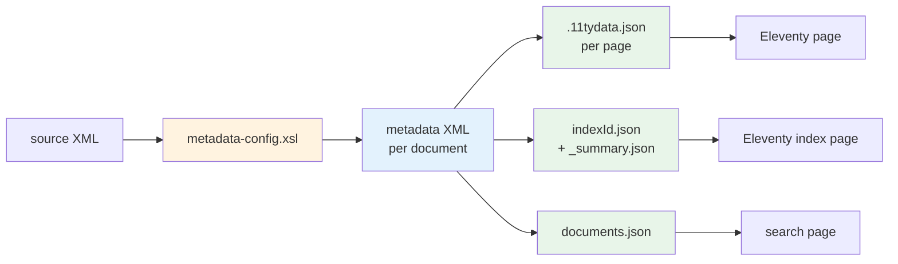

# Metadata Configuration

Every project has a `metadata-config.xsl` at the top of its `source/` directory. It tells the framework which page-display fields, indices, and search data to extract from each source document. 

This page explains the system as a whole: what `metadata-config.xsl` does, the three hook templates it provides, how `<idx:index>` declarations work, how multilingual content and entity merging are handled, and how the extracted data flows through the pipeline into rendered pages and JSON files.

It complements the [tutorial](/tutorial/metadata-and-data), which walks through the same concepts in the context of one specific project. Use the tutorial to learn by doing; use this page when you want a generic overview, or when you're starting a new project and want to see the moving parts in one place.

## Where it sits

`metadata-config.xsl` is a small, project-specific stylesheet. It imports `source/stylesheets/lib/extract-metadata.xsl` (which contains all the framework boilerplate) and overrides three hook templates with project-specific extraction logic.

::: tip
`metadata-config.xsl` is not a traditional declarative declaration file: It is a stand-alone XSLT transformation that you can run, for example, using Oxygen XML editor ([see Howto](oxygen-project.md)), with an EpiDoc or SigiDoc source file, and it will produce the extracted metadata as output.
:::

```
source/
├── metadata-config.xsl              # ← what you edit
└── stylesheets/
    └── lib/
        ├── extract-metadata.xsl     # framework: calls your hooks
        ├── aggregate-indices.xsl    # framework: builds index JSON
        └── aggregate-search-data.xsl # framework: builds search JSON
```

You almost never edit the lib stylesheets. They handle the generic mechanics (xml:lang stamping, entity merging across languages, JSON serialisation, language-keyed output). All the project-specific decisions go into `metadata-config.xsl`.

::: tip
If your projects needs any custom stylesheets you write yourself, make sure to put them into `source/stylesheet`  directly, and not under `source/stylesheet/lib`.
::: 

> [!info] Reference
> See [Library Stylesheets](/reference/library-stylesheets) for the full parameter contract of each lib XSLT.

## The three hooks

`metadata-config.xsl` provides three template overrides. The framework calls each one once per source document per configured language, passes a `$language` tunnel parameter, and stamps `xml:lang` onto whatever you return.

| Hook (mode) | Purpose | Becomes |
|---|---|---|
| `extract-metadata` | Page display fields (title, sortKey, dates) | `.11tydata.json` sidecars + the `<page>` block in metadata XML |
| `extract-all-entities` | `<entity>` elements for indices | `{indexId}.json` files via aggregation |
| `extract-search` | Search facet and filter fields | `documents.json` via aggregation |

Each is implemented as an XSLT template matching `tei:TEI` in the corresponding mode.

### `extract-metadata`: page display fields

Returns plain elements describing the page. In the example project and the starter template (scaffold), these fields end up in the `.11tydata.json` sidecar that Eleventy reads when rendering the page.

```xml
<xsl:template match="tei:TEI" mode="extract-metadata">
    <title>
        <xsl:value-of select="normalize-space(//tei:titleStmt/tei:title[1])"/>
    </title>
    <sortKey><xsl:value-of select="$sortKey"/></sortKey>
    <origDate><xsl:value-of select="//tei:origDate"/></origDate>
</xsl:template>
```

The names and structure of the elements you return are up to you. They map directly to keys in the resulting JSON. `title` becomes `data.title` in your Nunjucks templates, `origDate` becomes `data.origDate`, and so on.

### `extract-all-entities`: entities for indices

Returns `<entity>` elements, each tagged with an `@indexType` matching the `id` of an `<idx:index>` declaration. The framework groups entities by `@indexType` and feeds each group to the corresponding aggregation.

```xml
<xsl:template match="tei:TEI" mode="extract-all-entities">
    <xsl:apply-templates select="." mode="extract-persons"/>
    <xsl:apply-templates select="." mode="extract-places"/>
</xsl:template>

<xsl:template match="tei:TEI" mode="extract-persons">
    <xsl:for-each select=".//tei:persName[normalize-space()]">
        <xsl:variable name="displayName" select="normalize-space(.)"/>
        <entity indexType="persons" xml:id="{lower-case($displayName)}">
            <name><xsl:value-of select="$displayName"/></name>
            <sortKey><xsl:value-of select="lower-case($displayName)"/></sortKey>
        </entity>
    </xsl:for-each>
</xsl:template>
```

Two attributes carry meaning to the framework:

- **`@indexType`**: required; routes the entity to the matching `<idx:index id="…">`
- **`@xml:id`**: optional but important; controls entity merging (see below)

Other child elements are project-defined fields. Their names become keys in the resulting index JSON.

### `extract-search`: search facet data

Returns plain elements naming search fields. Multi-valued fields use `<item>` children; the framework deduplicates them automatically per document and per language.

```xml
<xsl:template match="tei:TEI" mode="extract-search">
    <title><xsl:value-of select="//tei:titleStmt/tei:title[1]"/></title>
    <material><xsl:value-of select="//tei:material"/></material>
    <centuries>
        <xsl:for-each select=".//tei:origDate/@when-iso">
            <item><xsl:value-of select="floor((number(substring(., 1, 4)) - 1) div 100) + 1"/></item>
        </xsl:for-each>
    </centuries>
    <fullText><xsl:value-of select="normalize-space(string-join(
        //tei:div[@type='edition']//text(), ' '))"/></fullText>
</xsl:template>
```

Scalar fields become JSON strings; multi-valued fields become JSON arrays. The client-side search component reads these straight from `documents.json` and uses them for full-text search, faceted filtering, and date-range filtering.

## Index declarations

Each index your project exposes is declared as an `<idx:index>` element somewhere in `metadata-config.xsl` (typically near its corresponding extraction template, or grouped at the top). The aggregation step reads these declarations to build `_summary.json` and the per-index JSON files.

```xml
<idx:index id="persons" nav="indices" order="10">
    <idx:title>Persons</idx:title>
    <idx:description>Persons attested in the collection.</idx:description>
    <idx:columns>
        <idx:column key="name">
            <idx:label>Name</idx:label>
        </idx:column>
        <idx:column key="references" type="references">
            <idx:label>References</idx:label>
        </idx:column>
    </idx:columns>
    <idx:notes>
        <idx:p>Names are normalised to lowercase for cross-document matching.</idx:p>
    </idx:notes>
</idx:index>
```

### Attributes

| Attribute | Required | Description |
|---|---|---|
| `id` | yes | Matches `@indexType` on entities; determines output filename (`{id}.json`) |
| `order` | no | Sort position in the index list (default: 99) |
| `nav` | no | Navigation group the index belongs to (default: `indices`) |

### Children

| Element | Purpose |
|---|---|
| `<idx:title>` | Display title; repeat with `xml:lang` for translations |
| `<idx:description>` | Short prose describing what's in the index; `xml:lang` aware |
| `<idx:columns>` / `<idx:column>` | Columns shown in the index table |
| `<idx:notes>` / `<idx:p>` | Editorial notes shown above or below the table |

### Columns

Each `<idx:column key="…">` references one of the fields produced by the extraction template (matched by element local-name). The optional `type` attribute hints at rendering: `references` triggers the documents-this-entity-appears-in column, other types are project-defined.

Column headers are localised the same way as titles:

```xml
<idx:column key="name">
    <idx:label xml:lang="en">Name</idx:label>
    <idx:label xml:lang="de">Name</idx:label>
    <idx:label xml:lang="el">Όνομα</idx:label>
</idx:column>
```

## Multilingual handling

Multilingual support runs through three mechanisms:

**1. The `$language` tunnel parameter.** Each hook receives `$language` and can use it to select language-specific source content. For projects whose source XML carries `xml:lang` markup, this lets one template return different content for different runs:

```xml
<xsl:template match="tei:TEI" mode="extract-metadata">
    <xsl:param name="language" tunnel="yes"/>
    <title>
        <xsl:value-of select="//tei:titleStmt/tei:title[@xml:lang=$language]"/>
    </title>
</xsl:template>
```

**2. Automatic `xml:lang` stamping.** The framework adds `xml:lang` on the elements you return. The same hook called once per language produces output tagged with each language code, all merged into the same metadata XML file.

**3. Language-keyed JSON.** Aggregation collapses multilingual fields into JSON objects keyed by language code:

```json
{
  "title": { "en": "Persons", "de": "Personen", "el": "Πρόσωπα" }
}
```

For the `idx:title`, `idx:description`, and `idx:label` elements in index declarations, repeat them with different `xml:lang` attributes:

```xml
<idx:title xml:lang="en">Persons</idx:title>
<idx:title xml:lang="de">Personen</idx:title>
```

> [!tip] See also
> [Multi-Language Architecture](./multi-language-architecture) covers how the pipeline as a whole handles multiple languages.

## Entity identity and merging

The same person, place, or work often appears in many documents and is referenced in multiple languages. The framework merges these into single index entries based on `@xml:id`:

- Entities sharing an `@xml:id` collapse into one entry. The entry's `references` array records every document and every variant the entity was extracted from.
- Entities **without** `@xml:id` are unique per occurrence. Each one becomes its own entry.

For controlled vocabularies (places, persons backed by an authority file, dignities), set `@xml:id` to a stable identifier, typically derived from the authority record:

```xml
<entity indexType="places" xml:id="{$placeId}">
    <name><xsl:value-of select="$placeName"/></name>
    <sortKey><xsl:value-of select="$placeName"/></sortKey>
</entity>
```

For free-text entities you don't want to merge, omit `@xml:id`.

The aggregation step also merges per-language variants of an entry: an entity with `@xml:id="kephalonia"` extracted as `Kephalonia` in English and `Kephalonien` in German becomes one entry with `name: { "en": "Kephalonia", "de": "Kephalonien" }`.

## Data flow

As in the example project and the starter template (scaffold), end-to-end, from a source document to the rendered site:



- The **source XML** is your TEI/EpiDoc document.
- **`metadata-config.xsl`** runs over each source via the lib's `extract-metadata.xsl`, producing one **metadata XML** per document (containing the `<page>`, `<entities>`, and `<search>` blocks).
- The metadata XMLs feed three downstream consumers:
  - **`create-11ty-data.xsl`** turns each one into a `.11tydata.json` sidecar that Eleventy uses for routing and template data.
  - **`aggregate-indices.xsl`** combines all of them into per-index JSON files (`persons.json`, `places.json`, …) plus `_summary.json`.
  - **`aggregate-search-data.xsl`** combines them into one `documents.json` per language.
- Eleventy templates render: per-document pages, index pages, and the search page.

> [!info] Pipeline wiring
> Pipeline nodes connect these steps. See [Pipeline & Nodes](./pipeline-and-nodes) for how the pipeline orchestrates them, and [Node Types: `xsltTransform`](/reference/node-types) for how to wire stylesheets into nodes with parameters.

## Customisation patterns

### Adding a new index

1. Add an `<idx:index id="dignities" …>` declaration with title, description, and columns.
2. Write an extraction template (`mode="extract-dignities"`) that emits `<entity indexType="dignities" xml:id="…">` elements.
3. Add `<xsl:apply-templates select="." mode="extract-dignities"/>` to your `extract-all-entities` hook so it gets called.
4. Add an Eleventy template under `source/website/` that reads `dignities.json` and renders it.

No pipeline changes are needed for only adding a new index. The aggregation node picks up the new index automatically because it discovers them from the declarations.

### Adding a new search facet

Add a new field to your `extract-search` hook. For multi-valued data, use `<item>` children which the framework will dedupe:

```xml
<dignities>
    <xsl:for-each select=".//tei:roleName">
        <item><xsl:value-of select="normalize-space(.)"/></item>
    </xsl:for-each>
</dignities>
```

Then add a corresponding `<efes-facet field="dignities">` to your search page template. The search component picks up the field and computes facet counts automatically.

### Splitting one entity type into two indices

Declare two `<idx:index>` elements with different `id`s. In your extraction template, branch on the source data and emit entities with the appropriate `@indexType`:

```xml
<entity indexType="{if (@type='ecclesiastic') then 'dignities-eccl' else 'dignities-civil'}" …>
```

### Referencing authority files

Pass the authority file path as a stylesheet parameter from `pipeline.xml`, then read it as a document inside the template:

```xml
<xsl:param name="places-file" as="xs:string"/>
<xsl:variable name="places" select="doc($places-file)"/>

<xsl:template match="tei:TEI" mode="extract-places">
    <xsl:for-each select=".//tei:placeName[@ref]">
        <xsl:variable name="ref" select="substring-after(@ref, '#')"/>
        <xsl:variable name="record" select="$places//tei:place[@xml:id=$ref]"/>
        <entity indexType="places" xml:id="{$ref}">
            <name><xsl:value-of select="$record/tei:placeName[1]"/></name>
            <sortKey><xsl:value-of select="$record/tei:placeName[1]"/></sortKey>
        </entity>
    </xsl:for-each>
</xsl:template>
```

The `<idx:index>` declaration stays the same; the difference is that entity fields now come from the authority record, not from the source document.

> [!tip] Example
> [Authority Files and Places Index](/tutorial/places-index) walks through this pattern with the SigiDoc places authority file.

## Where to go next

- [Library Stylesheets](/reference/library-stylesheets): full parameter contract for `extract-metadata.xsl`, `aggregate-indices.xsl`, `aggregate-search-data.xsl`, and the rest
- [Pipeline & Nodes](./pipeline-and-nodes): how the pipeline orchestrates the extraction and aggregation steps
- [Multi-Language Architecture](./multi-language-architecture): language handling at the pipeline level
- [Tutorial: Indices](/tutorial/indices): building an index, step by step
- [Tutorial: Search](/tutorial/search): wiring up the search component
