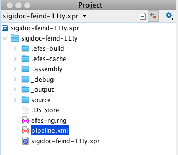
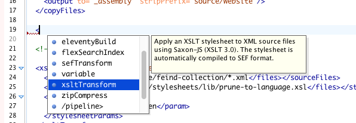
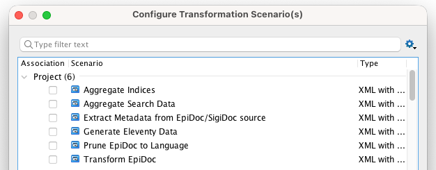
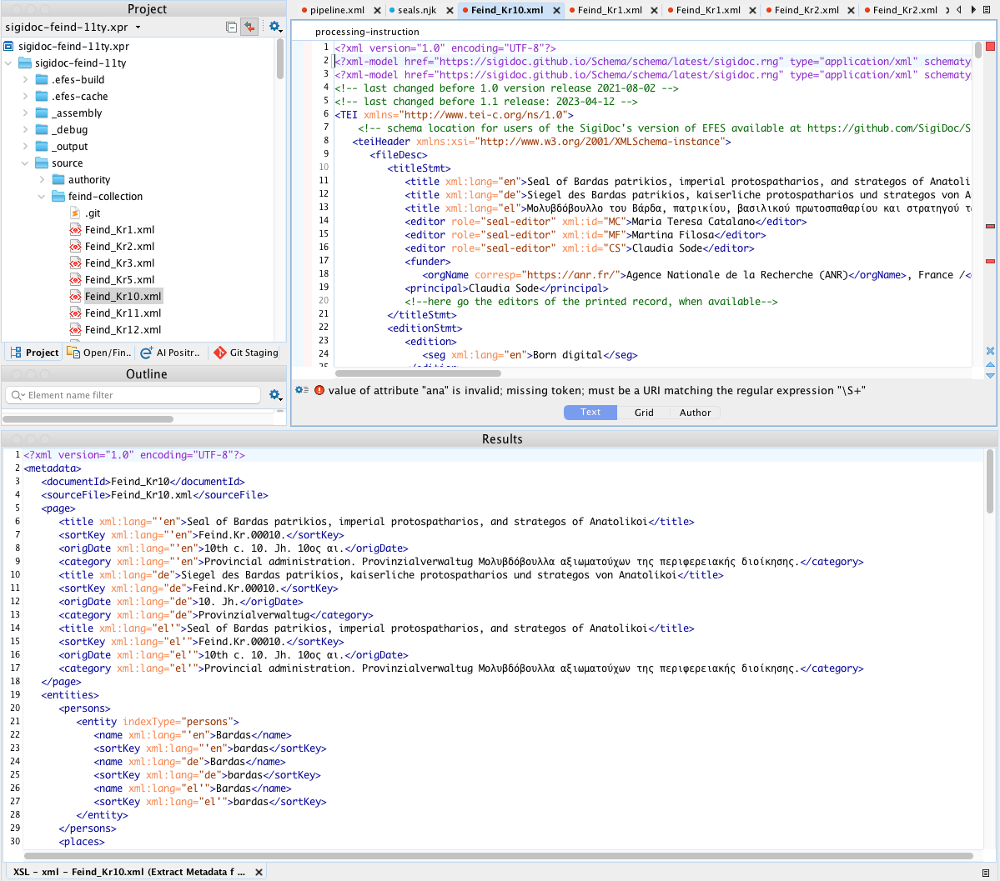
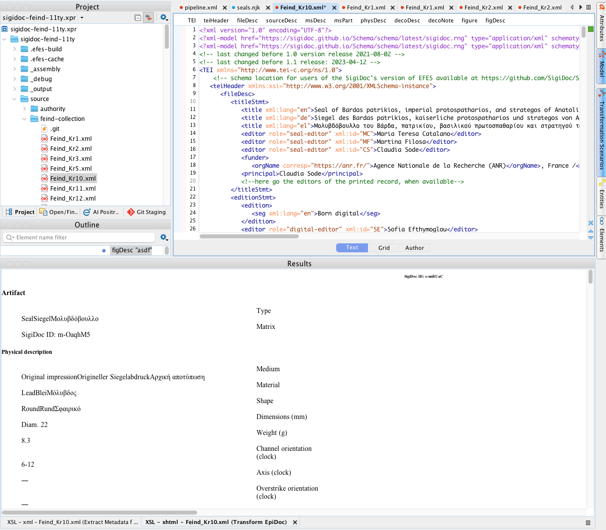
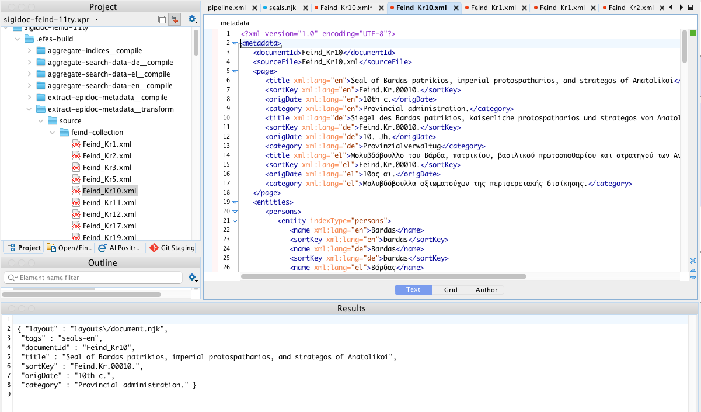
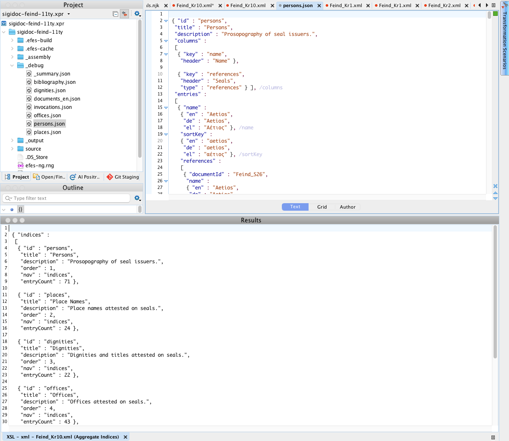
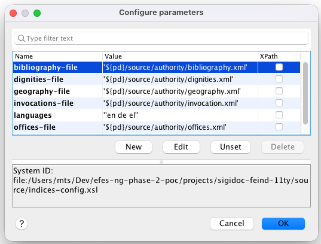

# Oxygen XML Editor Project

The example projects and newly generated projects include an Oxygen XML Editor project file (`.xpr`) with pre-configured transformation scenarios for each pipeline step. This lets you run individual XSLT transformations on single files directly in Oxygen, making it easy to explore, test, and debug your configuration without running the full pipeline.

## Opening the Project

Open the `.xpr` file in Oxygen via File > Open Project. The project tree shows your entire project directory.

The project configures `.njk` files to open with HTML syntax highlighting. You'll see one validation error per file for the YAML front matter block at the top. This is expected and can be ignored.

## Pipeline Validation

The project includes a RELAX NG schema (`efes-ng.rng`) that validates `pipeline.xml`. The schema is referenced via a `<?xml-model?>` processing instruction at the top of the file, so Oxygen picks it up automatically when you open `pipeline.xml`.

This gives you:
- **Validation**: red underlines for invalid element names, missing required attributes, or wrong attribute values
- **Autocomplete**: press Ctrl+Space (Cmd+Space on Mac) inside the pipeline to see available elements and attributes
- **Documentation tooltips**: hover over elements to see descriptions of what they do

If you add new node types to the framework, regenerate the schema with `npx efes-ng schema > efes-ng.rng`.

## Transformation Scenarios

Each scenario corresponds to a pipeline node. Instead of running the full pipeline, you can apply a single transformation to one file and inspect the output immediately.

To run a scenario: open the file you want to transform, then click the Transform button (or press Ctrl+Shift+T / Cmd+Shift+T) and select the scenario from the list.

### Extract Metadata

Runs your `indices-config.xsl` on a source XML file, producing the intermediate metadata XML with page fields, entities, and search data.

**How to use:** Open any source XML file (e.g., from `source/inscriptions/`), then run this scenario. The metadata XML appears in the XML output pane.

**When useful:** A field is empty in the seal list, an entity isn't showing up in an index, or a search facet has wrong values. Run this on the problematic source file and inspect the `<page>`, `<entities>`, and `<search>` sections directly.

**Adapting:** Add your authority file parameters (e.g., `geography-file`, `bibliography-file`) in the scenario's Parameters tab. Use `${pd}/source/authority/filename.xml` for the paths.

### Transform EpiDoc

Runs `epidoc-to-html.xsl` on a source XML file, producing the HTML fragment that appears on individual document pages.

**How to use:** Open a source XML file and run this scenario. The rendered HTML appears in the HTML preview pane.

**When useful:** A seal page renders incorrectly, a section is missing, bibliography links are broken, or UI labels show the wrong language. This isolates the XSLT rendering from the rest of the pipeline.

**Adapting:** Adjust the stylesheet parameters to match your `pipeline.xml` configuration:
- `edn-structure`, `leiden-style`: your EpiDoc rendering conventions
- `bibloc`: path to your bibliography authority file (`${pd}/source/authority/bibliography.xml`)
- `messages-file`: path to your UI label translations (`${pd}/source/translations/messages_en.xml`)
- `language`: which language to render (`en`, `de`, etc.)

### Prune EpiDoc to Language

Runs `prune-to-language.xsl` on a multilingual source XML file, stripping all language-specific content except the specified language.

**How to use:** Open a source XML file and run this scenario. The pruned XML appears in the output pane, containing only the selected language's content.

**When useful:** Verifying that language pruning keeps the right `<seg>`, `<title>`, and other language-tagged elements. If a German seal page shows English content (or vice versa), check the pruned output.

**Adapting:** Change the `language` parameter to test different languages (`en`, `de`, `el`, etc.).

### Generate Eleventy Data

Runs `create-11ty-data.xsl` on a metadata XML file, producing the `.11tydata.json` sidecar that Eleventy uses for page routing, layout assignment, and template data.

**How to use:** Open a metadata XML file from `.efes-build/extract-epidoc-metadata__transform/` (generated by a prior pipeline build), then run this scenario. The JSON output appears in the XML pane.

**When useful:** Checking which fields appear in the sidecar, whether language filtering selects the right values, or why a page isn't showing up in a collection.

::: tip
This scenario requires a metadata XML file as input, not a raw source XML file. Run the pipeline at least once first (or use the Extract Metadata scenario) to generate the metadata files.
:::

### Aggregate Indices

Runs `aggregate-indices.xsl` across all extracted metadata files at once, producing the index JSON files used by index pages.

**How to use:** Run this scenario directly (no input file needed, it uses an initial template). The primary output (`_summary.json`) is written to `_debug/` and displayed. Individual index files (e.g., `persons.json`, `places.json`) are written alongside via `xsl:result-document`.

**When useful:** An index page shows wrong data, entities aren't merging correctly, or entry counts don't match. Inspect the aggregated JSON directly.

::: warning
This scenario reads metadata files from `.efes-build/`. Run the pipeline at least once before using it. If the metadata files don't exist, the transformation produces empty output.
:::

**Adapting:** The `metadata-files` parameter uses an XPath expression with `uri-collection()` to find all metadata XML files. If your source directory isn't `source/inscriptions/`, adjust the path in the expression to match your project structure.

### Aggregate Search Data

Runs `aggregate-search-data.xsl` across all metadata files, producing the search JSON for one language.

**How to use:** Same as Aggregate Indices (no input file needed, requires prior pipeline build). Output is written to `_debug/documents_en.json`.

**When useful:** Search results show wrong data, a facet has unexpected values, or documents are missing from search. Inspect the search JSON directly.

**Adapting:** Change the `language` parameter to generate search data for a different language.

## Adapting Scenarios to Your Project

After scaffolding, the scenarios use default values that match the scaffold's `pipeline.xml`. When you customize the pipeline (changing stylesheet parameters, adding authority files, renaming directories), you'll need to update the corresponding scenarios.

To edit a scenario's parameters:

1. Open Transform > Configure Transformation Scenarios
2. Select the scenario and click Edit
3. Go to the Parameters tab
4. Double-click a parameter value to change it

Use `${pd}` in parameter values to reference the project directory. For example, `${pd}/source/authority/bibliography.xml` resolves to the absolute path of your bibliography file. This keeps the scenarios portable across machines.

::: tip
When you add a new authority file to your pipeline's `extract-epidoc-metadata` node, remember to add the same parameter to the Extract Metadata scenario so it works in Oxygen too.
:::

## Differences from the Pipeline

These scenarios run Saxon (Oxygen's built-in XSLT 3.0 processor), while the pipeline uses Saxon-JS. Most XSLT 3.0 works identically in both, but there can be minor behavioral differences in edge cases.

The aggregate scenarios (Indices, Search Data) read pre-built metadata from `.efes-build/`. If you change your extraction templates, run the pipeline once to regenerate the metadata before using the aggregate scenarios in Oxygen.
