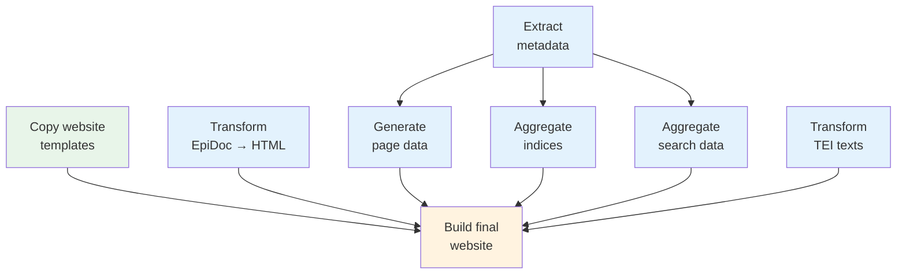

# Pipeline & Nodes

## What is a Pipeline?

A pipeline defines the processing steps that transform your XML source files into a website. It's written in XML (`pipeline.xml`) and consists of **nodes** — individual processing steps that each take some input, do something with it, and produce output.

Here's what the IRCyR inscription project's pipeline looks like:



Nodes that don't depend on each other run in parallel. The pipeline automatically determines the correct execution order from the dependency graph.

::: details Technical: Directed Acyclic Graphs
The pipeline structure is a *directed acyclic graph* (DAG). "Directed" means data flows in one direction (input to output). "Acyclic" means there are no loops — a node can never depend on its own output.

You don't specify execution order. You declare what each node needs, and the pipeline resolves the graph automatically.
:::

## Node Types

Each node type performs a specific kind of processing:

| Type | What It Does |
|------|-------------|
| `xsltTransform` | Applies an XSLT 3.0 stylesheet to XML documents |
| `copyFiles` | Copies files from one location to another |
| `eleventyBuild` | Builds the final website using Eleventy |
| `zipCompress` | Creates ZIP archives |

See the [Node Types reference](/reference/node-types) for full details.

## Inputs and Outputs

Nodes communicate through typed inputs and outputs:

- **`<files>`** — reference files on disk using glob patterns
- **`<from>`** — reference another node's output (creates a dependency)
- **`<collect>`** — depend on all nodes writing to a directory
- **`<dir>`** — reference a directory path

See the [Input Types reference](/reference/input-types) for the full list.

## Caching

The pipeline caches the results of each node. On subsequent runs, nodes whose inputs haven't changed skip processing entirely and reuse their cached output. This makes incremental rebuilds fast — only the nodes affected by your changes need to re-run.

::: details How does caching work?
The cache uses a multi-tier validation strategy:

1. **Upstream signatures** — if a dependency node's outputs haven't changed, skip re-checking
2. **Timestamps** — fast check: has the file modification time changed?
3. **Content hashes** — accurate check: has the file content actually changed?
4. **Output existence** — are the expected output files still present?

Cache data is stored in `.efes-cache/` and can be cleared with `npx efes-ng clean`.
:::

## Running the Pipeline

You can run the pipeline from the [desktop application](/guide/gui) or the [command line](/reference/cli):

```bash
# Build once
npx efes-ng run

# Watch for changes and rebuild automatically
npx efes-ng watch

# Remove all generated files and caches
npx efes-ng clean
```
