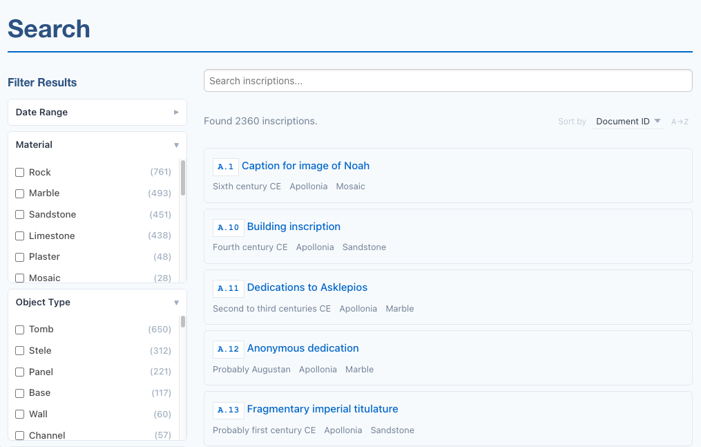
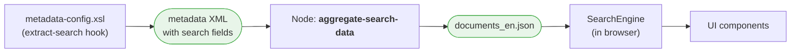
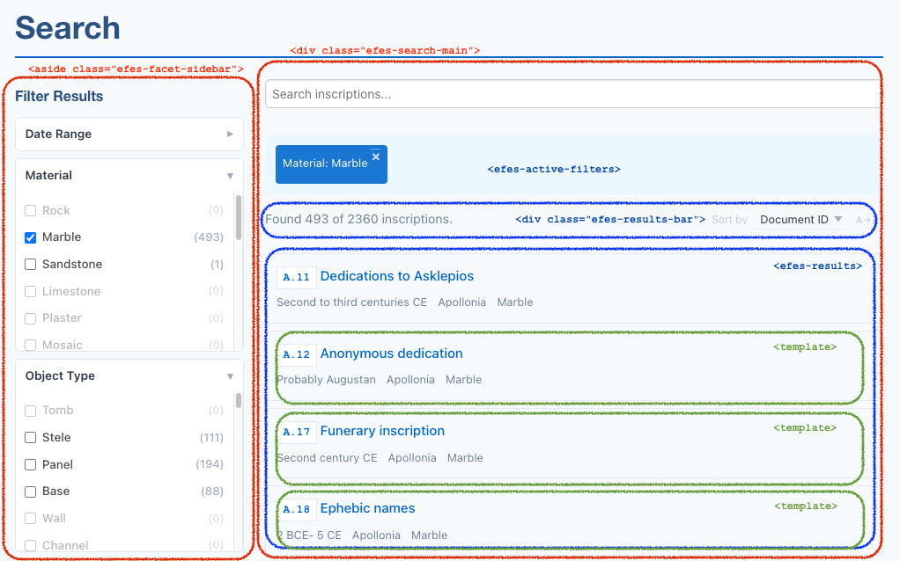

# Search

The framework ships a client-side search component, `efes-search`, that runs entirely in the browser. It loads a per-language JSON file produced by the pipeline, builds a full-text index in memory, and exposes a small set of [Web Components](https://developer.mozilla.org/en-US/docs/Web/API/Web_components) you compose into a search page.

This page covers the architecture, the standard page anatomy, and the moving parts. For step-by-step instructions in the context of one project, see the [Search tutorial](/tutorial/search). For the complete component API, see the [efes-search reference](/reference/efes-search).



## Data flow

In the example projects and the starter template (scaffold), the pipeline produces one JSON file per language. The component fetches it on page load, indexes it, and the rest happens in the browser:



For multilingual projects, the `aggregate-search-data` node is duplicated per language with a different `language` parameter and output filename (`documents_en.json`, `documents_de.json`, …). The page selects the right file at render time using its locale.

## Page anatomy

A typical search page has a sidebar (input, facets, clear-all) and a main area (active filter tags, a result count, a sort dropdown, the results list):

```html
<efes-search data-url="{{ searchDataUrl | url }}" text-fields="fullText,title" match-mode="prefix">
    <aside class="efes-facet-sidebar">
        <h2>Filter Results</h2>
        <efes-search-input placeholder="Search..."></efes-search-input>

        <!-- facet filters go here -->

        <div class="efes-filter-actions">
            <button data-action="clear-all">Clear All Filters</button>
        </div>
    </aside>

    <div class="efes-search-main">
        <efes-active-filters></efes-active-filters>

        <div class="efes-results-bar">
            <span class="efes-results-status">
                <efes-result-count
                    template="Found {total} documents."
                    filtered-template="Found {count} of {total} documents.">
                </efes-result-count>
            </span>
            <span class="efes-sort-label">Sort by</span>
            <efes-sort>
                <field key="sortKey">Document ID</field>
                <field key="title">Title</field>
            </efes-sort>
        </div>

        
        <efes-results result-url="{{ resultUrl | url }}">
            <template>
                <a>
                    <div class="efes-result-title">
                        <span class="doc-id" data-field="documentId"></span>
                        <span data-field="title"></span>
                    </div>
                </a>
            </template>
        </efes-results>
    </div>
</efes-search>
```

`<efes-search>` is the only mandatory wrapper: it owns the engine and child components find it via `closest('efes-search')`. The CSS class names on the sidebar and main area (`efes-facet-sidebar`, `efes-search-main`, `efes-results-bar`) are conventions used by the bundled stylesheet. You can rename or restructure them.



## Sidebar components

**`<efes-search-input>`** renders a debounced text input. As the user types, it forwards the trimmed query to the engine after a 300 ms pause (configurable via `debounce`). Pressing Enter applies immediately.

**`<efes-facet field="…" label="…">`** renders a collapsible checkbox list, one option per distinct value of the named field across all documents. Counts update as other filters narrow the result set, and unselectable values (zero count after current filters) are dimmed but kept in place to give a sense of what's available. Multi-valued fields (those emitted as `<item>` children by your `extract-search` template) are handled the same way as scalar fields. Add `expanded` to start the facet open instead of collapsed.

**`<efes-date-range>`** renders two number inputs (from / to year) plus a Clear button. It pushes a `{from, to}` range to the engine, which filters documents whose `dateNotBefore`/`dateNotAfter` fields overlap. Use the `hint` attribute to add a one-line tip below the inputs (e.g. *"Use negative numbers for BCE"*).

**Clear-all button.** Any descendant of `<efes-search>` with `data-action="clear-all"` triggers `engine.clearAll()` . Clears query, all facet filters, and the date range in one step. Wire it however you like; a single `<button data-action="clear-all">` in the sidebar is the convention.

## Main area components

**`<efes-active-filters>`** displays the current filter set as removable pills (one per active facet value, plus one for the date range if active). Reads the labels from sibling `<efes-facet>` elements so the pills say "Milieu: military" rather than the raw field name. Renders nothing when no filters are active.

**`<efes-result-count>`** is an inline element that shows the current count. It reads two attribute templates with `{count}` and `{total}` placeholders:

- `template`: used when no filter is active. Default: `{total}`.
- `filtered-template`: used when at least one filter is active. Default: `{count} of {total}`.

So `<efes-result-count template="Showing all {total} seals" filtered-template="Showing {count} of {total} seals" />` reads naturally in both states.

**`<efes-sort>`** renders a dropdown plus a direction toggle. Each `<field key="…">label</field>` child defines a sort option. Add the `numeric` attribute on `<field>` for numeric fields (dates, counts) so they sort as numbers rather than alphabetically. The first `<field>` is the default. Direction defaults to ascending and toggles to descending on click.

**`<efes-results result-url="…">`** renders the actual results list. The component clones an inner `<template>` for each result; elements with `data-field="fieldName"` get filled with the value of that field, and `<a>` elements without `href` get one constructed from the `result-url` pattern (with `{fieldName}` placeholders replaced from the document). Empty fields are hidden via `display: none` + `aria-hidden="true"` so the markup adapts to documents with optional data.

## Match modes

`match-mode` on `<efes-search>` controls how the search query matches against indexed text:

| Mode | Effect | Example: query "bar" |
|---|---|---|
| `exact` | Whole-word matches only | finds "bar", not "Bardas" |
| `prefix` (default) | Matches from the start of any word | finds "Bardas", "Bartolomaeus" |
| `substring` | Matches anywhere within a word | finds "Bardas", "rebars", "embargo" |

Behind the scenes these map to FlexSearch's `strict`, `forward`, and `full` tokenizer modes respectively. `prefix` is the right default for most prose: it catches inflectional variations and partial typing without exploding the index size or slowing queries the way `substring` does.

::: warning Substring mode and large corpora
`substring` (FlexSearch's `full` mode) builds an index roughly proportional to the cumulative length of all indexed text, not the number of distinct words. For a few hundred short documents it's fine; for a few thousand documents with long edition transcriptions it can produce a noticeably slower load and a larger memory footprint. If you need substring matching and have a large corpus, consider an alternative search backend (see [Limitations and Future Work](/guide/limitations-and-future-work#search)).
:::

## How it works under the hood

The components are thin DOM adapters. The actual search logic lives in a headless `SearchEngine` class:

1. **Load.** `<efes-search>` constructs a `SearchEngine` with `data-url`, `text-fields`, and `match-mode`, then calls `engine.load()` on the next tick (deferred so all child components have registered themselves first).
2. **Index.** The engine fetches the JSON, builds a [FlexSearch](https://github.com/nextapps-de/flexsearch) `Document` index from the `text-fields`, and computes a "full" facet count map across all documents.
3. **React.** Each child component subscribes to engine events: `status-change`, `results-change`, `facets-change`, `filters-change`. When the user types or clicks a facet, the engine recomputes the filtered set and the corresponding events fire.
4. **Render.** Components update their DOM in response. The DOM updates are scoped to the relevant component (e.g. `<efes-facet>` only re-renders its own checkbox list, `<efes-results>` only re-renders the list).

Faceting is performed against the in-memory document array (not the FlexSearch index), and full-text matches are intersected with facet hits.

## Customising the layout

The bundled stylesheet (`assets/efes-search/efes-search.css`) styles the standard layout (sidebar on the left at desktop widths, stacked on mobile). You can:

- **Restructure the markup.** The components don't enforce any container hierarchy. Move `<efes-active-filters>` above the sidebar, put facets in a horizontal bar above results, etc. The CSS class names in the example are conventions, not requirements.
- **Override CSS.** All components produce  HTML with predictable class names. Override styles in your project's `project.css` (loaded after `efes-search.css`).
- **Add components selectively.** None of the components are required except `<efes-search>` itself. 

## See also

- [Search tutorial](/tutorial/search): step-by-step, in the context of the SigiDoc Feind Collecton project
- [efes-search reference](/reference/efes-search): complete attribute and event reference for every component, plus the `SearchEngine` API for advanced cases
- [Metadata Configuration](/guide/metadata-config): how the `extract-search` hook in `metadata-config.xsl` shapes the data the components consume
- [Limitations and Future Work](/guide/limitations-and-future-work#search): adapter-pattern plans for alternative search backends
