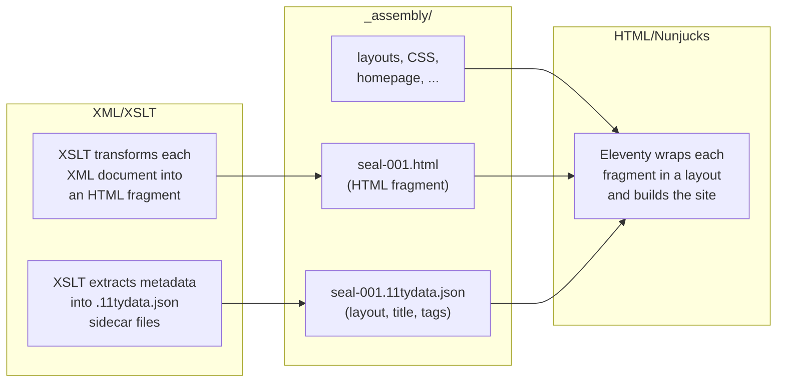

# Content and Templates

Working with EFES-NG Prototype involves two different technologies. Understanding where one ends and the other begins makes everything easier.

## The Two Worlds

### XML/XSLT — Your Content

This is where your domain expertise lives. XSLT stylesheets transform your EpiDoc/TEI XML documents into HTML fragments — the rendered transcriptions, metadata tables, apparatus entries, and index data that make up the scholarly content of your site.

If you've worked with EFES or Oxygen XML Editor before, this world will feel familiar. The pipeline's job is to run these transformations for you, with caching and dependency tracking.

**You work here when you want to change:**
- How a document is rendered (transcription style, metadata display)
- Which metadata is extracted for indices and search
- How authority files are resolved

**Files:** `source/stylesheets/`, `source/indices-config.xsl`, `pipeline.xml`

### HTML/Nunjucks — Your Site

The website templates define the frame around your content — the header, footer, navigation, page layouts, CSS, and any static pages like the homepage. They're written in plain HTML with a few [Nunjucks](https://mozilla.github.io/nunjucks/) expressions mixed in.

You don't need to learn Nunjucks deeply. Think of it as **HTML with a few extras**: `{{ title }}` outputs a value, `` inserts a reusable component. The project generator gives you working templates — customization is mostly editing HTML and CSS.

**You work here when you want to change:**
- The site header, footer, or navigation
- Page layouts and structure
- Colors, fonts, or styling
- Static pages (homepage, about page)

**Files:** `source/website/`

## The Handoff

The two worlds meet in the `_assembly/` directory. This is the pipeline's staging area:

- **XSLT** produces HTML fragments and JSON data files, writing them into `_assembly/`
- **Website templates** are copied into `_assembly/` alongside them
- **Eleventy** reads everything in `_assembly/`, wraps each content fragment in a page layout, and produces the final static site in `_output/`

The `.11tydata.json` sidecar file is the contract between the two worlds. It tells Eleventy which layout to use, what the page title is, and which collection the page belongs to — all generated automatically by the pipeline.

## Quick Decision Guide

| I want to... | Edit... |
|--------------|---------|
| Change how a seal/inscription *looks* | XSLT stylesheet (`source/stylesheets/`) |
| Change the page *around* the content | Nunjucks template (`source/website/`) |
| Change *which files* are processed | Pipeline config (`pipeline.xml`) |
| Change site colors or fonts | CSS (`source/website/assets/css/`) |
| Add a new static page | New `.njk` file in `source/website/` |
| Change index/search fields | `source/indices-config.xsl` |
