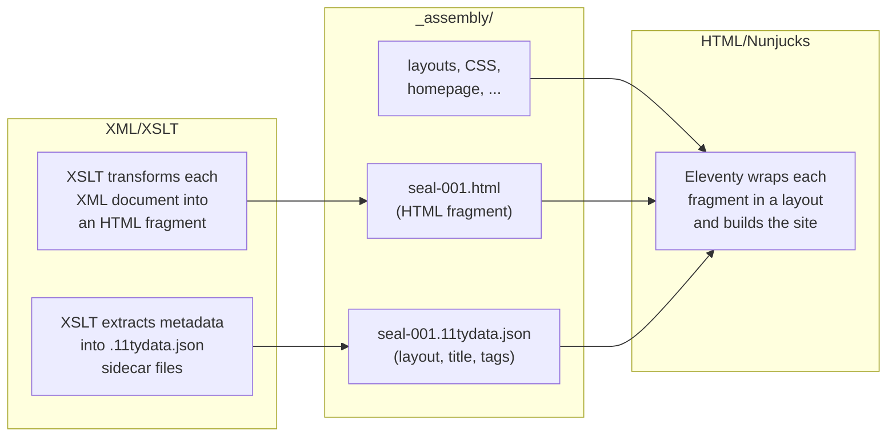

# Content and Templates

The projects that the Prototype and this documentation are structured around use two complimentary technologies to generate edition websites:

* **XML and XSLT**. If you have worked with EpiDoc or SigiDoc and EFES before, this will be familiar to you. The encoded source data is in XML, which are processed by XSLT stylesheets to create HTML display versions of the encoded data, and to extract some metadata that can be used to generate indices, search data, concordances, and more.
* **A static site generator**, currently [Eleventy](https://www.11ty.dev/) specifically, which processes HTML templates (written in the [Nunjucks templating language](https://mozilla.github.io/nunjucks/)) and can consume JSON and JavaScript files for configuration and dynamic content generation.

Splitting the work along this seam lets each technology do what it is good at. XSLT is exceptional at the thing it was designed for: walking a structured XML document and emitting derived markup. A static site generator handles everything around that (layouts, asset bundling, routing, pagination, hot reload during development) in plain HTML with a small amount of templating, using ecosystems (CSS, JavaScript) that lie at the foundation of the web. The deployable output is a folder of static files, hostable anywhere, with no server runtime to maintain.

So when working with the EFES-NG Prototype, you will be working in two worlds, and understanding where one ends and the other begins makes everything easier.

## The Two Worlds

### XML/XSLT: The Data and Metadata Configuration

XSLT stylesheets transform your EpiDoc/TEI XML documents into HTML fragments: the rendered transcriptions, metadata tables, apparatus entries, and index data that make up the scholarly content of your site.

If you've worked with EFES or Oxygen XML Editor before, this world will feel familiar. The pipeline's job is to run these transformations, with caching and dependency tracking.

**You work here when you want to change:**
- How a document is rendered (transcription style, metadata display)
- Which metadata is extracted for indices and search
- How authority data is are resolved

**Files:** `source/stylesheets/`, `source/metadata-config.xsl`, `pipeline.xml`...

### HTML/Nunjucks: The Presentation Shell

See also: [Static Site Generation](static-site-generation.md)

The website templates define the frame around your content: the header, footer, navigation, page layouts, CSS, and any static pages like the homepage. They're written in plain HTML with a few [Nunjucks](https://mozilla.github.io/nunjucks/) expressions mixed in.

You don't need to learn Nunjucks deeply. Think of it as **HTML with a few extras**: `{{ title }}` outputs a value, `` inserts a reusable component. The project generator gives you working templates. Customization is mostly editing HTML and CSS.

**You work here when you want to change:**
- The site header, footer, or navigation
- Page layouts and structure
- Colors, fonts, or styling
- Static pages (homepage, about page)

**Files:** `source/website/`

## The Handoff

The two worlds meet in the `_assembly/` directory. This is the pipeline's staging area:

- **XSLT** produces HTML fragments and JSON data files, writing them into `_assembly/`
- **Website templates** are copied into `_assembly/` alongside them
- **Eleventy** reads everything in `_assembly/`, wraps each content fragment in a page layout, and produces the final static site in `_output/`

The `.11tydata.json` sidecar file is the contract between the two worlds. It tells Eleventy which layout to use, what the page title is, and which collection the page belongs to (generated automatically by the pipeline from extracted metadata).

## Quick Decision Guide

| I want to... | Edit... |
|--------------|---------|
| Change how a seal/inscription *looks* | XSLT stylesheet (`source/stylesheets/`) |
| Change the page *around* the content | Nunjucks template (`source/website/`) |
| Change *which files* are processed | Pipeline config (`pipeline.xml`) |
| Change site colors or fonts | CSS (`source/website/assets/css/`) |
| Add a new static page | New `.njk` file in `source/website/` |
| Change index/search fields | `source/metadata-config.xsl` |
