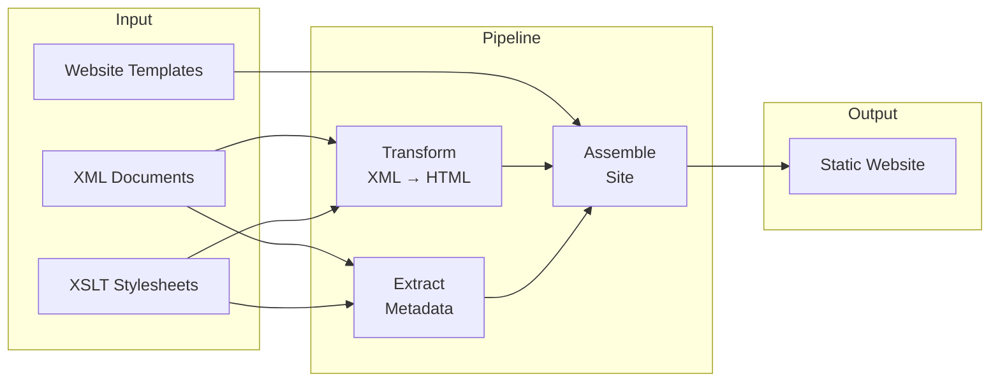

# What is EFES-NG Prototype?

EFES-NG Prototype is a modern re-implementation of [EFES](https://github.com/EpiDoc/EFES) (EpiDoc Front-End Services), the publication framework for [EpiDoc](https://epidoc.stoa.org/) and [TEI](https://tei-c.org/) XML projects in Digital Humanities.

> [!info] Prototype
> This is a prototype for exploring a potential architecture for a successor to the Kiln/Cocoon-based EFES. The pipeline system is generic, but the current focus is on creating static site editions of EpiDoc-based projects that mirror the structure and features of the original EFES.

## Why a New EFES?

The original EFES is built on [Apache Cocoon](https://cocoon.apache.org/) and [Kiln](https://github.com/kcl-ddh/kiln) — a Java-based XML pipeline framework. While powerful, this architecture presents challenges:

- **Heavy runtime** — requires a Java application server to run
- **Complex deployment** — not easily hosted on modern static platforms like GitHub Pages or Netlify
- **Maintenance burden** — Cocoon is no longer actively developed

EFES-NG Prototype takes a different approach:

- **Static output** — generates a complete static website you can deploy anywhere, no server required
- **XSLT 3.0** — uses [Saxon-JS](https://www.saxonica.com/saxon-js/index.xml) for full XSLT 3.0 support
- **Pipeline-based** — define your transformation steps in a simple XML configuration
- **Automatic caching** — only rebuilds what changed, with dependency tracking
- **Desktop application** — an Electron-based GUI for managing and previewing projects

## How It Works

At its core, EFES-NG Prototype takes your XML source documents and transforms them into a ready-to-deploy website through a series of processing steps:

1. You author XML documents (EpiDoc inscriptions, TEI texts, authority files)
2. A **pipeline** transforms them through a series of steps — XSLT transforms, file copies, metadata extraction, aggregation
3. The results are assembled into a website structure
4. A static site generator builds the final website

Your existing XSLT stylesheets work with minimal adaptation — EFES-NG Prototype re-uses the same EpiDoc rendering stylesheets as the original EFES.

Working with EFES-NG involves two technologies: **XML/XSLT** for content transformation (the part DH scholars already know) and **HTML templates** for the site structure around it. Read [Content and Templates](/guide/two-worlds) for how the two relate — or just dive into the tutorial, which introduces each in context.

## Where to Go Next

- **New to EFES-NG?** Start with the [Tutorial](/tutorial/) — it walks you through creating a complete project from scratch.
- **Want to understand the concepts?** Read about [Content and Templates](/guide/two-worlds), [Pipelines & Nodes](/guide/pipeline-and-nodes), or [Project Structure](/guide/project-structure).
- **Looking for details?** Check the [Reference](/reference/pipeline-xml) section for the complete configuration reference.
