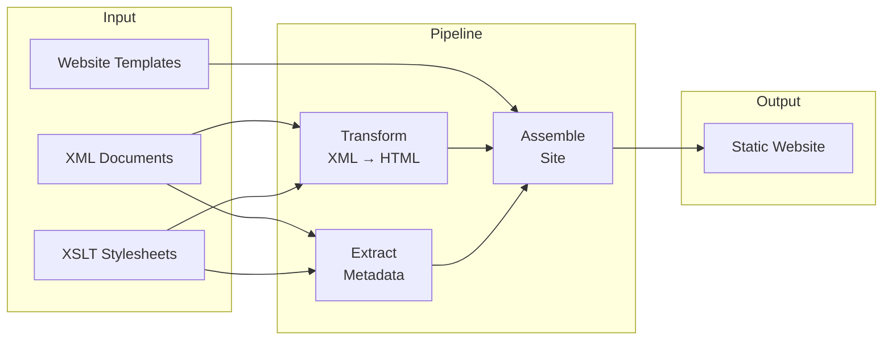

# What is the EFES-NG Prototype?

The EFES-NG Prototype is a framework for publishing XML-based content as static websites. It is primarily designed as a modern re-implementation of [EFES](https://github.com/EpiDoc/EFES) (EpiDoc Front-End Services), the publication framework for [EpiDoc](https://epidoc.stoa.org/) projects in Digital Humanities, and works well with the EpiDoc and SigiDoc stylesheets.

> [!info] Prototype
> This is a prototype exploring a potential architecture for a successor to the Kiln/Cocoon-based EFES. The pipeline system is generic and extendable, but the current focus is on creating static site editions of EpiDoc-based projects that mirror the structure and features of the original EFES.

### Features

- **Pipeline-based build system** with caching for fast, parallel, incremental builds
- Full **XSLT 3.0** support via [Saxon-JS](https://www.saxonica.com/saxon-js/index.xml)
- Recommended **project structure** and workflow conventions
- Re-usable XSLT stylesheets for **metadata extraction**, **index aggregation**, and **search data generation**
- **Faceted search** web component with full-text search, date range filtering, and sorting
- **Project scaffold** tool that generates starter projects with EpiDoc/SigiDoc rendering, entity indices, bibliography, client-side search, and CI deployment pipeline
- **Desktop application** with project creation wizard, real-time build progress, live preview, and site export

The current scope is efficiently running a series of XSLT transformations and building a final static site with the [Eleventy](https://www.11ty.dev/) static site generator.

## How It Works

At its core, the EFES-NG Prototype takes your XML source documents and transforms them into a ready-to-deploy website through a series of processing steps that you define:

1. You author XML documents (EpiDoc inscriptions, TEI texts, authority files)
2. A pipeline transforms them through a series of steps: XSLT transforms, file copies, metadata extraction, aggregation
3. The results are assembled into a website structure
4. A static site generator builds the final website

Working with EFES-NG involves two technologies: **XML/XSLT** for content transformation (the part DH scholars already know) and **HTML templates** for the site structure around it. Read [Content and Templates](/guide/two-worlds) for how the two relate, or just start with the [tutorial](/tutorial), which introduces each in context.

## What does "modern alternative to EFES" mean?

The original EFES is built on [Apache Cocoon](https://cocoon.apache.org/) and [Kiln](https://github.com/kcl-ddh/kiln), a Java-based XML pipeline framework. While powerful, this architecture presents challenges:

- **Heavy runtime**: requires a Java application server to run
- **Complex deployment**: not easily hosted on modern static platforms like GitHub Pages
- **Maintenance burden**: Cocoon is no longer actively developed

The EFES-NG Prototype takes a different approach: it generates a complete static website you can deploy anywhere, no special server-side environment required. See [Design Decisions](/guide/design-decisions) for the full rationale.

## Where to Go Next

- See it in action: browse the [Example Projects](/guide/example-projects) built with the EFES-NG Prototype.
- Start with the [Tutorial](/tutorial/): it walks you through creating a complete project from scratch.
- For a deeper understanding of the concepts, read [Content and Templates](/guide/two-worlds), [Pipelines & Nodes](/guide/pipeline-and-nodes), or [Project Structure](/guide/project-structure).
- For configuration details, see the [Reference](/reference/pipeline-xml) section.
