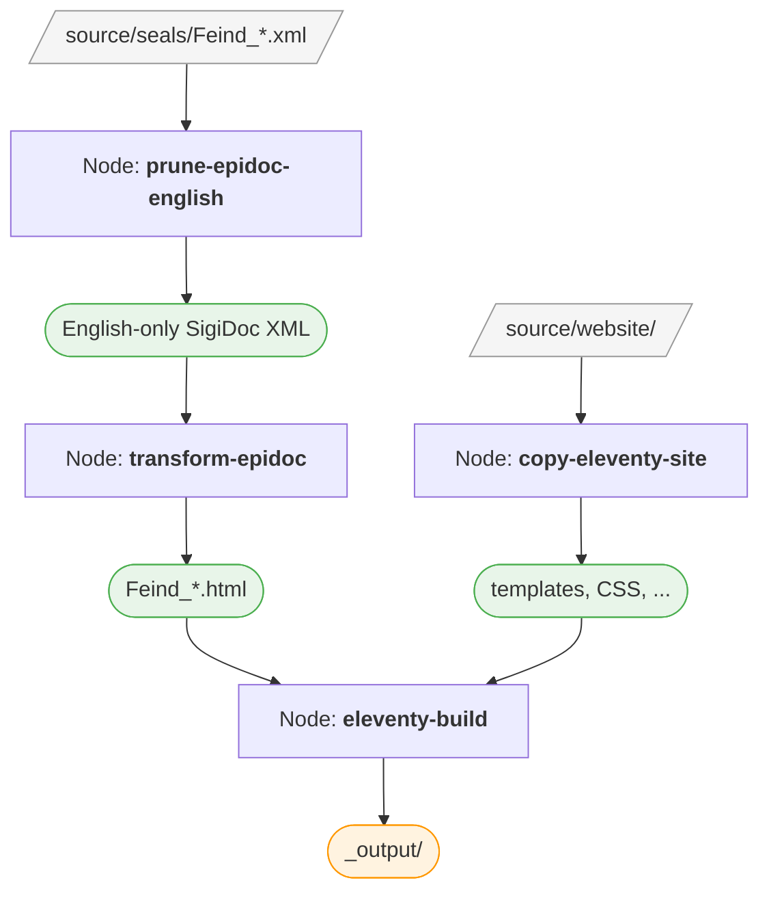

# Adding Content

Right now, the preview site shows our customized header and homepage, but if you click the "Seals" menu item you get an empty page. Let's add seals.

> [!info] We're now working with: Pipeline Configuration (pipeline.xml)
> This step is about configuring XML/XSLT transformations — telling the pipeline which XML files to process, which stylesheets to use, and where to write the output. See [Content and Templates](/guide/two-worlds) for how this relates to the website templates.

## What We Need

Seals are encoded as individual [SigiDoc](https://sigidoc.huma-num.fr/)/EpiDoc XML files. To get them onto the website, we need to:

1. Provide the XML source files as input to the pipeline
2. Configure the pipeline to transform each XML file into an HTML page
3. Generate the metadata needed for the seal list, indices, and search

## Adding Source Files

Create a `seals` directory inside `source/` and place your SigiDoc XML files there:

```
my-sigidoc-project/
├── pipeline.xml
├── source/
│   ├── seals/                    # ← NEW: your SigiDoc XML files
│   │   ├── Feind_Kr1.xml
│   │   ├── Feind_Kr10.xml
│   │   ├── Feind_Kr102.xml
│   │   └── ...
│   ├── authority/
│   ├── stylesheets/
│   └── website/
```

> [!tip] Using Git
> If your seals are in a Git repository, you can add them as a [Git submodule](https://git-scm.com/book/en/v2/Git-Tools-Submodules) instead of copying files:
>
> ```bash
> git submodule add https://github.com/your-org/feind-collection.git source/seals
> ```
>
> This keeps the source documents linked to their own version history.

You'll also need authority files — the controlled vocabulary XMLs that the stylesheets reference for resolving geographic names, dignities, offices, etc. Place them in `source/authority/`.

## Configuring the Pipeline

Now open `pipeline.xml`. You'll find a commented-out `<xsltTransform>` node that serves as a starting point. Let's uncomment it.

An `<xsltTransform>` node is the core building block of the pipeline: it takes a set of XML source files, applies an XSLT stylesheet to each of them, and writes the resulting output. You configure it by telling it *what* to transform, *how* to transform it (which stylesheet and parameters), and *where* to put the results.

Let's adapt it step by step.

### Step 1: Source Files

The first thing to configure is where the node finds its input:

```xml
<sourceFiles><files>source/seals/*.xml</files></sourceFiles>
```

The `<files>` element contains a *glob pattern* — a way to describe a set of files using wildcards. `source/seals/*.xml` means "all XML files directly inside the `source/seals/` folder". You could also use `source/seals/**/*.xml` to include files in subdirectories recursively, or just a plain path like `source/authority/bibliography.xml` for a single file.

Wrapping a path in `<files>` does more than just point the node to its input — it also registers those files as tracked **dependencies**. When you run the pipeline a second time, the node checks each input file individually: if a file hasn't changed since the last build, its cached result is reused and the transformation is skipped for that file. Only files that actually changed get re-processed. This is what makes incremental rebuilds fast — editing one seal doesn't require re-transforming all of them.

### Step 2: Stylesheet

Next, specify which XSLT stylesheet to use for the transformation:

```xml
<stylesheet>
  <files>source/stylesheets/lib/epidoc-to-html.xsl</files>
</stylesheet>
```

This points to the framework's EpiDoc-to-HTML wrapper stylesheet. It imports the upstream SigiDoc stylesheets and applies them to each source document, producing an HTML fragment for each seal.

Just like with `<sourceFiles>`, wrapping the stylesheet path in `<files>` registers it as a tracked dependency. The pipeline also detects stylesheets that are imported or included via `xsl:import` and `xsl:include`. So if you modify the main stylesheet *or* any stylesheet it imports, all affected documents will be re-transformed on the next build.

### Step 3: Stylesheet Parameters

XSLT stylesheets accept parameters that control their behavior. The EpiDoc stylesheets have many options for rendering — which Leiden convention to use, how to display line numbers, where to find bibliography data, and more:

```xml
<stylesheetParams>
  <param name="edn-structure">sigidoc</param>
  <param name="edition-type">interpretive</param>
  <param name="leiden-style">sigidoc</param>
  <param name="line-inc">1</param>
  <param name="verse-lines">off</param>
  <param name="bibloc">
    <files>source/authority/bibliography.xml</files>
  </param>
  <param name="bib-link-template">../../bibliography/$1/</param>
  <param name="language">en</param>
  <param name="messages-file"><files>source/translations/messages_en.xml</files></param>
</stylesheetParams>
```

Notice that the `bibloc` parameter uses `<files>` to reference a file. This registers the bibliography as a dependency — if you update `bibliography.xml`, the pipeline knows to re-transform.

The `language` parameter tells the stylesheet to resolve UI labels (like "Material", "Type", "Dating") to English. The `messages-file` parameter points to the translation file and registers it as a dependency — so if you edit the translations, the pipeline rebuilds affected pages. The scaffold includes a stub with a few common keys, but for SigiDoc projects you need the complete translation file. Download it from [the SigiDoc EFES repository](https://github.com/SigiDoc/EFES-SigiDoc/blob/master/webapps/ROOT/assets/translations/messages_en.xml) and save it to `source/translations/messages_en.xml`, replacing the stub.

::: details How do UI label translations work?
The SigiDoc stylesheets don't hardcode label text. Instead, they output placeholder elements like `<i18n:text i18n:key="material"/>`. The `epidoc-to-html.xsl` wrapper looks up each key in the messages file and replaces the placeholder with the translated text. Without the translation file, labels appear as bracketed keys like `[material]` instead of "Material".

For multi-language support, you can add additional translation files (`messages_de.xml`, `messages_el.xml`) and pass the corresponding `language` parameter — we'll do this in the [Multi-Language Support](./multi-language) step.
:::

### Step 4: Output Configuration

Finally, specify where the HTML output should go. By default, a node preserves the full input file path in the output. So if you only specified a target directory:

```xml
<output to="_assembly/en/seals"/>
```

then `source/seals/Feind_Kr1.xml` would be written to `_assembly/en/seals/source/seals/Feind_Kr1.xml` — which is not what we want. The `source/seals/` part of the path is just where the files happen to live in our project, not where they should end up on the website.

That's what `stripPrefix` is for — it removes the source directory from the path:

```xml
<output to="_assembly/en/seals"
        stripPrefix="source/seals"
        extension=".html"/>
```

Now the path mapping works as expected:

| Input | Output |
|-------|--------|
| `source/seals/Feind_Kr1.xml` | `_assembly/en/seals/Feind_Kr1.html` |
| `source/seals/Feind_Kr10.xml` | `_assembly/en/seals/Feind_Kr10.html` |

The `extension=".html"` attribute changes the file extension from `.xml` to `.html`.

After a build, you can verify these output paths in the GUI: click on the node in the node list to open the **node inspector** panel, then expand the **Outputs** section to see all files the node produced.

### The Complete Node

Putting it all together:

```xml
<xsltTransform name="transform-epidoc">
  <sourceFiles><files>source/seals/*.xml</files></sourceFiles>
  <stylesheet>
    <files>source/stylesheets/lib/epidoc-to-html.xsl</files>
  </stylesheet>
  <stylesheetParams>
    <param name="edn-structure">sigidoc</param>
    <param name="edition-type">interpretive</param>
    <param name="leiden-style">sigidoc</param>
    <param name="line-inc">1</param>
    <param name="verse-lines">off</param>
    <param name="bibloc">
      <files>source/authority/bibliography.xml</files>
    </param>
    <param name="bib-link-template">../../bibliography/$1/</param>
    <param name="language">en</param>
    <param name="messages-file"><files>source/translations/messages_en.xml</files></param>
  </stylesheetParams>
  <output to="_assembly/en/seals"
          stripPrefix="source/seals"
          extension=".html"/>
</xsltTransform>
```

## Building and Inspecting

If you already clicked **Start** earlier (during the customization step), the pipeline is in watch mode. It automatically detects changes to `pipeline.xml` and reloads the pipeline configuration — you should see the new `transform-epidoc` node appear in the node list, and a rebuild starts automatically.

If the pipeline is not running yet, click **Start** now.

Watch as the node processes each XML file — the progress counter shows how many seals have been transformed.

### What Did the Pipeline Produce?

Once the build completes, let's look at what happened. Open the `_assembly/en/seals/` directory in your file manager or editor. You should see an `.html` file for every input XML file — `Feind_Kr1.html`, `Feind_Kr10.html`, and so on.

Open one of these HTML files in a text editor. You'll see a partial HTML fragment — the seal's transcription, metadata, and commentary, rendered by the SigiDoc stylesheets. This is the content that will eventually be embedded in a page on the site.

> [!tip] Inspecting a Node
> You can also inspect the output from the GUI: click on `transform-epidoc` in the node list to open the inspector panel. It shows the node's configuration, dependencies, cache statistics, and the list of output files it produced.

### The Pages Look Wrong

Now switch to the preview and try opening a seal page directly (like `/en/seals/Feind_Kr1/`). You'll notice two things are off:

1. The page shows raw HTML without the site template — no header, footer, or navigation. This is because Eleventy needs a sidecar data file to know which layout to use. We'll fix that in the [next step](./metadata-and-data).
2. The content itself is garbled — text from different languages is mashed together: "SiegelSealΜολυβδόβουλλο" instead of just "Seal".

The garbled text happens because the SigiDoc XML files contain content in multiple languages side by side. For example, look at the object type in `Feind_Kr1.xml`:

```xml
<objectType>
  <term>
    <seg xml:lang="en">Seal</seg>
    <seg xml:lang="de">Siegel</seg>
    <seg xml:lang="el">Μολυβδόβουλλο</seg>
  </term>
</objectType>
```

English, German, and Greek are all in the same element. When the stylesheet renders this without filtering, it outputs all three: "SiegelSealΜολυβδόβουλλο". The same pattern repeats throughout the file — titles, materials, descriptions — producing the garbled output we see. Let's fix this first.

### Fixing with Language Pruning

We need to filter the XML to a single language *before* transforming it. Add a new node above `transform-epidoc`:

```xml
<xsltTransform name="prune-epidoc-english">
  <sourceFiles><files>source/seals/*.xml</files></sourceFiles>
  <stylesheet>
    <files>source/stylesheets/lib/prune-to-language.xsl</files>
  </stylesheet>
  <stylesheetParams>
    <param name="language">en</param>
  </stylesheetParams>
</xsltTransform>
```

This node takes each XML file and strips out all content that isn't marked as English, producing a pruned version. Our `<objectType>` example from above would become:

```xml
<objectType>
  <term>
    <seg xml:lang="en">Seal</seg>
  </term>
</objectType>
```

Notice the node has no `<output>` — its results are only needed by other pipeline nodes, not by external tools.

> [!tip]
> After a build, you can inspect the pruned XML files by clicking the **folder icon** next to `prune-epidoc-english` in the node list. Open one to see what the XML looks like with only English content remaining.

### Connecting the Nodes with `<from>`

Now we need to change `transform-epidoc` so it reads the pruned XML instead of the raw source files. Replace its `<sourceFiles>`:

```xml
<sourceFiles>
  <from node="prune-epidoc-english" output="transformed"/>
</sourceFiles>
```

The `<from>` element says: "instead of reading files from disk, take the output of another pipeline node." This does two things:
- **Provides the input** — uses the `transformed` output of `prune-epidoc-english`
- **Creates a dependency** — the pipeline knows it must run `prune-epidoc-english` before `transform-epidoc`

### Rebuild

The watcher detects the `pipeline.xml` changes, reloads the pipeline, and rebuilds. You should see both nodes in the node list — `prune-epidoc-english` runs first, then `transform-epidoc`.

Switch to the preview and open a seal page (e.g. `/seals/Feind_M163/`) or refresh the page if you already have it open. The content is now clean English — no more garbled multilingual text.

The content is correct now, but the two issues from before remain: the seal pages are still missing the site shell (header, footer, navigation), and the seal list at `/en/seals/` is still empty. Both are caused by the same thing — Eleventy doesn't know how to handle the HTML fragments yet. It needs a **data sidecar file** for each seal — a small JSON file that tells Eleventy which layout to use, what the page title is, and which collection the page belongs to.

Here's what such a file looks like. For `Feind_Kr1.html`, Eleventy expects a file called `Feind_Kr1.11tydata.json`:

```json
{
  "layout": "layouts/document.njk",
  "title": "Feind Kr1",
  "tags": "seals"
}
```

This tells Eleventy three things:
- **`layout`** — wrap this HTML fragment in the `document.njk` template (which gives it the site header, footer, and navigation)
- **`title`** — the page title (used in the browser tab and the page heading)
- **`tags`** — add this page to the `seals` collection, which is what populates the seal list page

Writing these by hand for every seal would be tedious — and the title and other metadata are already in the XML source files. In the next step, we will create the pipeline nodes that generate these sidecar files automatically from the XML.

## What We've Built So Far

Here's the pipeline at this point — three nodes:



The seal HTML fragments reach `_output/` but without sidecar data files, Eleventy doesn't wrap them in the site template. That's what we'll fix next.

[Metadata and Data Generation →](./metadata-and-data)
