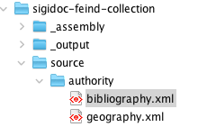
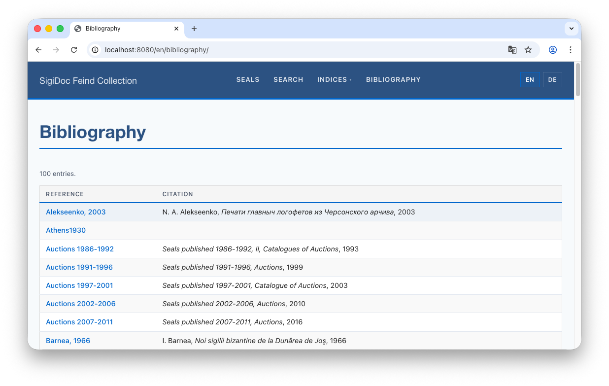
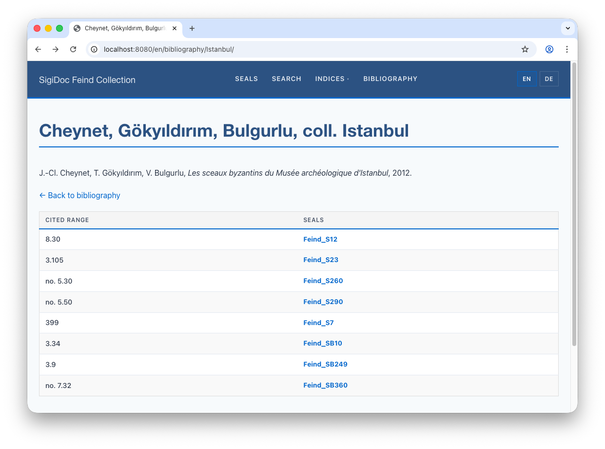
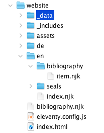
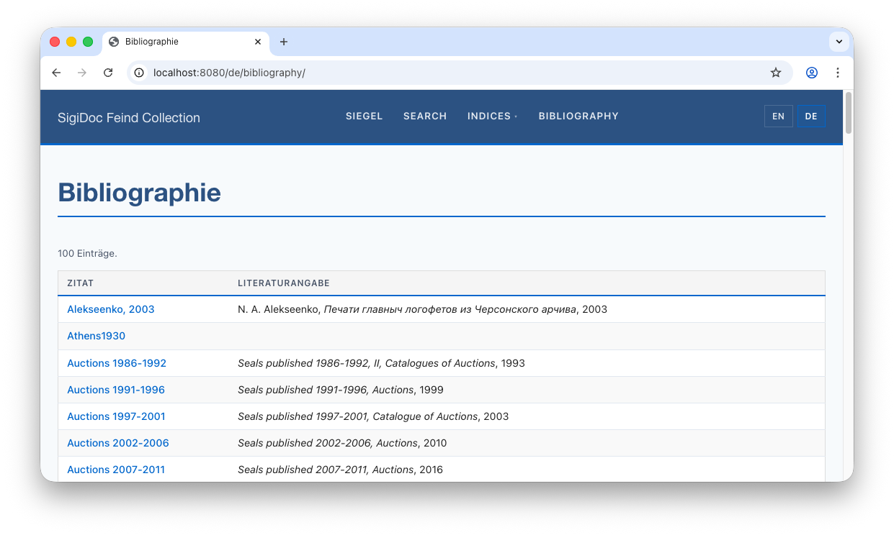
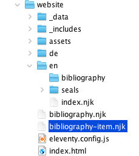
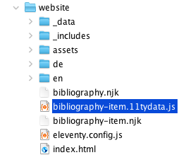
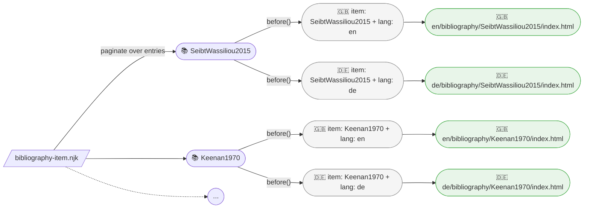
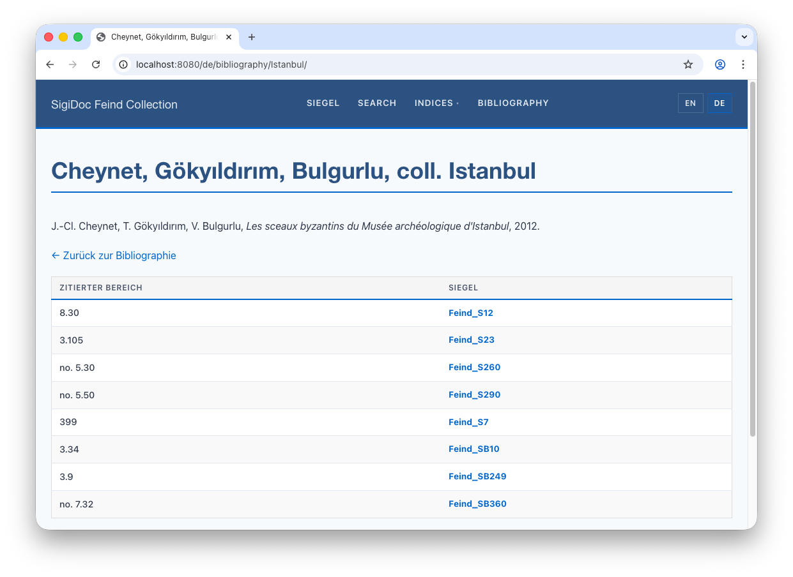
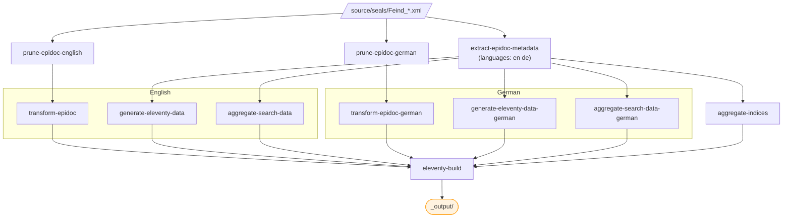

# Bibliography

We'll create two things: a **bibliography index** (a table listing all cited works) and **detail pages** (one per work, showing which seals cite it and where).

## Step 1: Add the Authority File

> [!info] We're working with: Source Files (source/authority/)


<div style="display: flex; gap: 2rem; align-items: flex-start; flex-wrap: wrap; margin: 1.5rem 0;">
<div style="flex: 1 1 300px; min-width: 0;">

Like the geography authority file for places, bibliography entries live in a shared authority file. Download `bibliography.xml` from the [SigiDoc authority repository](https://github.com/byzantinistik-koeln/authority) and save it to `source/authority/bibliography.xml`.

</div>
<div style="min-width: 0;">



</div>
</div>

Each entry has an ID, an abbreviated citation, and structured metadata:

```xml
<bibl type="book" xml:id="SeibtWassiliou2015">
    <bibl type="abbrev">Seibt &amp; Wassiliou-Seibt, 2015</bibl>
    <author><forename>W.</forename><surname>Seibt</surname></author>
    <author><forename>A.-K.</forename><surname>Wassiliou-Seibt</surname></author>
    <title level="m">Der byzantinische Mensch in seinem Umfeld...</title>
    <pubPlace>Hannover</pubPlace>
    <publisher>VML Vlg Marie Leidorf</publisher>
    <date>2015</date>
</bibl>
```

The seal XML references these entries by ID:

```xml
<bibl>
    <ptr target="SeibtWassiliou2015"/>, <citedRange unit="page">p. 66-7</citedRange>
</bibl>
```

## Step 2: Declare the Pipeline Dependency

> [!info] We're switching to: Pipeline Configuration (pipeline.xml)

In `pipeline.xml`, add the bibliography file as a parameter to the `extract-epidoc-metadata` node, just like we did for the geography file:

```xml
<xsltTransform name="extract-epidoc-metadata">
  <sourceFiles><files>source/seals/*.xml</files></sourceFiles>
  <stylesheet><files>source/metadata-config.xsl</files></stylesheet>
  <stylesheetParams>
    <param name="languages">en de</param>
    <param name="geography-file"> 
      <files>source/authority/geography.xml</files> 
    </param> 
    <param name="bibliography-file"> <!-- [!code ++] -->
	    <files>source/authority/bibliography.xml</files> <!-- [!code ++] -->
	</param> <!-- [!code ++] -->
  </stylesheetParams>
</xsltTransform>
```

> [!info] We're switching to: metadata extraction configuration (source/metadata-config.xsl)

And add the parameter declaration at the top of `metadata-config.xsl` (just below the geography parameter):

```xml
<xsl:import href="stylesheets/lib/extract-metadata.xsl"/>
    
<xsl:param name="geography-file" as="xs:string"/> 
<xsl:variable name="geography" select="document('file://' || $geography-file)"/> 

<xsl:param name="bibliography-file" as="xs:string"/> <!-- [!code ++] -->
<xsl:variable name="bibliography" select="document('file://' || $bibliography-file)"/> <!-- [!code ++] -->
```

## Step 3:  Add and Translate the Bibliography Index Definition

The scaffold includes a commented-out bibliography index definition and extraction template. Find them in `metadata-config.xsl` and uncomment both **the `<idx:index>` block** and **the `extract-bibliography` template** below it.

Let's translate the uncommented index definition using our known pattern:

```xml
<!-- [!code word:xml\:lang=\"en\"] -->
<!-- [!code word:xml\:lang=\"de\"] -->
<!-- [!code word:Seals] -->
<idx:index id="bibliography" nav="bibliography" order="10">
	<idx:title xml:lang="en">Bibliography</idx:title>
	<idx:title xml:lang="de">Bibliographie</idx:title> <!-- [!code ++] -->
	<idx:description xml:lang="en">Bibliographic references.</idx:description>
	<idx:description xml:lang="de">Bibliographische referenzen.</idx:description> <!-- [!code ++] -->
	<idx:columns>
		<idx:column key="shortCitation">
			<idx:label xml:lang="en">Citation</idx:label> 
			<idx:label xml:lang="de">Zitat</idx:label> <!-- [!code ++] -->
        </idx:column>
        <idx:column key="fullCitation">
	        <idx:label xml:lang="en">Full Citation</idx:label>
	        <idx:label xml:lang="de">Literaturangabe</idx:label> <!-- [!code ++] -->
        </idx:column>
        <idx:column key="references" type="references">
			<idx:label xml:lang="en">Seals</idx:label>
			<idx:label xml:lang="de">Siegel</idx:label> <!-- [!code ++] -->
        </idx:column>
    </idx:columns>
</idx:index>
```

Notice `nav="bibliography"`: this is different from the persons and places indices which use `nav="indices"` (the default). The header navigation filters by this value: the Indices dropdown only shows indices with `nav="indices"`, while Bibliography has its own hard-coded top-level menu entry. 

The extraction template that you just uncommented can be left as-is if your bibliographic encoding matches. It scans each seal for bibliography references, looks up the cited work in the authority file, and extracts citation data:

```xml
<xsl:template match="tei:TEI" mode="extract-bibliography">
    <xsl:for-each select=".//tei:body//tei:div//tei:bibl[tei:ptr[@target != '']]">
        <xsl:variable name="target" select="string(tei:ptr/@target)"/>
        <xsl:variable name="auth" select="$bibliography//tei:bibl[@xml:id = $target]"/>
        ...
        <entity indexType="bibliography" xml:id="{$target}">
            <bibRef><xsl:value-of select="$target"/></bibRef>
            <shortCitation>...</shortCitation>
            <fullCitation>
	            <authors>...</authors>  
                <title>...</title>  
				<pubPlace>...</pubPlace>  
				<publisher>...</publisher>  
				<date>...</date>
            </fullCitation>
            <citedRange>...</citedRange>
            <sortKey>...</sortKey>
        </entity>
    </xsl:for-each>
</xsl:template>
```

A few things to notice:

- **`xml:id="{$target}"`** uses the bibliography entry's ID for cross-document merging: citations to the same work from different seals are grouped into one index entry
- **One entity per `citedRange`**: if a seal cites a work at multiple locations ("p. 66" and "no. 43"), each gets its own entity. They merge by `xml:id`, but each reference keeps its specific `citedRange`
- **Structured `fullCitation`**: instead of plain text, the template extracts author, title, place, publisher, and date as separate child elements. The aggregation serializes these as a JSON object, and the bibliography template renders them with formatting (italic titles, etc.)

Also **uncomment the `extract-bibliography`** call in `extract-all-entities`:

```xml
<xsl:template match="tei:TEI" mode="extract-all-entities">
    <xsl:apply-templates select="." mode="extract-persons"/>
    <xsl:apply-templates select="." mode="extract-places"/>
    <xsl:apply-templates select="." mode="extract-bibliography"/>
</xsl:template>
```

## Step 4: Adapt Bibliography Pages

The scaffold includes bibliography website templates under `source/website/en/bibliography/`:

**`source/website/en/bibliography/index.njk`**: the list page. Shows a table with short citation (linked to detail page) and formatted full citation.

**`source/website/en/bibliography/item.njk`**: the detail page template. Eleventy paginates it over `indices.bibliography.entries` (one entry per page) and emits one HTML file per bibliography entry. Each page shows the full citation and a table of citing seals with their cited ranges. Pagination is configured in the template's YAML front matter (`pagination: data: indices.bibliography.entries`).

::: info Small project-specific tweaks
Open `source/website/en/bibliography/item.njk` and change `documentBasePath` from `/inscriptions` to `/seals` so the citing-document links in the table point at our seal pages. This is the same pattern we used in `index-persons.njk` and `index-places.njk` earlier:
```njk
<!-- [!code word:seals] -->
{# Where citing-document links should point. Change "inscriptions" to match  
   your collection's URL structure (e.g. "seals" for sigillographic projects). #}
 <!-- [!code highlight] -->
```

We could also change the *Documents* column header to *Seals* forther down:
```html
<!-- [!code word:Seals] -->
  
<table class="data-table index-table">  
    <thead>  
        <tr>  
            <th>Cited range</th>  
            <th>Seals</th>  <!-- [!code highlight] -->
        </tr>  
    </thead> 
```
:::

After rebuild, switch to the preview and navigate to the Bibliography page (`🌎 /en/bibliography/`). You should see a table of all cited works:



Click an entry to see its detail page: the full citation and which seals cite it, with specific page/section references.



## Step 5: Add German Support

Like the seals, indices, and search pages in the [multi-language tutorial](./multi-language), the bibliography templates move from `source/website/en/` to the root of `source/website/` and gain language pagination. The list page follows the same simple-pagination pattern you've already used. The item template introduces a new pattern, **cross-product pagination**, because each entry needs its own page in each language.

### Move the list template


<div style="display: flex; gap: 2rem; align-items: flex-start; flex-wrap: wrap; margin: 1.5rem 0;">
<div style="flex: 1; min-width: 0;">

Rename `source/website/en/bibliography/index.njk` to `bibliography.njk` and move it to `source/website/bibliography.njk`. Replace the front matter with the paginated form (same shape as `seals.njk`):

</div>
<div style="min-width: 0;">



</div>
</div>

```njk
---
layout: layouts/base.njk
permalink: "{{ langCode }}/bibliography/index.html"
pagination:
    data: languages.codes
    size: 1
    alias: langCode
eleventyComputed:
    title: "{{ 'bibliography' | t }}"
---
```

It already uses `page.lang` for language-aware rendering, so it works for both English and German once Eleventy paginates it over both. 

Replace the few strings (such as the column headers) in the template body with translation lookup using the `| t ` filter:

```njk{4,9-10}
<!-- [!code word:\{\{ \"entries\" | t }}] -->
<!-- [!code word:\{\{ \"reference\" | t }}] -->
<!-- [!code word:\{\{ \"citation\" | t }}] -->
<p class="entry-count-info">{{ indices.bibliography.entries | length }} {{ "entries" | t }}.</p>
  
<table class="data-table index-table">  
    <thead>  
        <tr>  
            <th>{{ "reference" | t }}</th>
            <th>{{ "citation" | t }}</th>
        </tr>  
    </thead>
```

Make sure to add entries for the new translation keys `entries`, `reference`, and `citation` to the translation files in `/source/website/_data/translations`.

The bibliography list should now be available in German at `🌎 /de/bibliography/`:



### Move the item template

<div style="display: flex; gap: 2rem; align-items: flex-start; flex-wrap: wrap; margin: 1.5rem 0;">
<div style="flex: 1 1 300px; min-width: 0;">

Rename `source/website/en/bibliography/item.njk` to `bibliography-item.njk`,  move it to the website root at  `source/website/bibliography-item.njk` and adapt the front matter:

</div>
<div style="min-width: 0;">



</div>
</div>

`source/website/bibliography-item.njk`:
```njk
---
layout: layouts/base.njk
permalink: "{{ item.lang }}/bibliography/{{ item.bibRef[item.lang] }}/index.html"
eleventyComputed:
    title: "{{ item.shortCitation[item.lang] or item.shortCitation.en }}"
---
{# ...the rest of the file (documentBasePath set + rendering markup) stays unchanged. #}
```

Two changes from the single-language version:

- The `permalink` and `eleventyComputed.title` now use `item.lang` and the language-keyed lookups (`item.bibRef[item.lang]`, `item.shortCitation[item.lang]`). The `item.lang` field is supplied by the sidecar file we add next.
- The `pagination:` block is gone from the front matter, it's also moving to the sidecar file.

Also translate the column headers and the "back" link using translation key lookup with the `| t`filter:

`source/website/bibliography-item.njk`:
```html
<!-- [!code word:\{\{ \"citedRange\" | t }}] -->
<!-- [!code word:\{\{ \"seals\" | t }}] -->
<!-- [!code word:\{\{ \"backToBibliography\" | t }}] -->
<!-- ... -->
<p><a href="/{{ page.lang }}/bibliography/">&larr; {{ "backToBibliography" | t }}</a></p> <!-- [!code highlight] -->

  
<table class="data-table index-table">  
	<thead>
	<tr>
		<th>{{ "citedRange" | t }}</th>  <!-- [!code highlight] -->
        <th>{{ "seals" | t }}</th>  <!-- [!code highlight] -->
    </tr>  
</thead>
<!-- ... -->
```

And add a translation entry for the new `citedRange` and `backToBibliography` keys in the translation files in `source/website/_data/translations`.

### Create the JavaScript pagination sidecar

<div style="display: flex; gap: 2rem; align-items: flex-start; flex-wrap: wrap; margin: 1.5rem 0;">
<div style="flex: 1 1 300px; min-width: 0;">

So far, all the pagination configurations you've seen have lived in front matter inside the template itself (e.g. `seals.njk`, `index-persons.njk`). Front matter is enough when pagination just needs to read a data array and chunk it. But bibliography items need to *transform* the data array first (multiplying entries × languages) and that transform is a JavaScript function. YAML can't hold a function, so Eleventy's solution is a sibling JavaScript file with the same base name as the template: `bibliography-item.11tydata.js` next to `bibliography-item.njk`.

</div>
<div style="min-width: 0;">



</div>
</div>

Create `source/website/bibliography-item.11tydata.js` and paste in the following content:

```js
// Cross-product pagination: one page per bibliography entry × language.
// Each entry is expanded into N items (one per language), so Eleventy
// produces /en/bibliography/{id}/, /de/bibliography/{id}/, etc.
module.exports = {
    pagination: {
        data: "indices.bibliography.entries",
        size: 1,
        alias: "item",
        before(entries, fullData) {
            const langs = fullData.languages?.codes || ['en'];
            return entries.flatMap(entry =>
                langs.map(lang => ({ lang, ...entry }))
            );
        }
    }
};
```

::: details Technical: How does this work?
The `data`, `size`, and `alias` keys mirror what was in the YAML front matter. The new piece is `before()`: a function Eleventy calls *before* paginating. It receives the resolved `data` array (the bibliography entries), returns a transformed array, and Eleventy paginates over the new array.

Concretely: `before()` receives the bibliography entries, returns N × L items (one per entry per language), each a shallow copy of the entry with a `lang` field attached. The template then uses `item.lang` in its `permalink` to route each item to the right language URL.

The flow looks like this:



:::

::: details Recap: three pagination patterns
You've now used all three Eleventy pagination shapes:

| Pattern | Where | Data source |
|---|---|---|
| Simple, over a fixed array | `seals.njk`, `indices.njk`, `search.njk`, `index-persons.njk`, `index-places.njk` | `data: languages.codes` |
| Simple, over a data collection | the scaffolded `en/bibliography/item.njk` (single-language form, before this step) | `data: indices.bibliography.entries` |
| **Cross-product** (transformed data) | `bibliography-item.njk` (this step) | `data: indices.bibliography.entries` plus `before()` transform |

The first two are configurable in YAML front matter inside the template. The third needs a JavaScript sidecar, because the `before()` transform is a function.
:::

After rebuilding, navigate to the German bibliography page (`🌎 /de/bibliography/`) and click any entry to see its German detail page. The entries themselves remain in their original encoding (author names, titles), but the page title, table headers, and "Back to bibliography" link are translated.



## What We've Built

The complete pipeline now looks like this:



One source XML file now produces:
- HTML seal pages (English + German)
- Sidecar data files (English + German)
- Person, place, and bibliography index entries
- Search data (English + German)

All connected by cross-references: seals link to bibliography, bibliography links back to seals, indices link to seals.
