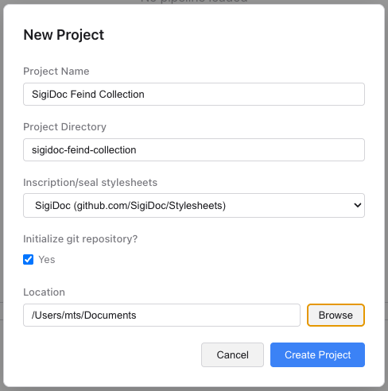
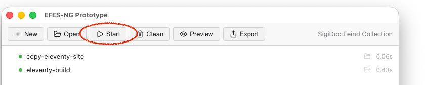
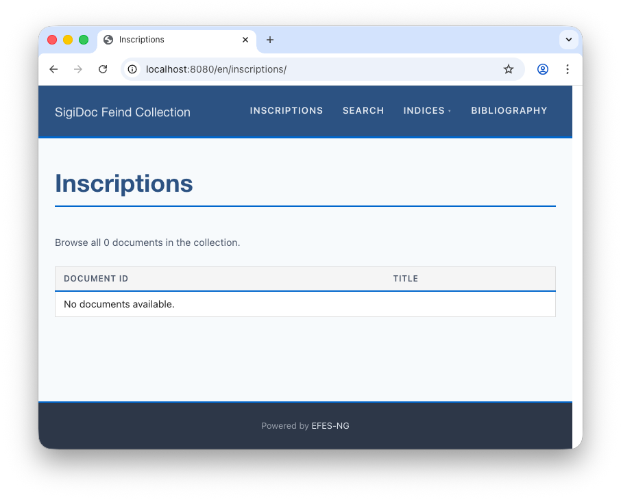

# Creating a Project

The fastest way to start a new project is with the built-in project generator, which creates a new projects from the included **scaffold**.

In the desktop application, click **New** in the toolbar. The assistants will ask you to provide some information about your project.



To create your new project:

1. Enter a **name for your project**, for example "*SigiDoc Feind Collection*"
2. Enter a **folder name** for your project. The assistant will automatically suggest one based on the project name, e.g. "*sigidoc-feind-collection*".
3. Choose **SigiDoc** from the stylesheets dropdown
4. Leave **Initialize git repository** checked.
5. **Choose a folder** where your project will be saved

Then click **Create Project**. The app will generate the project and open it automatically. The SigiDoc stylesheet will be automatically added to your project as a git submodule. 

::: details Command-line alternative
You can also create a project from the terminal:

```bash
npx create-efes-ng my-sigidoc-project
```
:::

## What Just Happened?

The generator scaffolded a project directory with this structure:

```
my-sigidoc-project/
├── efes-ng.rng                     # Pipeline XML Validation schema 
├── my-sigidoc-project.xpr          # Pre-configured Oxygen project 
├── pipeline.xml                    # Pipeline definition
├── source/
│   ├── stylesheets/
│   │   ├── sigidoc/                # SigiDoc stylesheets (cloned)
│   │   ├── lib/                    # Framework-provided XSLT
│   │   │   ├── epidoc-to-html.xsl
│   │   │   ├── extract-metadata.xsl
│   │   │   ├── create-11ty-data.xsl
│   │   │   ├── aggregate-indices.xsl
│   │   │   ├── aggregate-search-data.xsl
│   │   │   └── prune-to-language.xsl
│   │   └── overrides.xsl            # Your project-level EpiDoc overrides
│   ├── authority/                   # Controlled vocabularies (empty)
│   ├── translations/                # UI label translations for EpiDoc/SigiDoc stylesheets
│   │   └── messages_en.xml
│   ├── website/                     # Website templates & assets
│   │   ├── _data/                   # Shared data to use in Eleventy templates
│   │   ├── _includes/
│   │   │   ├── layouts/
│   │   │   │   ├── base.njk        # Root HTML layout
│   │   │   │   └── document.njk    # Document page layout
│   │   │   ├── header.njk          # Header for all pages
│   │   │   └── footer.njk          # Footer for all pages
│   │   ├── assets/
│   │   │   ├── css/                # CSS Stylesheets
│   │   │   │   ├── base.css        
│   │   │   │   ├── epidoc.css      # Stylesheets for EpiDoc/SigiDoc HTML output
│   │   │   │   └── project.css     # Your custom project styles
│   │   │   ├── fonts/              # Self-hosted web fonts
│   │   │   └── vendor/             # Third-party libraries (Foundation, jQuery)
│   │   ├── en/
│   │   │   └── index.njk           # Homepage
│   │   └── eleventy.config.js      # Static site generator config
│   └── metadata-config.xsl         # Index & search configuration
```

::: details What are all these files?
- **`pipeline.xml`**: defines the processing steps that transform your XML into a website (more on this shortly)
- **`source/stylesheets/sigidoc/`**: the upstream SigiDoc XSLT stylesheets, cloned from the official repository
- **`source/stylesheets/lib/`**: [Framework-provided stylesheets](../reference/library-stylesheets.md) for use in typical projects
- **`source/stylesheets/overrides.xsl`**: a place for your [project-specific EpiDoc/SigiDoc XSLT overrides](../guide/xslt-overrides.md) (when using the provided `epidoc-to-html.xsl`, empty by default)
- **`source/translations/`**: [translation files](../guide/multi-language-architecture.md) for UI labels in the EpiDoc/SigiDoc XSLT output (e.g., "Material", "Type", "Dating")
- **`source/website/`**: the website template: HTML layouts, CSS, and the homepage
- **`source/website/eleventy.config.js`**: configures the Eleventy static site generator (language detection, translation filter)
- **`source/metadata-config.xsl`**: configures which metadata fields to extract for indices and search
- **`source/authority/`**: will hold your controlled vocabulary XML files (geography, bibliography, etc.)
:::

> [!tip]
> The project structure is flexible: you can organize your source files however you like. But we recommend following this structure, which is what the documentation and examples use. See [Designing Sustainable projects](../guide/designing-sustainable-projects.md) for the rationale behind this structure.

## First Build

Let's build the project to see what we have. Open the project folder in the EFES-NG Prototype desktop application and click **Start**.



The pipeline will run through its steps and generate the website. Once complete, click **Preview** to open it in your browser. Usually, the preview is served under the address `http://localhost:8080`.

You should see a generic site with a header, navigation, and footer, but if you navigate to *Inscriptions*, there is no content yet. That's expected: we haven't added any XML source documents.


Next, let's understand what the pipeline is doing: [Exploring the Project →](./explore-project)
