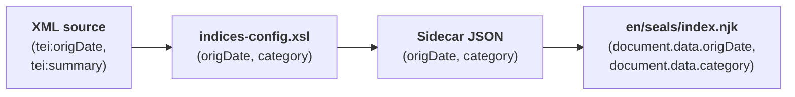

# Customizing the Seal List

The seal list currently shows two columns: Document ID and Title. Let's add Dating and Category columns so readers can browse seals by date and type.

This involves both worlds: first we add the metadata fields in the XSLT configuration, then we add the table columns in the website template.

## Step 1: Add Metadata Fields

> [!info] We're working with: XSLT Configuration (source/indices-config.xsl)

Open `source/indices-config.xsl` and find the `extract-metadata` template. You'll see two commented-out lines:

```xml
<!-- Uncomment to add more page metadata fields:
<origDate><xsl:value-of select="string-join(//tei:origDate, ', ')"/></origDate>
<category><xsl:value-of select="string-join(//tei:msContents/tei:summary/normalize-space(.), ', ')"/></category>
-->
```

Uncomment them so they're active:

```xml
<origDate><xsl:value-of select="string-join(//tei:origDate, ', ')"/></origDate>
<category><xsl:value-of select="string-join(//tei:msContents/tei:summary/normalize-space(.), ', ')"/></category>
```

These extract two fields from each seal's XML:
- **`origDate`** — the dating information from the `<origDate>` element (e.g., "mid-10th c.")
- **`category`** — the seal category from the `<summary>` element (e.g., "Provincial administration.")

## Step 2: Verify the Data

Rebuild and inspect the results. Open a metadata XML file (click the **folder icon** next to `extract-epidoc-metadata`) — you should see the new fields in the `<page>` section:

```xml
<page xml:lang="en">
    <language>en</language>
    <title>Seal of N. imperial protospatharios ...</title>
    <sortKey>Feind.Kr.00001.</sortKey>
    <origDate>mid-10th c.</origDate>
    <category>Provincial administration.</category>
</page>
```

The sidecar JSON files now include these fields too — open a `.11tydata.json` file in `_assembly/en/seals/` to confirm:

```json
{
  "layout": "layouts/document.njk",
  "tags": "seals",
  "documentId": "Feind_Kr1",
  "title": "Seal of N. imperial protospatharios ...",
  "origDate": "mid-10th c.",
  "category": "Provincial administration."
}
```

The data flows from your XML source through the metadata extraction into the sidecar JSON — now we just need to display it.

## Step 3: Add Table Columns

> [!info] We're switching to: Website Templates (source/website/)

Open `source/website/en/seals/index.njk`. You'll see a commented-out Dating column:

```html
{# To add a column, uncomment below and add the corresponding field to indices-config.xsl #}
{# <th>Dating</th> #}
```

Uncomment the `<th>` and its matching `<td>`, then add a Category column:

```html
<thead>
<tr>
    <th>Document ID</th>
    <th>Title</th>
    <th>Category</th>
    <th>Dating</th>
</tr>
</thead>
```

And in the `` loop:

```html
<tr>
    <td><a href="{{ document.url }}">{{ document.data.documentId }}</a></td>
    <td>{{ document.data.title }}</td>
    <td>{{ document.data.category }}</td>
    <td>{{ document.data.origDate }}</td>
</tr>
```

Notice how `document.data.category` and `document.data.origDate` match the field names from the sidecar JSON — which in turn match the element names in `indices-config.xsl`. The names you choose in the XSLT are the names you use in the template.

::: details How does Eleventy make this data available?
When Eleventy finds a `.11tydata.json` file next to an `.html` file, it reads the JSON and attaches all its fields to that page. In the seal list template, `` loops over all seal pages — and `document.data` gives you access to everything from the corresponding sidecar JSON.

**1. XML source** (`Feind_Kr1.xml`):
```xml
<origDate notBefore="0941" notAfter="0960">mid-10th c.</origDate>
```
**2. You extract it** in `indices-config.xsl`:
```xml
<origDate><xsl:value-of select="string-join(//tei:origDate, ', ')"/></origDate>
```
**3. It appears in the metadata XML** (`extract-epidoc-metadata` output):
```xml
<origDate>mid-10th c.</origDate>
```
**4. It ends up in the sidecar JSON** (`Feind_Kr1.11tydata.json`):
```json
"origDate": "mid-10th c."
```
**5. You display it** in the template (`index.njk`):
```html
{{ document.data.origDate }}
```

This means any field you add in `indices-config.xsl` automatically becomes available in templates as `document.data.yourFieldName`. 
:::

## See It Work

Rebuild and open the seal list. You should now see four columns — Document ID, Title, Category, and Dating — populated with data extracted from each seal's XML source.

This is the full data flow in action:



To add more columns, repeat this pattern: add an extraction element in `indices-config.xsl`, then add the `<th>` and `<td>` in the template. The element name you choose becomes the field name in the JSON and the property name in the template.

Next, let's add browsable indices — [Indices →](./indices)
