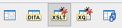
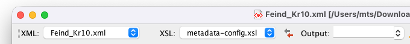
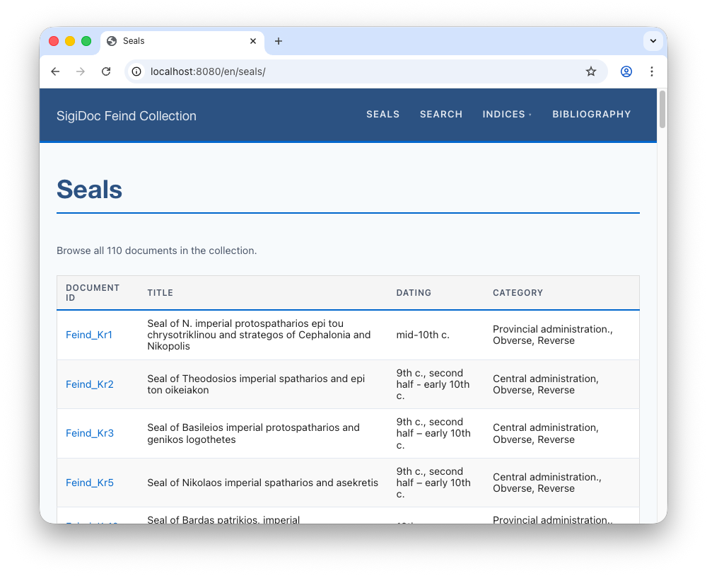
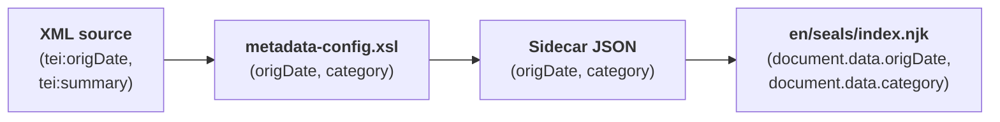

# Customizing the Seal List

The seal list currently shows two columns: Document ID and Title. Let's add Dating and Category columns. First we add the metadata fields in the metadata extraction configuration, then we add the table columns in the website template.

## Step 1: Add Metadata Fields

> [!info] We're working with: metadata extraction configuration (source/metadata-config.xsl)

Open `source/metadata-config.xsl` and find the `extract-metadata` template. You'll see two commented-out lines:

```xml
<xsl:template match="tei:TEI" mode="extract-metadata">
	<!-- ... -->

	<!-- Uncomment to add more page metadata fields:
	<origDate><xsl:value-of select="string-join(//tei:origDate, ', ')"/></origDate>
	<category><xsl:value-of select="string-join(//tei:msContents/tei:summary/normalize-space(.), ', ')"/></category>
	-->
	
	<!-- ... -->
</xsl:template>
```

Uncomment them so they're active:

```xml
<xsl:template match="tei:TEI" mode="extract-metadata">
	<!-- ... -->

	<origDate><xsl:value-of select="string-join(//tei:origDate, ', ')"/></origDate>
	<category><xsl:value-of select="string-join(//tei:msContents/tei:summary/normalize-space(.), ', ')"/></category>
	
	<!-- ... -->
</xsl:template>
```

These extract two fields from the SigiDoc XML:
- **`origDate`**: the dating information from the `<origDate>` element (e.g., "mid-10th c.")
- **`category`**: the seal category from the `<summary>` element (e.g., "Provincial administration")
## Step 2: Verify the Data

After the pipeline rebuilt, inspect the results. Open a metadata XML file (click the **folder icon** next to `extract-epidoc-metadata` to see them). You should find the new fields in the `<page>` section:

```xml
<metadata>
	<!-- ... -->
	
	<page>
	    <title xml:lang="en">Seal of N. imperial protospatharios ...</title>
	    <sortKey xml:lang="en">Feind.Kr.00001.</sortKey>
	    <origDate xml:lang="en">  
                        10th c.  
                        10. Jh.  
                        10ος αι.  
        </origDate>
	    <category xml:lang="en">Provincial administration</category>
	</page>
	
	<!-- ... -->
</metadata>
```

> [!tip] Using Oxygen XML Editor to test metadata extraction
> This is a good opportunity to test the `extract-metadata` transformation scenario using your Oxygen project. While customising metadata extraction by adapting your `metadata-config.xsl`, it is often easier to test changes directly in Oxygen instead of waiting for a pipeline rebuild, finding the result files and opening them for inspection. See the [Oxygen Project](../guide/oxygen-project.md#extract-metadata) guide page to see how it works. In short:
>  
> 1. Switch the Oxygen user interface to XSLT debug mode by selecting the "XSLT" button in the upper right corner. This mode shows input XML, XSLT, and output side by side.  
>    
> 2. Open a seal file (e.g., `source/seals/Feind_Kr10.xml`)
> 3. Open `source/metadata-config.xsl`
> 4. Select the seal XML as input file and `metadata-config.xsl` as XSL file. Leave the *Output* field empty:
> 
> 5. Click the transform button with the arrow icon in the XSL toolbar:
> 
> The transformed output appears in the *Output* sidebar where you can see exactly what was extracted for each field. You can change the input XML or XSLT, click *Transform* again, and you can immediately see what changed in the output.

## Step 3: Fix date and category extraction for SigiDoc encoding

After uncommenting the `origDate` and `category` extraction code in `metadata-config.xsl`, you might have noticed that the resulting `origDate` field in the extracted metadata looks off:

```xml
<origDate xml:lang="en">  
	10th c.  
	1. Jh.  
	10ος αι.  
</origDate>
<category xml:lang="en">Provincial administration. Provinzialverwaltug Μολυβδόβουλλα αξιωματούχων της περιφερειακής διοίκησης., Obverse, Reverse</category>
```

Instead of only a dating, we have three values, each on a new line, in different languages. For `category`, it is similar. The reason for both issues is the same, so let's focus on fixing the `origDate` extraction first:

The example `origDate` extraction code is designed for mono-lingual EpiDoc editions and expects `origDate` elements in the encoded source with simple text content, such as:

```xml{5}
<origDate
	notBefore="0301"
	notAfter="0400"
	precision="low"
	evidence="titulature">Fourth century CE</origDate>
```

But in multilingual SigiDoc encoding, `origDate` is encoded like this:

```xml{7-9}
<origDate type="analysis"
	notBefore="0901"
	notAfter="1000"
	evidence="iconography"
	cert="low"
	resp="MC">
		<seg xml:lang="en">10th c.</seg>
		<seg xml:lang="de">10. Jh.</seg>
		<seg xml:lang="el">10ος αι.</seg>
</origDate>
```

Instead of simple string content, `tei:origDate` contains a series of `tei:seg`  elements each containing the dating in a specific language. Since we are currently building the English-only website, we need to adapt our `origDate` extraction XPath to select the content of the English `seg` element (in the `extract-metadata-template` in `metadata-config.xsl`):

```xml
<origDate><xsl:value-of select="string-join(//tei:origDate, ', ')"/></origDate> <!--[!code rm]-->
<origDate><xsl:value-of select="string-join(//tei:origDate/tei:seg[@xml:lang='en'], ', ')"/></origDate><!--[!code ++]-->
```

This way, we get exactly the output we need in the extracted metadata, which is a single english-language string for `origDate`:
```xml
<!-- [!code word:10th c.] -->
<page>  
      <title xml:lang="en">Seal of Bardas patrikios, imperial protospatharios, and strategos of Anatolikoi</title>  
      <sortKey xml:lang="en">Feind_Kr00010</sortKey>  
      <origDate xml:lang="en">10th c.</origDate>  <!-- [!code highlight] -->
      <category xml:lang="en">Provincial administration. Provinzialverwaltug Μολυβδόβουλλα αξιωματούχων της περιφερειακής διοίκησης., Obverse, Reverse</category>  
</page>
```

You'll notice `category` still doesn't look right – it has a similar issue as `origDate` has. Let's make the extraction XPath in `metadata-config.xsl` more specific to target exactly the English-language `tei:seg` in the seal's `tei:summary` element:

```xml
<!-- [!code word:/tei\:seg[@xml\:lang='en'\]/] -->
<category><xsl:value-of select="string-join(//tei:msContents/tei:summary/normalize-space(.), ', ')"/></category> <!-- [!code rm] -->
<category><xsl:value-of select="string-join(//tei:msContents/tei:summary/tei:seg[@xml:lang='en']/normalize-space(.), ', ')"/></category> <!-- [!code ++] -->
```


::: info
The sidecar JSON files now include these fields too. Open a `.11tydata.json` file in `_assembly/en/seals/` to confirm:
```json
{
  "layout": "layouts/document.njk",
  "tags": "seals",
  "documentId": "Feind_Kr1",
  "title": "Seal of N. imperial protospatharios ...",
  "origDate": "mid-10th c.", // [!code highlight]
  "category": "Provincial administration."  // [!code highlight]
}
```
:::


The data flows from your XML source through the metadata extraction into the sidecar JSON. Now we just need to display it.

## Step 4: Add Table Columns

> [!info] We're switching to: Website Templates (source/website/)

Open `source/website/en/seals/index.njk`. You'll see a commented-out Dating column:

```njk{8}
<!-- ... -->
<table class="data-table">  
    <thead>  
    <tr>  
        <th>Document ID</th>  
        <th>Title</th>  
        {# To add a column, uncomment below and add the corresponding field to metadata-config.xsl #}  
        {# <th>Dating</th> #}  

    </tr>  
    </thead>
```

Uncomment the Dating `<th>` (table header, highlighted above) by removing the wrapping `{#` and `#}` (these mark columns in the Nunjucks template language), then add a Category column header:

```njk{8-9}
<!-- ... -->
<table class="data-table">  
    <thead>  
    <tr>  
        <th>Document ID</th>  
        <th>Title</th>  
        {# To add a column, uncomment below and add the corresponding field to metadata-config.xsl #}  
        <th>Dating</th>  
        <th>Category</th>
    </tr>  
    </thead>
```

And in the `` loop a few lines down, do the same for the matching `<td>`s (table cells) – uncomment the `origDate` cell by removing `{#` and `#}`, then add the cell for `category`:

```html
<!-- ... -->
  
	<tr>  
		<td><a href="{{ document.url }}">{{ document.data.documentId }}</a></td> 
		<td>{{ document.data.title }}</td>  
		<td>{{ document.data.origDate }}</td> <!-- [!code highlight] -->
		<td>{{ document.data.category }}</td> <!-- [!code highlight] -->
	</tr>  

<!-- ... -->
```

Notice how `document.data.category` and `document.data.origDate` match the field names from the sidecar JSON, which in turn match the element names in `metadata-config.xsl`. The names you choose in the XSLT are the names you use in the template.

::: details How does Eleventy make this data available?
When Eleventy finds a `.11tydata.json` file next to an `.html` file, it reads the JSON and attaches all its fields to that page. In the seal list template, `` loops over all seal pages, and `document.data` gives you access to everything from the corresponding sidecar JSON.

**1. XML source** (`Feind_Kr1.xml`):
```xml
<origDate notBefore="0941" notAfter="0960">mid-10th c.</origDate>
```
**2. You extract it** in `metadata-config.xsl`:
```xml
<origDate><xsl:value-of select="string-join(//tei:origDate, ', ')"/></origDate>
```
**3. It appears in the metadata XML** (`extract-epidoc-metadata` output):
```xml
<origDate>mid-10th c.</origDate>
```
**4. It ends up in the sidecar JSON** (`Feind_Kr1.11tydata.json`):
```json
"origDate": "mid-10th c."
```
**5. You display it** in the template (`index.njk`):
```html
{{ document.data.origDate }}
```

This means any field you add in `metadata-config.xsl` automatically becomes available in templates as `document.data.yourFieldName`. 
:::

## See It Work

Rebuild and open the seal list. You should now see four columns (Document ID, Title, Category, and Dating) populated with data extracted from each seal's XML source.



This is the full data flow in action:



To add more columns, repeat this pattern: add an extraction element in `metadata-config.xsl`, then add the `<th>` and `<td>` in the template. The element name you choose becomes the field name in the JSON and the property name in the template.

Next, let's add browsable indices: [Indices →](./indices)
