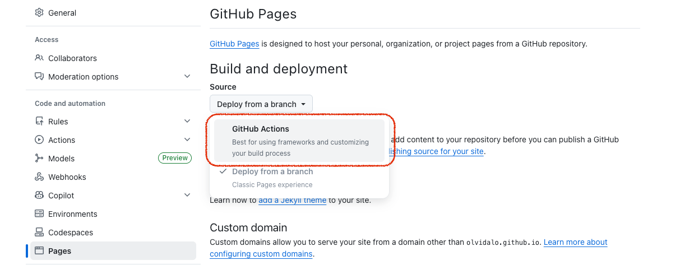

# Deploying

Your edition is ready. Let's publish it so anyone can access it online.

## Deploy to GitHub Pages

::: note
This requires to maintain your project as a git repository (the scaffold initialises one by default), commit all your files and push them to a remote repository on GitHub.
:::

The scaffold includes a GitHub Actions workflow that automatically builds and deploys your site on every push. Setup takes one step:

1. Go to your repository on GitHub
2. Click **Settings** > **Pages**
3. Under **Source**, select **GitHub Actions**
4. Click **Save**

Push to `main` and your site will be live at `https://your-username.github.io/your-repo-name/` within a few minutes. If you already pushed before enabling Pages, go to **Actions** > **Deploy to GitHub Pages** > **Run workflow** to trigger the first build manually.

> [!tip] First build
> The first build takes longer (several minutes for large collections) because it processes every file from scratch. Subsequent builds are much faster thanks to caching.

For more details on build caching, clean builds, custom domains, and other hosting options, see [Publishing Your Site](/guide/deployment).

## Export for Other Hosting

If you prefer to deploy to another platform (Netlify, your own server, etc.), use the desktop app's **Export** button to build the site and save it to a folder. See [Publishing Your Site](/guide/deployment) for all options.
