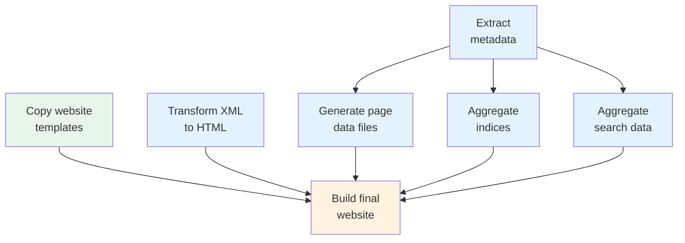

# Exploring the Project

Before adding content, let's understand what we generated. Open `pipeline.xml` in a text editor (or in [Oxygen XML Editor](https://www.oxygenxml.com/), if you have it).

## The Pipeline

A pipeline is a series of processing steps, called **nodes**, that transform your source files into a website. Think of it as a recipe: each step takes some input, does something with it, and produces output that the next step can use.

Here's a simplified view of what a typical pipeline does:



Each box is a **node**. The arrows show how data flows between them: the "Extract metadata" node feeds into "Generate page data files", "Aggregate indices", and "Aggregate search data". Nodes that don't depend on each other (like "Copy website templates" and "Transform XML to HTML") run in parallel.

::: details Technical: Directed Acyclic Graphs (DAGs)
This kind of structure is called a *directed acyclic graph* (DAG) in computer science. "Directed" means data flows in one direction (from input to output). "Acyclic" means there are no loops: a node can never depend on its own output, directly or indirectly.

The pipeline automatically figures out the correct execution order from the dependency graph. You don't need to specify the order yourself. Just declare what each node needs as input, and the pipeline handles the rest.
:::

## Reading the Pipeline XML

Let's look at the actual `pipeline.xml`. Every pipeline starts with a root element and some metadata:

```xml
<?xml version="1.0" encoding="UTF-8"?>
<pipeline name="My SigiDoc Project">
  <meta siteDir="_output"/>

  <!-- Nodes go here -->
</pipeline>
```

The `name` is a display label. `siteDir` tells the live preview server which directory contains the pipeline's final output, so it can serve and preview that directory.

### Nodes

Each node is an XML element inside `<pipeline>`. The element name determines the **type** of node, and the `name` attribute gives it a unique identifier. Let's walk through the nodes you'll find in the generated pipeline.

#### Copying the Website Template

```xml
<copyFiles name="copy-eleventy-site">
  <sourceFiles><files>source/website/**/*</files></sourceFiles>
  <output to="_assembly" stripPrefix="source/website"/>
</copyFiles>
```

This node copies the website template files (layouts, CSS, homepage) into the `_assembly` directory. It's the simplest kind of node: take files from here, put them there.

::: details What does `<files>source/website/**/*</files>` mean?
The `<files>` element contains a *glob pattern*, a way to describe a set of files using wildcards. `**/*` means "all files in all subdirectories". So `source/website/**/*` matches every file inside the `source/website/` folder.

Other common patterns:
- `source/seals/*.xml`: all XML files directly in the `seals/` folder
- `source/**/*.xml`: all XML files anywhere under `source/`
- `source/stylesheets/lib/epidoc-to-html.xsl`: a single specific file
:::

#### Commented-Out Nodes

You'll also notice several commented-out nodes in the generated pipeline, for XSLT transformations, metadata extraction, index aggregation, and more. These are templates we'll uncomment and configure in the [next steps](./adding-content) when we add content to the project. For now, just note that they're there.

#### The Final Build

```xml
<eleventyBuild name="eleventy-build">
  <sourceDir><collect>_assembly</collect></sourceDir>
  <output to="_output"/>
</eleventyBuild>
```

The last node uses [Eleventy](https://www.11ty.dev/) to build the final website from everything that was assembled in the `_assembly` directory. The `<collect>` element is another way to declare dependencies. We'll explain how it works later, once you're familiar with `<files>` and `<from>`.

<!-- TODO: Move this explanation to a later tutorial step (after <files> and <from> are familiar):

::: details What does `<collect>` do?
The `<collect>` element creates an implicit dependency on *all* nodes that write files into the specified directory. Since multiple nodes write into `_assembly/` (the template copy, the HTML transforms, the data files, the indices), this single `<collect>` ensures the Eleventy build waits for all of them to finish.
:::

-->

::: details What is a static site generator?
A static site generator (SSG) takes content files and templates and produces a complete set of HTML pages: a "static" website that can be served by any web server without a database or application runtime.

[Eleventy](https://www.11ty.dev/) is the SSG used in this prototype. It processes the [Nunjucks](https://mozilla.github.io/nunjucks/) templates in the `source/website/` directory, wrapping the HTML fragments produced by XSLT into complete pages with headers, footers, and navigation.

Using Eleventy is one possible choice. The pipeline system is flexible enough that other generators (or even a pure XSLT-based approach) could be used instead. This documentation focuses on using Eleventy.
:::

## Viewing the Pipeline in the GUI

The desktop application shows the pipeline as a node list with real-time status. Open your project and you'll see each node listed. Click any node to inspect its configuration, dependencies, and outputs in the side panel.

When you click **Start**, you can watch the nodes execute. Independent nodes run in parallel, and each node shows a progress counter as it processes files.

Now that we understand the pipeline structure, let's customize the site: [Customizing the Site →](./customize-site)
