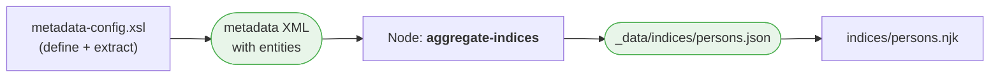
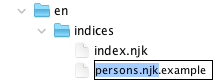
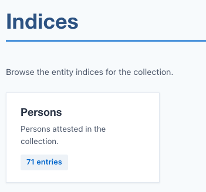
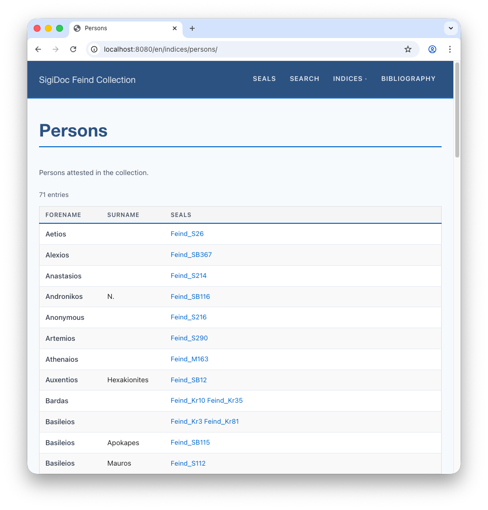
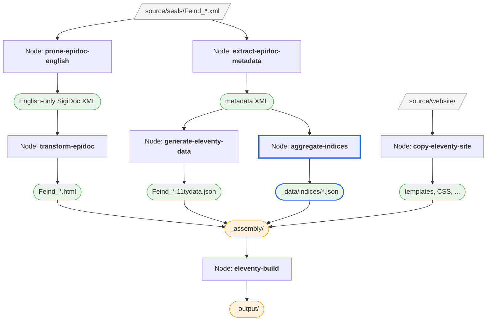

# Indices

The seal pages and seal list work, but the Indices section is still empty. Indices are browsable tables that collect entities (persons, places, dignities, offices) extracted from across all your documents. Let's add one.

## How Indices Work

An index configuration has three parts:

1. **Definition**: in `metadata-config.xsl`, an `<idx:index>` block declares the index (its ID, title, and column layout)
2. **Extraction**: an XSLT template finds the relevant entities in each XML source file and outputs `<entity>` elements
3. **Aggregation**: a pipeline node combines all extracted entities across documents into a single JSON file that can be read by Eleventy

The data flows like this:



We already have the extraction step (`extract-epidoc-metadata`), but its `<entities>` section was empty because we hadn't defined any indices yet. Let's fix that.

> [!tip] See also
> This page walks through one specific index for the Feind project. For the broader picture, including the `<idx:index>` schema, the three hook templates, multilingual handling, and entity merging across documents, see the [Metadata Configuration](/guide/metadata-config) guide.

## Step 1: Adding a Persons Index

> [!info] We're working with: XSLT Index Configuration (source/metadata-config.xsl)

Open `source/metadata-config.xsl`. The scaffold includes a commented-out persons index example. We'll uncomment and adapt it in three places.

### Define the Index

Find the commented-out `<idx:index id="persons">` block and uncomment it. We'll also rename *Name* to *Forname* add a *Surname* column, since the scaffold only has a generic *Name* column but our SigiDoc seals have separate forenames and surnames:

```xml
<!-- [!code word:Forename] -->
<!-- [!code word:forename] -->
<!-- [!code word:Surname] -->
<!-- [!code word:surname] -->
<idx:index id="persons" nav="indices" order="10">
    <idx:title>Persons</idx:title>
    <idx:description>Persons attested in the collection.</idx:description>
    <idx:columns>
        <idx:column key="forename"><idx:label>Forename</idx:label></idx:column> <!-- [!code highlight] -->
        <idx:column key="surname"><idx:label>Surname</idx:label></idx:column><!-- [!code highlight] -->
        <idx:column key="references" type="references"><idx:label>Seals</idx:label></idx:column>
    </idx:columns>
</idx:index>
```

This declares an index called "Persons" with three columns. Each `<idx:column>` has a `key` attribute (matching a field name in the extracted entity data) and an `<idx:label>` that becomes the column header. The `type="references"` tells the template to render the column as clickable links to seal pages.

::: tip Make sure you have adapted the both column `key` attribute as well as the `idx:label`for the *Name* to *Forename* change. 
:::
### Adapt the Extraction Template

Uncomment the `extract-persons` template below the index definition. The scaffold provides a generic version that extracts all `<tei:persName>` elements:

```xml
<!-- Scaffold default (generic) -->
<xsl:template match="tei:TEI" mode="extract-persons">
    <xsl:for-each select=".//tei:persName[normalize-space()]">
        <xsl:variable name="displayName" select="normalize-space(.)"/>
        <entity indexType="persons">
            <name><xsl:value-of select="$displayName"/></name>
            <sortKey><xsl:value-of select="lower-case($displayName)"/></sortKey>
        </entity>
    </xsl:for-each>
</xsl:template>
```

This works as a starting point, but for our SigiDoc project the person encoding is more specific: seal issuers are in `<listPerson type="issuer">` with separate forename and surname elements in multiple languages:

```xml
<listPerson type="issuer">  
	<person role="private" gender="M">  
		<persName xml:lang="en">  
			<forename>Manouel</forename>  
			<surname>Mandromenos</surname>  
		</persName>  
		<persName xml:lang="de">  
			<forename>Manouel</forename>  
			<surname>Mandromenos</surname>  
		</persName>  
		<persName xml:lang="el">  
			<forename>Μανουήλ</forename>  
			<surname>Μανδρομηνοός</surname>  
		</persName>  
	</person>  
</listPerson>
```

Let's adapt the extraction template accordingly (you can copy and paste it into your `metadata-config.xsl`, replacing the original `extract-persons` template):

```xml
<!-- Adapted for SigiDoc seal issuers -->
<xsl:template match="tei:TEI" mode="extract-persons">
    <xsl:param name="language" tunnel="yes"/>
    <xsl:for-each select=".//tei:listPerson[@type='issuer']/tei:person">
        <xsl:variable name="name" select="(tei:persName[@xml:lang='en'], tei:persName)[1]"/>
        <xsl:variable name="forename" select="normalize-space($name/tei:forename)"/>
        <xsl:variable name="surname" select="normalize-space($name/tei:surname)"/>
        <xsl:if test="$forename or $surname">
            <entity indexType="persons">
                <forename><xsl:value-of select="$forename"/></forename>
                <surname><xsl:value-of select="$surname"/></surname>
                <sortKey><xsl:value-of select="lower-case(string-join(($forename, $surname)))"/></sortKey>
            </entity>
        </xsl:if>
    </xsl:for-each>
</xsl:template>
```

The key differences from the scaffold version:
- We target `tei:listPerson[@type='issuer']` instead of all `tei:persName
- We target the English-language  `tei:persName` elements by selecting for `[@xml:lang='en']
- We extract `forename` and `surname` as separate fields (matching our column definitions)
- The `sortKey` combines forename and surname for alphabetical ordering

Each returned `<entity>` must have:
- **`indexType`** matching the index ID (`"persons"`)
- **Fields matching the column keys**: here `forename` and `surname`
- **`sortKey`** for ordering

The framework auto-stamps `xml:lang` on your output fields, merges entities across language iterations (by position), and groups them across all documents (by `sortKey`) to collect references.

### Register the Extraction

Find the `extract-all-entities` template further down in `extract-metadata.xsl` and uncomment the `apply-templates` line:

```xml
<xsl:template match="tei:TEI" mode="extract-all-entities">
    <xsl:apply-templates select="." mode="extract-persons"/>
</xsl:template>
```

This tells the metadata extraction to run your persons template for each document. When you add more indices later, you add more `apply-templates` lines here.

### Verify the Extraction

After the pipeline rebuild, inspect a metadata XML file (click the **folder icon** next to `extract-epidoc-metadata`), or test the metadata extraction in Oxygen. The `<entities>` section that was empty before should now contain person data. The extraction template we wrote above returned one `entity` element with `type="persons"`for each seal issuer.

```xml
<entities>
    <persons>
        <entity indexType="persons">
            <forename xml:lang="en">Manouel</forename>
            <surname xml:lang="en">Mandromenos</surname>
            <sortKey xml:lang="en">manouel mandromenos</sortKey>
        </entity>
        <!-- ... -->
    </persons>
</entities>
```

## Step 2: Adding the Aggregation Node

> [!info] We're switching to: Pipeline Configuration (pipeline.xml)

The extraction produces per-document entity data, but the index page needs all persons combined into one table. The `aggregate-indices` node does this.

Uncomment it in `pipeline.xml`, you can leave everything as is:

```xml
<xsltTransform name="aggregate-indices">
    <stylesheet>
        <files>source/stylesheets/lib/aggregate-indices.xsl</files>
    </stylesheet>
    <initialTemplate>aggregate</initialTemplate>
    <stylesheetParams>
        <param name="metadata-files">
            <from node="extract-epidoc-metadata" output="transformed"/>
        </param>
        <param name="metadata-config">
            <files>source/metadata-config.xsl</files>
        </param>
    </stylesheetParams>
    <output to="_assembly/_data/indices" filename="_summary.json"/>
</xsltTransform>
```

This node is different from the ones we've seen before:

* Instead of using `<sourceFiles>` for processing input files one by one, this node uses **`<initialTemplate>`** to call a named template (`aggregate`) that processes all metadata files at once to produce combined output.
- The **`metadata-files`**: XSL parameter passes all the metadata XML files from `extract-epidoc-metadata` as a parameter to the stylesheet. This is how the aggregation gets access to entity data from every document at once. It uses `<from>` to read the metadata files produced by the `extract-epidoc-metadata` node.
- The **`metadata-config`** XSLT parameter passes your `metadata-config.xsl` so the `aggregate-indices.xsl` stylesheet knows which indices are defined and how their columns are structured
- **`<output filename="_summary.json">`** produces a single file rather than one per input. The aggregation stylesheet also produces individual JSON files for each index (e.g., `persons.json`) alongside the summary

::: info How Does Eleventy Know to Wait?

You might wonder: we didn't add a `<from>` dependency between `aggregate-indices` and `eleventy-build`. How does the Eleventy build know to wait for the index data?

Look at the `eleventyBuild` node's configuration:

```xml
<eleventyBuild name="eleventy-build">
    <sourceDir><collect>_assembly</collect></sourceDir>
    ...
</eleventyBuild>
```

Back in [Exploring the Project](./explore-project), we mentioned that `<collect>` would be explained later. Here's how it works. The `<collect>` element creates an implicit dependency on *all* nodes that write files into the specified directory. Since `aggregate-indices` writes to `_assembly/_data/indices/`, and `transform-epidoc` writes to `_assembly/en/seals/`, and `copy-eleventy-site` writes to `_assembly/`, this single `<collect>` ensures the Eleventy build waits for all of them to finish, without you having to list every dependency explicitly.
:::
### Inspecting the Aggregated Data

Rebuild and open the output directory for `aggregate-indices` (click the **folder icon**). You'll find two kinds of files:

**`_summary.json`**: a list of all defined indices with entry counts:

```json
{
  "indices": [
    {
      "id": "persons",
      "title": "Persons",
      "description": "Persons attested in the collection.",
      "entryCount": 69
    }
  ]
}
```

The indices landing page (`source/website/en/indices/index.njk`) reads this file to show an overview card for each index.

**`persons.json`**: the full data for the persons index. You might wonder how this file got here. The pipeline only specifies `_summary.json` as the output filename. The aggregation stylesheet uses an XSLT feature called `xsl:result-document` to write additional files alongside the primary output. For each index it defines, it produces a separate JSON file. The file names are derived from the index IDs in your `metadata-config.xsl`.

Here's what `persons.json` looks like:

```json
{
  "id": "persons",
  "title": "Persons",
  "columns": [
    { "key": "forename", "header": "Forename" },
    { "key": "surname", "header": "Surname" },
    { "key": "references", "header": "Seals", "type": "references" }
  ],
  "entries": [
    {
      "forename": { "en": "Manouel" },
      "surname": { "en": "Mandromenos" },
      "sortKey": { "en": "manouel mandromenos" },
      "references": [
        { "inscriptionId": "Feind_Kr12" }
      ]
    }
  ]
}
```

Notice how the aggregation grouped all occurrences of each person across documents and collected the references. The column definitions come from the `<idx:index>` block you defined, and they tell the template how to render the table.

::: details How does Eleventy make this data available?
Eleventy has a special convention: any JSON file in a `_data/` directory is automatically loaded and made available to templates. The directory structure becomes the property path, so files in `_data/indices/` become properties of `indices`. So `_data/indices/persons.json` is available as `indices.persons`, and `_data/indices/_summary.json` as `indices._summary`. That's why the index page template can simply write ``, no configuration needed.
:::

## Step 3: Creating the Index Page

> [!info] We're switching to: Website Templates (source/website/)

The indices landing page (`source/website/en/indices/index.njk`) already exists and will automatically show your new index as a card. But we need a page to display the actual persons table.

The scaffold includes an example template for this. Rename `source/website/en/indices/persons.njk.example` to `persons.njk`.



Then update the `documentBasePath` to point to our seals instead of `/en/inscriptions`:

```njk
---
layout: layouts/base.njk
title: Persons
---
<!-- [!code word:seals] -->
 <!-- [!code highlight] -->
  

```

The template is short because the heavy lifting is done by the shared `source/website/_includes/partials/index-table.njk` partial. It reads the `persons.json` data and renders the table with the columns we defined in the index definition.

The `documentBasePath` variable tells the template where your seal pages live, so the reference links point to the right URLs (e.g., `/en/seals/Feind_Kr1/`).

## See It Work

After the pipeline rebuilt, switch to the preview and navigate your browser to `🌎 /en/indices/` (or click the *Indices* main menu entry, and notice that a *Persons* entry has been added to the drop down menu that appears when hovering it):


On the *Indices* landing page, you should see a "Persons" card with an entry count:


Click it to see the full table at `🌎 /en/indices/persons/`: 




> [!tip] Adding More Indices
> To add another index (places, dignities, offices, etc.), repeat the pattern:
> 1. Add an `<idx:index>` definition in `metadata-config.xsl`
> 2. Add an extraction template (`mode="extract-yourindex"`)
> 3. Register it in `extract-all-entities`
> 4. Create a page template (`en/indices/yourindex.njk`)
>
> The SigiDoc FEIND project has complete examples with five indices. See its `metadata-config.xsl` for reference.

## Advanced: Showing Greek Names

The persons index shows transliterated names ("Basileios Apokapes"), but the SigiDoc XML also has the original Greek. Let's add a column for it.

First, add the column to the index definition in `metadata-config.xsl`:

```xml
<idx:index id="persons" nav="indices" order="10">
    <idx:title>Persons</idx:title>
    <idx:description>Persons attested in the collection.</idx:description>
    <idx:columns>
        <idx:column key="forename"><idx:label>Forename</idx:label></idx:column>
        <idx:column key="surname"><idx:label>Surname</idx:label></idx:column>
        <idx:column key="greekName"><idx:label>Greek</idx:label></idx:column>
        <idx:column key="references" type="references"><idx:label>Seals</idx:label></idx:column>
    </idx:columns>
</idx:index>
```

Then add the field to the extraction template. The Greek name is in `tei:persName[@xml:lang='grc']`:

```xml
<xsl:variable name="greekName" select="normalize-space(
    string-join((tei:persName[@xml:lang='grc']/tei:forename,
                 tei:persName[@xml:lang='grc']/tei:surname), ' ')
)"/>
<entity indexType="persons">
    <forename><xsl:value-of select="$forename"/></forename>
    <surname><xsl:value-of select="$surname"/></surname>
    <greekName><xsl:value-of select="$greekName"/></greekName>
    <sortKey><xsl:value-of select="lower-case(string-join(($forename, $surname)))"/></sortKey>
</entity>
```

Rebuild. The persons table now shows three columns: Forename, Surname, and Greek. For "Basileios Apokapes," the Greek column shows "Βασίλειος Ἀποκάπης".

## What We've Built So Far



The `aggregate-indices` node (highlighted in blue) is new in this step. It reads the metadata we already extract and produces index JSON files that Eleventy renders as browsable tables.

Next, let's make the seals searchable. [Search →](./search)
