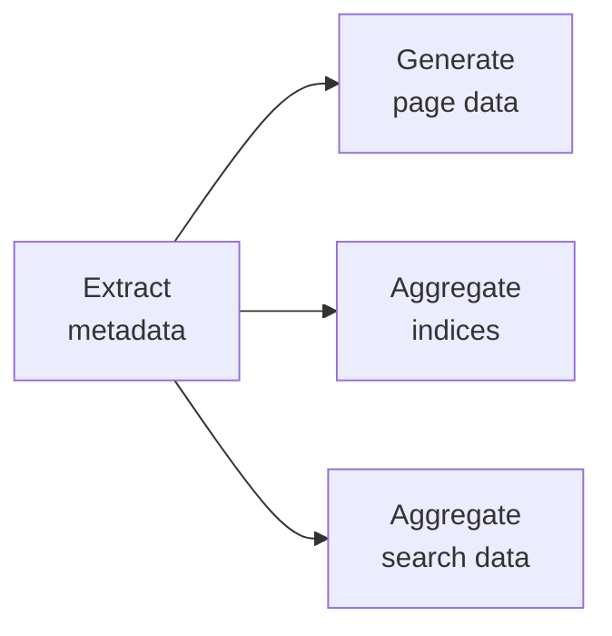
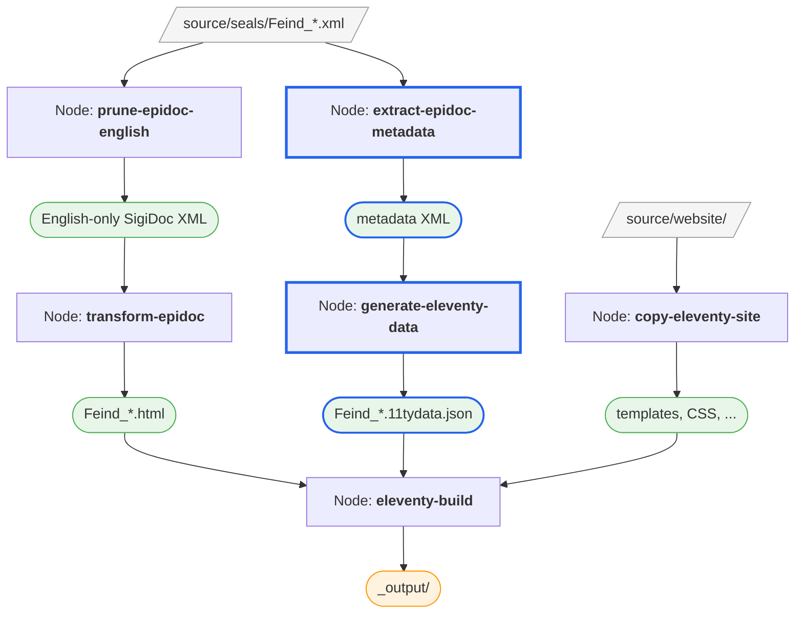

# Metadata and Data Generation

The seal pages render content, but they're missing the site shell (header, footer, navigation) and the seal list is empty. Both problems are solved by generating **sidecar data files**: small JSON files that tell Eleventy how to handle each page.

Two pipeline nodes do this: one extracts metadata from the XML, the other generates the JSON files.

> [!info] We're still working with: Pipeline Configuration (pipeline.xml)

## Why Two Steps?

You might wonder why this isn't a single step. Remember the pipeline diagram from [Exploring the Project](./explore-project)? The "Extract metadata" node feeds into three different consumers: page data files, index aggregation, and search data. By extracting the metadata once into an intermediate format, we avoid re-processing every XML file three times.



We'll configure the first two nodes now. Index aggregation and search come later.

## Extracting Metadata

The `extract-epidoc-metadata` node reads each XML source file and extracts structured metadata (title, sort key, document ID, and other fields) into intermediate XML files.

Uncomment this node in `pipeline.xml`, after `transform-epidoc`. Adapt `source/inscriptions` to `source/seals` to match our project:

```xml
<xsltTransform name="extract-epidoc-metadata">
  <sourceFiles><files>source/seals/*.xml</files></sourceFiles>
  <stylesheet><files>source/metadata-config.xsl</files></stylesheet>
  <stylesheetParams>
    <param name="languages">en</param>
  </stylesheetParams>
</xsltTransform>
```

Unlike `transform-epidoc`, this node reads the **raw source XML** directly, without pruning. The extraction templates use the `languages` parameter to select the right language content internally.

- It transforms each file with **`metadata-config.xsl`**: your project's metadata configuration stylesheet, which defines which fields to extract from the XML
- **No `<output>`**: this node's results are only consumed by other pipeline nodes via `<from>`, so the default build directory (`.efes-build/extract-epidoc-metadata/`) is fine

::: details What does `metadata-config.xsl` do?
This stylesheet is the bridge between your XML encoding and the website's metadata needs. It imports the generic `extract-metadata.xsl` library provided by the EFES-NG Prototype as part of your project and adds project-specific extraction logic.

The generated scaffold already extracts two fields:
- **`title`**: from the first `<title>` in the TEI header, falling back to the filename
- **`sortKey`**: auto-generated from the filename for natural sort ordering

You can open `source/metadata-config.xsl` to see how these are extracted, and customize or add more fields later (like dates, categories, or findspots). The scaffold also has commented-out examples for additional fields and index definitions.
:::

::: details How do I add a new metadata field?
The `metadata-config.xsl` contains an `<xsl:template>` named `extract-metadata` that will be applied to each XML source file,
matching on it's `tei:TEI` root element. It is expected to return one XML for each metadata field you want to extract. To add 
a new field, for instance `date`, add a `<date>` element to the template's output containing the extracted value:
```xml
<date><xsl:value-of select="//tei:orgDate"/></date>
```
:::

After the build, you can inspect the generated metadata files: in the GUI, click the **folder icon** next to the `extract-epidoc-metadata` node in the node list to open its output directory. Each XML source file has a corresponding metadata XML file. Open one. Here's what `Feind_Kr1.xml` looks like:

```xml
<metadata>
  <documentId>Feind_Kr1</documentId>
  <sourceFile>Feind_Kr1.xml</sourceFile>
  <page>
    <title xml:lang="en">Seal of N. imperial protospatharios ...</title>
    <sortKey xml:lang="en">Feind.Kr.00001.</sortKey>
  </page>
  <entities/>
  <search>
    <title xml:lang="en">Seal of N. imperial protospatharios ...</title>
    <material xml:lang="en">Lead</material>
    <fullText xml:lang="en">Κ ύρι ε βοήθει ...</fullText>
  </search>
</metadata>
```

Notice how the structure reflects what's configured: `documentId` and `sourceFile` come from the framework automatically. The `<page>` section contains fields from your `metadata-config.xsl`, here `title` and `sortKey`. Each field carries an `xml:lang` attribute (the framework adds this automatically based on the configured languages). The `entities` section is empty for now; we'll populate it when we add indices later.

## Generating Sidecar Files

The `generate-eleventy-data` node takes the extracted metadata and produces the `.11tydata.json` sidecar files that Eleventy needs. It uses the `create-11ty-data.xsl` stylesheet provided as part of your generated project, a simple transformation that reads the metadata XML and produces a JSON file.

Uncomment it (after `extract-epidoc-metadata`) and adapt the configuration: change `inscriptions` to `seals` in the `tags` parameter and in the `<output>` element:

```xml
<xsltTransform name="generate-eleventy-data">
  <sourceFiles>
    <from node="extract-epidoc-metadata" output="transformed"/>
  </sourceFiles>
  <stylesheet>
    <files>source/stylesheets/lib/create-11ty-data.xsl</files>
  </stylesheet>
  <stylesheetParams>
    <param name="layout">layouts/document.njk</param>
    <param name="tags">seals</param>
    <param name="language">en</param>
  </stylesheetParams>
  <output to="_assembly/en/seals"
          stripPrefix="source/seals"
          extension=".11tydata.json"/>
</xsltTransform>
```

This node uses `<from>` to read the metadata XML produced by `extract-epidoc-metadata`, the same pattern we introduced in the [previous step](./adding-content#connecting-the-nodes-with-from). The `language` parameter tells it which language's fields to pick from the metadata (selecting fields where `xml:lang` matches).

The stylesheet parameters control the sidecar content:

- **`layout`**: which Eleventy layout to use for these pages
- **`tags`**: which collection to add the pages to (this is what makes them appear in the seal list)

The `<output>` uses the same `to`/`stripPrefix`/`extension` pattern as before. The sidecar file must end up next to the corresponding HTML file and share the same base name. That's how Eleventy pairs them:

| HTML (from `transform-epidoc`) | Sidecar (from `generate-eleventy-data`) |
|--------------------------------|-----------------------------------------|
| `_assembly/en/seals/Feind_Kr1.html` | `_assembly/en/seals/Feind_Kr1.11tydata.json` |

## Inspecting the Results

The watcher detects the `pipeline.xml` changes and rebuilds. You should see the two new nodes, `extract-epidoc-metadata` and `generate-eleventy-data`, appear in the node list and run in sequence (since the second depends on the first).

Once the build completes, inspect the `_assembly/en/seals/` directory again. Next to each `.html` file, there's now a `.11tydata.json` file. Open one. Here's what it looks like:

```json
{
  "layout": "layouts/document.njk",
  "tags": "seals",
  "documentId": "Feind_Kr1",
  "title": "Seal of N. imperial protospatharios epi tou chrysotriklinou ...",
  "sortKey": "Feind.Kr.00001."
}
```

Beyond the three fields we introduced earlier (`layout`, `tags`, `title`), the pipeline added `documentId` and `sortKey`. The title and sort key come from your `metadata-config.xsl`. If you open that file, you can see exactly how they're extracted. The `documentId` is provided by the framework automatically.

The `sortKey` ensures seals are listed in natural order (so `Feind_Kr2` comes before `Feind_Kr10`), and the `title` is what appears in the seal list and browser tab.

Now switch to the preview. Individual seal pages work. If you navigate to `/en/seals/Feind_Kr1/`, you'll see the seal content wrapped in the site template with header, footer, and navigation. But the seal list at `/en/seals/` is still empty.

## Connecting the Seal List

Why is the list empty? The `tags` parameter we set to `"seals"` tells Eleventy to group these pages into a **collection** called `seals`. But the list template is still looking for the default collection name from the scaffold (`inscriptions`).

> [!info] We're switching to: Website Templates (source/website/)

Open `source/website/en/seals/index.njk`. Near the top you'll see a `collections.inscriptions` reference. Change it to `collections.seals`. This must match the `tags` value we set in the pipeline:

```liquid
{# Collection name must match the "tags" stylesheet parameter in the generate-eleventy-data pipeline node #}

```

Notice how the rest of the template uses the `documents` variable to loop over the collection and display each seal's `documentId` and `title` in a table. These are the same fields from the sidecar JSON we saw earlier.

The same change is needed in `source/website/_includes/layouts/document.njk`, which is the layout that wraps each individual seal page and provides prev/next navigation. Find the `collections.inscriptions` line and change it to `collections.seals`.

After rebuilding, the seal list populates and the prev/next navigation on individual seal pages works.

Your seals are on the site.

> [!tip]
> Click on `extract-epidoc-metadata` or `generate-eleventy-data` in the GUI to inspect their outputs and cache statistics. Try editing one XML source file and saving. The watcher will rebuild only the affected files.

## What We've Built So Far

Here's the pipeline as it stands now, with five nodes working together:



Nodes and outputs highlighted in blue were added in this step.

## What's Next

The seal list shows Document ID and Title, but we can do better. Let's add more columns: [Customizing the Seal List →](./customize-seal-list)

<!-- TODO: After seal list customization, continue with:
  - Index aggregation (aggregate-indices node)
  - Search data (aggregate-search-data node)
  - Multi-language support
-->
