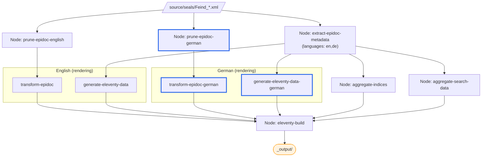

# Multi-Language Support

So far, our seals are published in English only. The SigiDoc Feind Collection is available in three languages — English, German, and Greek. Let's add German.

Multi-language support involves three layers: source content, XSLT UI labels, and the website shell. See [Multi-Language Architecture](/guide/multi-language-architecture) for the full picture — here we'll work through each layer hands-on.

## Step 1: German Seal Pages

With a static site, each language version needs its own set of HTML pages. Remember how we [pruned to English](./adding-content#fixing-with-language-pruning) because the source XML contains all languages side by side? Now we'll add a German pipeline chain alongside the English one.

> [!info] We're working with: Pipeline Configuration (pipeline.xml)

### Pipeline Nodes

Two kinds of changes are needed in `pipeline.xml`:

**First**, update the existing `extract-epidoc-metadata` node to extract both languages. Change the `languages` parameter from `en` to `en,de`:

```xml
<xsltTransform name="extract-epidoc-metadata">
    <sourceFiles><files>source/seals/*.xml</files></sourceFiles>
    <stylesheet><files>source/indices-config.xsl</files></stylesheet>
    <stylesheetParams>
        <param name="languages">en,de</param>
    </stylesheetParams>
</xsltTransform>
```

This single node now extracts metadata for both languages at once — no separate German extraction node needed.

Also update the existing `generate-eleventy-data` node's tags to include the language suffix:

```xml
<param name="tags">seals-en</param>
```

**Then**, add the new German nodes:

```xml
<!-- ===== GERMAN ===== -->

<xsltTransform name="prune-epidoc-german">
    <sourceFiles><files>source/seals/*.xml</files></sourceFiles>
    <stylesheet>
        <files>source/stylesheets/lib/prune-to-language.xsl</files>
    </stylesheet>
    <stylesheetParams>
        <param name="language">de</param>
    </stylesheetParams>
</xsltTransform>

<xsltTransform name="transform-epidoc-german">
    <sourceFiles>
        <from node="prune-epidoc-german" output="transformed"/>
    </sourceFiles>
    <stylesheet>
        <files>source/stylesheets/lib/epidoc-to-html.xsl</files>
    </stylesheet>
    <stylesheetParams>
        <param name="edn-structure">sigidoc</param>
        <param name="edition-type">interpretive</param>
        <param name="leiden-style">sigidoc</param>
        <param name="line-inc">1</param>
        <param name="verse-lines">off</param>
        <param name="bib-link-template">../../bibliography/$1/</param>
        <param name="language">de</param>
        <param name="messages-file"><files>source/translations/messages_de.xml</files></param>
    </stylesheetParams>
    <output to="_assembly/de/seals"
            stripPrefix="source/seals"
            extension=".html"/>
</xsltTransform>

<xsltTransform name="generate-eleventy-data-german">
    <sourceFiles>
        <from node="extract-epidoc-metadata" output="transformed"/>
    </sourceFiles>
    <stylesheet>
        <files>source/stylesheets/lib/create-11ty-data.xsl</files>
    </stylesheet>
    <stylesheetParams>
        <param name="layout">layouts/document.njk</param>
        <param name="tags">seals-de</param>
        <param name="language">de</param>
    </stylesheetParams>
    <output to="_assembly/de/seals"
            stripPrefix="source/seals"
            extension=".11tydata.json"/>
</xsltTransform>
```

Notice:
- **No separate extraction node** — the existing `extract-epidoc-metadata` handles both languages. Only the HTML rendering (`prune` + `transform`) and sidecar generation (`generate-eleventy-data`) need per-language nodes
- `generate-eleventy-data-german` reads from the **same** `extract-epidoc-metadata` as the English version
- Tags use a language suffix (`seals-en`, `seals-de`) — this creates separate Eleventy collections per language

### German UI Labels

Remember how we [downloaded `messages_en.xml`](./adding-content#step-3-stylesheet-parameters) for English UI labels like "Material", "Type", "Dating"? The SigiDoc stylesheets use `i18n:text` placeholders that get resolved from these message files.

Download `messages_de.xml` from the [SigiDoc EFES repository](https://github.com/SigiDoc/EFES-SigiDoc/blob/master/webapps/ROOT/assets/translations/messages_de.xml) and save it to `source/translations/messages_de.xml`. The `messages-file` parameter we set on the transform node points to this file and registers it as a tracked dependency — so edits to the translations trigger a rebuild.

### Build and Inspect

Rebuild. You should see the four new German nodes in the pipeline. Once complete, navigate to `/de/seals/Feind_Kr1/` — the seal content is now in German, with German UI labels.

The seal list at `/de/seals/` won't work yet — that's a website shell concern, which we'll handle next.

## Step 2: German Seal List

The German seal pages work, but the seal list at `/de/seals/` doesn't exist yet. Let's fix that.

> [!info] We're switching to: Website Templates (source/website/)

The simplest approach: copy the English seal list template. Duplicate `source/website/en/seals/index.njk` to `source/website/de/seals/index.njk` and make two changes:

1. Change the title to "Siegel"
2. Change the collection from `collections.seals` to `collections["seals-de"]` — this matches the `tags: "seals-de"` we set in the German pipeline node

```nunjucks
---
layout: layouts/base.njk
title: Siegel
---


```

Because we used language-suffixed tags (`seals-en`, `seals-de`), each language has its own collection. No filtering needed — `collections["seals-de"]` contains only German seals.

Do the same for `document.njk` — update `collections.seals` to `collections["seals-" + page.lang]`. Since `page.lang` is auto-detected from the `/en/` or `/de/` directory, this one change makes the layout work for both languages.

Rebuild, and the German seal list at `/de/seals/` shows only German seals.

### This Works — But Doesn't Scale

We now have a working German seal list. You could stop here for a two-language project — it's simple and explicit.

But notice what happened: we copied a template file. If we add Greek, we copy again. Every change to the table layout needs updating in all copies. For three or more languages, this becomes tedious and error-prone.

If you want a more maintainable approach, read on. Otherwise, skip to [Adding More Languages](#adding-more-languages).

### A Better Way: One Template, Multiple Languages

Eleventy's **permalink** feature lets a single template produce pages at different URLs. Instead of separate copies per language, we write one template and use a variable:

```yaml
---
layout: layouts/base.njk
permalink: "{{ langCode }}/seals/index.html"
pagination:
    data: languages.codes
    size: 1
    alias: langCode
---
```

This requires a data file that lists the supported languages. Create `source/website/_data/languages.json`:

```json
{
    "codes": ["en", "de"]
}
```

Eleventy evaluates the `langCode` variable for each language code and generates a page for each:

| `langCode` | Output URL |
|------------|-----------|
| `en` | `/en/seals/` |
| `de` | `/de/seals/` |

The collection reference becomes generic too — using `page.lang` instead of hardcoded language:

```nunjucks

```

With this approach, the original `en/seals/index.njk` and the copied `de/seals/index.njk` are replaced by a single `seals.njk` at the root of `source/website/`. Adding Greek later is just adding `"el"` to `languages.json`.

> [!tip]
> Permalink only matters for templates that need to produce multiple outputs. For pipeline-generated content (like the individual seal HTML pages), the output path is determined by the pipeline's `<output>` configuration — no permalink needed.

### Translating the Website Shell

The header still says "Seals" in both language versions. To translate menu items, page titles, and other UI text, create translation data files:

Create `source/website/_data/translations/en.json` and `source/website/_data/translations/de.json`:

::: details What goes in the translation files?
These provide translated strings for the website shell. For example:

```json
{
    "nav": {
        "seals": "Seals",
        "indices": "Indices",
        "search": "Search"
    },
    "seals": {
        "pageTitle": "Seals"
    }
}
```

The German version has `"Siegel"`, `"Indizes"`, `"Suche"`, etc. Templates use `translations[langCode].nav.seals` instead of hardcoded text. See the SigiDoc FEIND project's `source/website/_data/translations/` for a complete example.
:::

The same permalink pagination + translation data pattern applies to all templates: the seal list, index pages, the homepage, header, footer, and any other page that needs language variants.

::: details This is a lot of template changes...
It is — each template needs to switch from hardcoded paths and direct collection access to language-parameterized versions. The SigiDoc FEIND project's `source/website/` directory shows the complete set of multi-language templates — use it as a reference for your own project.

For simpler projects, the copy-per-language approach works fine. The pagination machinery is optional — it just scales better.
:::

## Adding More Languages

To add Greek (or any other language), repeat the same steps:

1. Add `el` to the `languages` param in `extract-epidoc-metadata`: `en,de,el`
2. Add pipeline nodes: `prune-epidoc-greek`, `transform-epidoc-greek` (for HTML rendering), and `generate-eleventy-data-greek` (for sidecar data with `tags: "seals-el"`)
3. Add `messages_el.xml` translation file
4. If using the permalink approach: add `"el"` to `languages.json` and create `el.json` translation data
5. If using the copy approach: duplicate templates with `el` paths

## What We've Built

The complete multi-language pipeline:



The German nodes (highlighted in blue) add a prune + transform chain for HTML rendering, and a sidecar data node. The metadata extraction is **shared** — one node handles both languages, so adding German didn't require duplicating the extraction step.
