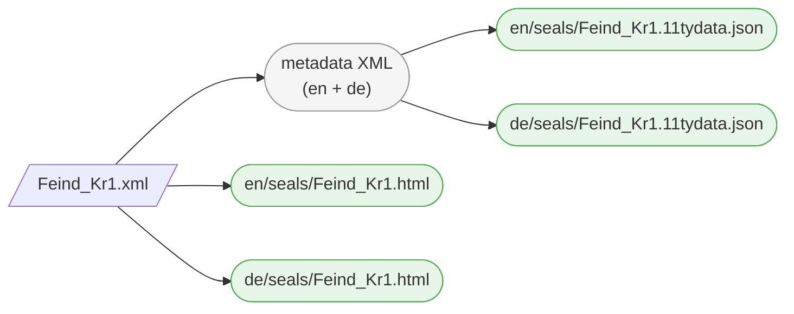
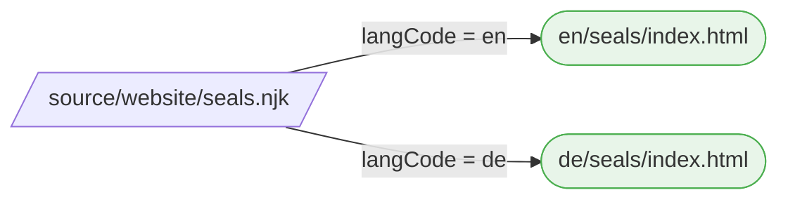
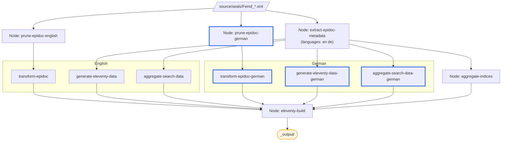

# Multi-Language Support

So far, our seals are published in English only. The SigiDoc Feind Collection is available in three languages — English, German, and Greek. Let's add German.

Multi-language support involves three layers: source content, XSLT UI labels, and the website shell. See [Multi-Language Architecture](/guide/multi-language-architecture) for the full picture — here we'll work through each layer hands-on.

## Step 1: German Seal Pages

With a static site, each language version needs its own set of HTML pages. Remember how we [pruned to English](./adding-content#fixing-with-language-pruning) because the source XML contains all languages side by side? Now we'll add a German pipeline chain alongside the English one.

> [!info] We're working with: Pipeline Configuration (pipeline.xml)

### Pipeline Nodes

Two kinds of changes are needed in `pipeline.xml`:

**First**, update the existing `extract-epidoc-metadata` node to extract both languages. Change the `languages` parameter from `en` to `en de` (space-separated):

```xml
<xsltTransform name="extract-epidoc-metadata">
    <sourceFiles><files>source/seals/*.xml</files></sourceFiles>
    <stylesheet><files>source/indices-config.xsl</files></stylesheet>
    <stylesheetParams>
        <param name="languages">en de</param>
    </stylesheetParams>
</xsltTransform>
```

This single node now extracts metadata for both languages at once — no separate German extraction node needed. The framework calls your extraction templates once per language and auto-stamps `xml:lang` on the output. Each metadata XML file now contains fields for both languages:

```xml
<metadata>
    <documentId>Feind_Kr1</documentId>
    <sourceFile>Feind_Kr1.xml</sourceFile>
    <page>
        <title xml:lang="en">Seal of N. imperial protospatharios ...</title>
        <sortKey xml:lang="en">Feind.Kr.00001.</sortKey>
        <title xml:lang="de">Siegel des N. kaiserlicher protospatharios ...</title>
        <sortKey xml:lang="de">Feind.Kr.00001.</sortKey>
    </page>
    <entities>...</entities>
    <search>
        <title xml:lang="en">Seal of N. ...</title>
        <material xml:lang="en">Lead</material>
        <title xml:lang="de">Siegel des N. ...</title>
        <material xml:lang="de">Blei</material>
    </search>
</metadata>
```

Every field carries an `xml:lang` attribute — the framework adds this automatically. The downstream stylesheets (`create-11ty-data.xsl`, `aggregate-search-data.xsl`) select the fields matching their `language` parameter.

Also update the existing `generate-eleventy-data` node's tags from `seals` to `seals-en`. This creates a language-specific Eleventy collection — when we add the German node with `seals-de`, each language gets its own collection, so the seal list template can show only the right language's seals:

```xml
<param name="tags">seals-en</param>
```

Since you changed the tag from `seals` to `seals-en`, also update the English seal list template (`source/website/en/seals/index.njk`) to match:
```liquid

```

> [!note]
> Note the bracket syntax: `collections["seals-en"]` instead of `collections.seals`. This is just another way of accessing a collection that we need here because because the hyphen in `seals-en` doesn't work with the dot notation that we used before.

**Then**, add the new German nodes — a prune + transform chain for rendering the German seal HTML pages, and a sidecar data node for German page metadata:

```xml
<!-- ===== GERMAN ===== -->

<xsltTransform name="prune-epidoc-german">
    <sourceFiles><files>source/seals/*.xml</files></sourceFiles>
    <stylesheet>
        <files>source/stylesheets/lib/prune-to-language.xsl</files>
    </stylesheet>
    <stylesheetParams>
        <param name="language">de</param>
    </stylesheetParams>
</xsltTransform>

<xsltTransform name="transform-epidoc-german">
    <sourceFiles>
        <from node="prune-epidoc-german" output="transformed"/>
    </sourceFiles>
    <stylesheet>
        <files>source/stylesheets/lib/epidoc-to-html.xsl</files>
    </stylesheet>
    <stylesheetParams>
        <param name="edn-structure">sigidoc</param>
        <param name="edition-type">interpretive</param>
        <param name="leiden-style">sigidoc</param>
        <param name="line-inc">1</param>
        <param name="verse-lines">off</param>
        <param name="bib-link-template">../../bibliography/$1/</param>
        <param name="language">de</param>
        <param name="messages-file"><files>source/translations/messages_de.xml</files></param>
    </stylesheetParams>
    <output to="_assembly/de/seals"
            stripPrefix="source/seals"
            extension=".html"/>
</xsltTransform>

<xsltTransform name="generate-eleventy-data-german">
    <sourceFiles>
        <from node="extract-epidoc-metadata" output="transformed"/>
    </sourceFiles>
    <stylesheet>
        <files>source/stylesheets/lib/create-11ty-data.xsl</files>
    </stylesheet>
    <stylesheetParams>
        <param name="layout">layouts/document.njk</param>
        <param name="tags">seals-de</param>
        <param name="language">de</param>
    </stylesheetParams>
    <output to="_assembly/de/seals"
            stripPrefix="source/seals"
            extension=".11tydata.json"/>
</xsltTransform>
```

Notice:
- **No separate extraction node** — the existing `extract-epidoc-metadata` handles both languages. Only the HTML rendering (`prune` + `transform`) and sidecar generation (`generate-eleventy-data`) need per-language nodes
- `generate-eleventy-data-german` reads from the **same** `extract-epidoc-metadata` as the English version
- Tags use a language suffix (`seals-en`, `seals-de`) — this creates separate Eleventy collections per language

> [!tip]
> If you have the watcher running, you'll see an error about `messages_de.xml` not found. That's expected — we just told the transform node to use German translations from `messages_de.xml` for the SigiDoc seal page UI labels, but haven't added the file yet. Let's fix that now.

### Step 2: German UI Labels

Remember how we [downloaded `messages_en.xml`](./adding-content#step-3-stylesheet-parameters) for English UI labels like "Material", "Type", "Dating"? The SigiDoc stylesheets use `i18n:text` placeholders that get resolved from these message files.

Download `messages_de.xml` from the [SigiDoc EFES repository](https://github.com/SigiDoc/EFES-SigiDoc/blob/master/webapps/ROOT/assets/translations/messages_de.xml) and save it to `source/translations/messages_de.xml`. The `messages-file` parameter we set on the transform node points to this file and registers it as a tracked dependency — so edits to the translations trigger a rebuild.

### Build and Inspect

Rebuild. You should see the four new German nodes in the pipeline. Once complete, navigate to `/de/seals/Feind_Kr1/` — the seal content is now in German, with German UI labels.

Here's what happens to a single source file now:



One source file produces four outputs: an HTML page and a sidecar JSON for each language.

## Step 3: Language Switcher

Open an English seal page like `/en/seals/Feind_Kr1/`. You can see the German version exists at `/de/seals/Feind_Kr1/` — but how does a user switch between them? Let's add a language switcher to the header.

This requires the `languages.json` data file. The scaffold includes a `languages.json.example` — rename it to `languages.json`:

```json
{
    "codes": ["en", "de"],
    "labels": { "en": "EN", "de": "DE" }
}
```

Then find the commented-out language switcher block in `source/website/_includes/header.njk` and uncomment it:

```liquid
<nav class="language-switcher">
    
        
            <span class="lang-current">{{ languages.labels[lang] }}</span>
        
            <a href="{{ page.url | replace('/' + page.lang + '/', '/' + lang + '/') }}" class="lang-link">{{ languages.labels[lang] }}</a>
        
    
</nav>
```

This loops over the configured languages and shows the current one highlighted, with links to switch to the others. The URL replacement swaps the language prefix — so clicking "DE" on `/en/seals/Feind_Kr1/` takes you to `/de/seals/Feind_Kr1/`.

The seal list at `/de/seals/` won't work yet — that's a website shell concern, which we'll handle next.

## Step 4: German Seal List

The German seal pages work, but the seal list at `/de/seals/` doesn't exist yet. Let's fix that.

> [!info] We're switching to: Website Templates (source/website/)

The simplest approach: copy the English seal list template. Create a `source/website/de/seals/` directory (mirroring the `en/seals/` structure) and copy `source/website/en/seals/index.njk` into it. Then make two changes:

1. Change the title to "Siegel"
2. Change the collection to `collections["seals-de"]` — this matches the `tags: "seals-de"` we set in the German pipeline node

```liquid
---
layout: layouts/base.njk
title: Siegel
---


```

Because we used language-suffixed tags (`seals-en`, `seals-de`), each language has its own collection. No filtering needed — `collections["seals-de"]` contains only German seals.

You also need to update the **document layout** at `source/website/_includes/layouts/document.njk`. This is a shared layout (not inside `en/` or `de/`), used by both English and German seal pages — it provides the prev/next navigation between seals. Change its collection reference from `collections.seals` to `collections["seals-" + page.lang]`:

```liquid

```

Since `page.lang` is auto-detected from the `/en/` or `/de/` directory, this one change makes the layout work for both languages — it automatically shows prev/next links to seals in the same language.

Rebuild, and the German seal list at `/de/seals/` shows only German seals.

## Step 5: German Homepage

Let's also add a German homepage. This is a pure content page — just copy `source/website/en/index.njk` to `source/website/de/index.njk` and translate the text by hand:

```html
---
layout: layouts/base.njk
title: Sammlung Robert Feind
suppressTitle: true
---

<div class="home-hero">
    <h1 class="home-title">Sammlung Robert Feind</h1>
</div>

<div class="home-section">
    <p>Eine digitale Edition byzantinischer Bleisiegel aus der Sammlung Robert Feind,
    kodiert nach dem <a href="https://sigidoc.huma-num.fr/">SigiDoc</a>-Standard.</p>
</div>
```

Navigate to `/de/` — you now have a German homepage.

## Step 6: Translating the Website Shell

We now have German seal pages, a German seal list, and a German homepage. But look at the header — the navigation menu still says "Seals", "Search", "Indices" on German pages too. The prev/next links say "Previous" and "Next". All of this text is hardcoded in the templates and needs translating.

Unlike the seal list or homepage, we can't just copy these files per language. The header, footer, and document layout are **shared includes** — one `header.njk` is used by every page on the site, regardless of language. Both `/en/seals/` and `/de/seals/` include the same file. It needs to display "Seals" or "Siegel" depending on which page is using it.

Our project's Eleventy configuration file (`source/website/eleventy.config.js`) provides a `| t` filter for this. It reads translation files from `source/website/_data/translations/` — one JSON file per language (`en.json`, `de.json`, etc.) — and looks up a key based on the current page's language.

> [!note] 
> The approach is the same one we saw for the SigiDoc XSLT UI labels (`messages_en.xml` with key lookups) — but adapted for Eleventy templates: translation files that map keys to translated strings, and a method to look them up.

The language file defines the translation keys and texts like this:

**`en.json`:**
```json
{
    "seals": "Seals",
    "indices": "Indices",
    "search": "Search",
    "bibliography": "Bibliography",
    "backToIndex": "Back to Index",
    "previous": "Previous",
    "next": "Next"
}
```

In a template, you use it wherever a translated text should appear:

```liquid
{{ "seals" | t }}
```

On an English page (`page.lang = "en"`), this looks up `seals` in `en.json` and outputs "Seals". On a German page, it looks up the same key in `de.json` and outputs "Siegel". If a key is missing in the current language, it falls back to English, then to the raw key wrapped in brackets.

The scaffold includes an `en.json.example` file in `source/website/_data/translations/`. Rename it to `en.json` and create a `de.json` alongside it with the German translations:

**`de.json`:**
```json
{
    "seals": "Siegel",
    "indices": "Indizes",
    "search": "Suche",
    "bibliography": "Bibliographie",
    "backToIndex": "Zurück zur Übersicht",
    "previous": "Zurück",
    "next": "Weiter"
}
```

Then replace hardcoded strings in your templates with `| t` lookups. For example, in `header.njk`:

```html
<!-- Before -->
<a href="/{{ page.lang }}/seals/" class="nav-link">Seals</a>

<!-- After -->
<a href="/{{ page.lang }}/seals/" class="nav-link">{{ "seals" | t }}</a>
```

The `t` filter automatically looks up the key in the translation file matching `page.lang`. If no translation is found, it falls back to English, then to the raw key wrapped in brackets.

If you like, try it on a few texts across the project. Then let's go on to internationalise the remaining sections of the site.

::: details How many strings need converting?
About 20 across all templates — mostly in the header (nav labels), document layout (prev/next/back), and the seal list (column headers, intro text). 
:::

## Step 7: German Search Page

The search page needs one more pipeline change. Currently, only English search data is generated. Add a German search data node to `pipeline.xml`:

> [!info] We're switching to: Pipeline Configuration (pipeline.xml)

```xml
<xsltTransform name="aggregate-search-data-german">
    <stylesheet><files>source/stylesheets/lib/aggregate-search-data.xsl</files></stylesheet>
    <initialTemplate>aggregate</initialTemplate>
    <stylesheetParams>
        <param name="metadata-files">
            <from node="extract-epidoc-metadata" output="transformed"/>
        </param>
        <param name="language">de</param>
    </stylesheetParams>
    <output to="_assembly/search-data" filename="documents_de.json"/>
</xsltTransform>
```

This node is basically a copy of the `aggregate-search-data` node for English, with only the `language` stylesheet param and the output `filename` changed from `en` to `de`. This produces `documents_de.json` with German titles, dates, and material names (e.g., "Blei" instead of "Lead") for the search facets. The search page template already uses `page.lang` in the `data-url` attribute, so the German search page automatically loads the German data file.

> [!info] We're switching to: Website Templates (source/website/)

Then create the German search page: create the `source/website/de/search` directory, move `source/website/en/search/index.njk` to `source/website/de/search/index.njk` and change the title to "Suche".

## Step 8: German Entity Index Pages

Copy the remaining index pages to German. The data-driven content (index tables) handles language automatically — you just need to copy the template and translate the title.

**Indices landing page:** create the `source/website/de/indices` directory and move `source/website/en/indices/index.njk` to `source/website/de/indices/index.njk`:

```html
---
layout: layouts/base.njk
title: Indizes
---

<p class="index-intro">Durchsuchen Sie die Indizes der Sammlung.</p>

<div class="indices-grid">

    
    <a href="/{{ page.lang }}/indices/{{ idx.id }}/" class="index-card">
        <h3>{{ idx.title }}</h3>
        
        <p>{{ idx.description }}</p>
        
        <span class="entry-count">{{ idx.entryCount }} entries</span>
    </a>
    

</div>
```

**Persons index page:** Copy `source/website/en/indices/persons.njk` to `source/website/de/indices/persons.njk`:

```html
---
layout: layouts/base.njk
title: Personen
---




```

The index table partial already handles multilingual entity names — it uses `entry[col.key][page.lang]` with a fallback to English.

## Going further
### This Works — But Doesn't Scale

Take a step back and look at what we've done: we copied the seal list, search page, indices landing, and persons index — four templates that are mostly identical across languages. For content pages like the homepage, copying and translating by hand is fine — the text is unique to each language. But these data-driven pages are essentially the same template with a different title.

If we add Greek, we copy all four again. Every change to the table layout needs updating in all copies. For three or more languages, this becomes tedious and error-prone.

### Concept: Template Pagination

Above, we copied four data-driven templates (seal list, search, indices landing, persons index) per language. Eleventy's **pagination** feature lets us replace each pair with a single template that produces pages for all languages automatically. The general steps for each template are:

1. Delete the German copy (`de/seals/index.njk`)
2. Move the English version to the site root and rename it (e.g., `en/seals/index.njk` → `seals.njk`)
3. Add pagination front matter that iterates over `languages.json`

Let's walk through it for the seal list:

1. Delete the German-specific `de/seals/index.njk` copy
2. Move `source/website/en/seals/index.njk` to `source/website/seals.njk` (root level, outside any language directory)
3. Replace the front matter with the following pagination configuration:
```yaml
---
layout: layouts/base.njk
permalink: "{{ langCode }}/seals/index.html"
pagination:
    data: languages.codes
    size: 1
    alias: langCode
eleventyComputed:
    title: "{{ 'seals' | t }}"
---
```
::: info What does each property do?
- **`permalink`**: Tells Eleventy what output file to produce for each language. Uses the `langCode` variable to put each page under its language prefix
- **`pagination.data`**: The data to iterate over. Here it points to `languages.codes` from our `languages.json` file (`["en", "de"]`)
- **`pagination.size`**: Produce exactly one page per language.
- **`pagination.alias`**: The variable name for the current item. We use `langCode`, which becomes `"en"` or `"de"` in each iteration
- **`eleventyComputed.title`**: The title needs to be different for each language, so we can't just write `title: Seals` — that would be the same for every generated page. `eleventyComputed` tells Eleventy to evaluate the value at render time (like a template expression), so <span v-pre style="white-space: nowrap">`{{ 'seals' | t }}`</span> resolves to "Seals" or "Siegel" depending on the current language
:::

3. Change the collection reference to use `page.lang`:
   ```liquid
   
   ```


> [!warning] Prototype Note
> If you create the paginated version before deleting the German copy, you'll get an error at the Eleventy build stage complaining that multiple templates want to create a page at `_output/de/seals/index.html`. Delete the German copy first. If the error persists even after deleting the source file, the old file is still present in the intermediate `_assembly/` directory from a previous build. To fix this, stop the pipeline, click the **Clean** button in the GUI (or run `npx efes-ng clean` on the command line) to remove intermediate build outputs, and start the pipeline again.

Eleventy evaluates the `langCode` variable for each language code and generates a page for each:



The original `en/seals/index.njk` and the copied `de/seals/index.njk` are now replaced by a single `seals.njk`. Adding Greek later is just adding `"el"` to `languages.json`.

Apply the same pattern to the other copied templates. Each one: move to root, add pagination front matter, delete the `de/` copy.

::: info Walkthrough: Convert remaining pages to pagination

**1. Search page**: Delete `de/search/index.njk`, move `en/search/index.njk` to `source/website/search.njk`, change frontmatter to:

```yaml
---
layout: layouts/base.njk
permalink: "{{ langCode }}/search/index.html"
pagination:
    data: languages.codes
    size: 1
    alias: langCode
eleventyComputed:
    title: "{{ 'search' | t }}"
---
```


**2. Indices landing page**: Delete `de/indices/index.njk`, move `en/indices/index.njk` to `source/website/indices.njk`, change frontmatter to:

```yaml
---
layout: layouts/base.njk
permalink: "{{ langCode }}/indices/index.html"
pagination:
    data: languages.codes
    size: 1
    alias: langCode
eleventyComputed:
    title: "{{ 'indices' | t }}"
---
```


**3. Persons index page**: Delete `de/indices/persons.njk`,  move `en/indices/persons.njk` to `source/website/index-persons.njk`, change frontmatter to:

```yaml
---
layout: layouts/base.njk
permalink: "{{ langCode }}/indices/persons/index.html"
pagination:
    data: languages.codes
    size: 1
    alias: langCode
eleventyComputed:
    title: "{{ 'persons' | t }}"
---
```

4. **Add missing title translation**: For the index titles, we used the translation keys `indices`, `seals`, and `persons`. The `de.json` and `en.json` translation files in `/website/data/translations` are currently missing an entry for `persons`. Make sure to add it for both languages, or you will see the key `persons` appear as the title for the index in both languages.

5. **Remove stale language directories.** To clean up the website source structure, we can also remove the following now-empty language specific directories:
	- `website/en/indices`
	- `website/en/search`
	- `website/de/indices`
	- `website/de/search`

::: 

> [!tip]
> The *permalink* front matter property that controls where pages generated from this template end up only matters for templates that need to produce multiple outputs. For pipeline-generated content (like the individual seal HTML pages), the output path is determined by the pipeline's `<output>` configuration — no permalink needed.

#### Copy vs. Pagination: Which to Choose?

|                                                    | Copy approach                                               | Pagination approach                                                                    |
| -------------------------------------------------- | ----------------------------------------------------------- | -------------------------------------------------------------------------------------- |
| **Initial Setup**                                  | Copy file, translate text in template                       | Move file, add front matter, translate text using key lookup method with `\| t` filter |
| **Adding a language**                              | Copy all templates and make language-specific changes again | Add one code to `languages.json`                                                       |
| **Changing a template**                            | Update every copy                                           | Update one file                                                                        |
| **Content pages** (homepage, about)                | Recommended — content is unique per language                | Not useful — nothing to share                                                          |
| **Data-driven pages** (seal list, indices, search) | Works okay for 2 languages                                  | Recommended for 3 or more languages                                                    |
| **Complexity**                                     | Simple, explicit                                            | Requires understanding pagination front matter                                         |

Both approaches are valid — use what fits your project. You can mix them: pagination for data-driven pages, copy for content pages.

### Adding More Languages

If you're using the pagination approach, adding a third language (e.g., Greek) is straightforward – the templates already generate pages for all languages in `languages.json`. You only need to add pipeline nodes and translation files:

1. **Pipeline:** Add `el` to the `languages` param in `extract-epidoc-metadata`: `en de el`
2. **HTML rendering:** Add `prune-epidoc-greek` and `transform-epidoc-greek` nodes
3. **Sidecar data:** Add `generate-eleventy-data-greek` with `tags: "seals-el"` and `language: el`
4. **Search data:** Add `aggregate-search-data-greek` with `language: el` and `filename: documents_el.json`
5. **XSLT UI labels:** Add `messages_el.xml` translation file
6. **Website shell:** Add `el.json` translation data and `"el"` to `languages.json`

If you're using the copy approach, you also need to duplicate all templates to `el/` paths and adapt them according to the language.

> [!info] The SigiDoc FEIND project's `source/website/` directory shows a complete set of multi-language templates — use it as a reference.
## What We've Built

### Template Structure

Here's how the website template directory changed from single-language to multi-language (with pagination):

| Before (single-language) | After (multi-language with pagination) | |
|---|---|---|
| `en/index.njk` | `en/index.njk` | Content page (English) |
| | `de/index.njk` | Content page (German) |
| `en/seals/index.njk` | `seals.njk` | Paginated → `/en/seals/`, `/de/seals/` |
| `en/search/index.njk` | `search.njk` | Paginated → `/en/search/`, `/de/search/` |
| `en/indices/index.njk` | `indices.njk` | Paginated → `/en/indices/`, `/de/indices/` |
| `en/indices/persons.njk` | `index-persons.njk` | Paginated → `/en/indices/persons/`, ... |
| `_includes/...` | `_includes/...` | Shared (uses `\| t` filter) |
| `_data/...` | `_data/languages.json` | Language codes + labels |
| | `_data/translations/en.json` | English UI strings |
| | `_data/translations/de.json` | German UI strings |

### Pipeline

The complete multi-language pipeline:



The German nodes (highlighted in blue) add a prune + transform chain for HTML rendering, a sidecar data node, and a search data node. The metadata extraction and index aggregation are **shared** — one node each handles both languages.

Now that we have multi-language support, let's see it in action with a genuinely multilingual index — [Authority Files and Places Index →](./places-index)
