# Multi-Language Support

So far, our seals are published in English only. The SigiDoc Feind Collection is available in three languages: English, German, and Greek. Let's add German.

Multi-language support involves three layers: source content, XSLT UI labels, and the website shell. See [Multi-Language Architecture](/guide/multi-language-architecture) for the full picture. Here we'll work through each layer hands-on.

## Step 1: German Seal Pages

With a static site, each language version needs its own set of HTML pages. Remember how we [pruned to English](./adding-content#fixing-with-language-pruning) because the source XML contains all languages side by side? Now we'll add a German pipeline chain alongside the English one.

> [!info] We're working with: Pipeline Configuration (pipeline.xml)

### Pipeline Nodes

Two kinds of changes are needed in `pipeline.xml`:

**First**, update the existing `extract-epidoc-metadata` node to extract both languages. Change the `languages` parameter from `en` to `en de` (space-separated):

```xml
<!-- [!code word:de] -->
<xsltTransform name="extract-epidoc-metadata">
    <sourceFiles><files>source/seals/*.xml</files></sourceFiles>
    <stylesheet><files>source/metadata-config.xsl</files></stylesheet>
    <stylesheetParams>
        <param name="languages">en de</param> <!-- [!code highlight] -->
    </stylesheetParams>
</xsltTransform>
```

This single node now extracts metadata for both languages at once, so no separate German extraction node is needed. The framework calls your extraction templates once per language and auto-stamps `xml:lang` on the output. Each metadata XML file now contains fields for both languages:

```xml
<metadata>
    <documentId>Feind_Kr1</documentId>
    <sourceFile>Feind_Kr1.xml</sourceFile>
    <page>
        <title xml:lang="en">Seal of N. imperial protospatharios ...</title>
        <sortKey xml:lang="en">Feind.Kr.00001.</sortKey>
        <title xml:lang="de">Siegel des N. kaiserlicher protospatharios ...</title> <!-- [!code highlight] -->
        <sortKey xml:lang="de">Feind.Kr.00001.</sortKey> <!-- [!code highlight] -->
    </page>
    <entities>...</entities>
    <search>
        <title xml:lang="en">Seal of N. ...</title>
        <material xml:lang="en">Lead</material>
        <title xml:lang="de">Siegel des N. ...</title> <!-- [!code highlight] -->
        <material xml:lang="de">Blei</material> <!-- [!code highlight] -->
    </search>
</metadata>
```

::: details Configure Oxygen XML Editor for multi-language metadata extraction
When using [Oxygen XML Editor](../guide/oxygen-project.md) to test metadata extraction, changing the `languages` XSLT parameter to `en de` in `pipeline.xml` doesn't have an effect because the transformation runs directly in Oxygen, independent from the pipeline's configuration. To see the multi-lingual metadata output, you need to tell Oxygen set the `languages` parameter to `en de` as follows:
1. Click the *Configure parameters* button (with the wrench-and-nut icon) in the toolbar:
  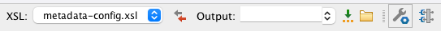
  2. Scroll down in the parameter list until you find `languages`:
  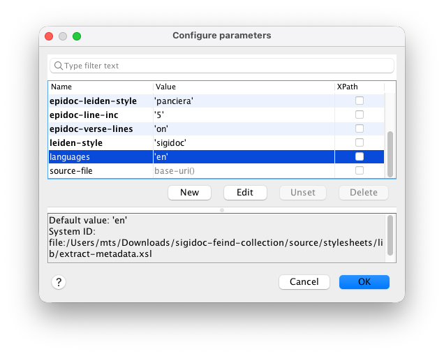
  3. Double-click `languages` and enter `en de` as Value:
  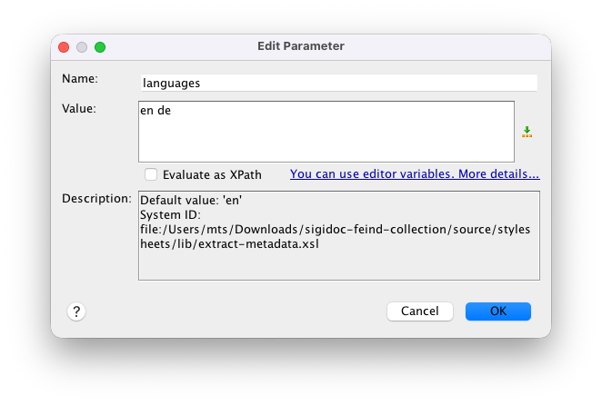

:::

Every field carries an `xml:lang` attribute (the framework adds this automatically). The downstream stylesheets (`create-11ty-data.xsl`, `aggregate-search-data.xsl`) select the fields matching their `language` parameter.

Also update the existing `generate-eleventy-data` node's tags from `seals` to `seals-en`. This creates a language-specific Eleventy collection. When we add the German node with `seals-de` later, each language gets its own collection, so the seal list template can show only the right language's seals:

```xml
<!-- [!code word:seals-en] -->
<xsltTransform name="generate-eleventy-data">
    <!-- ... -->
    <stylesheetParams>
      <param name="layout">layouts/document.njk</param>
      <param name="tags">seals-en</param> <!-- [!code highlight] -->
      <param name="language">en</param>
    </stylesheetParams>
    <!-- ... -->
</xsltTransform>
```

Since you changed the tag from `seals` to `seals-en`, also update the English seal list template (`source/website/en/seals/index.njk`) to match:
```njk
<!-- [!code word:seals-en] -->
{# Collection name must match the "tags" stylesheet parameter in the generate-eleventy-data pipeline node #}  
 <!-- [!code highlight] -->
```

> [!note]
> Note the bracket syntax: `collections["seals-en"]` instead of `collections.seals`. This is just another way of accessing a collection that we need here because because the hyphen in `seals-en` doesn't work with the dot notation that we used before.

**Then**, add the new German nodes: a prune + transform chain for rendering the German seal HTML pages, and a sidecar data node for German page metadata:

```xml
<!-- ===== GERMAN ===== -->

<xsltTransform name="prune-epidoc-german">
    <sourceFiles><files>source/seals/*.xml</files></sourceFiles>
    <stylesheet>
        <files>source/stylesheets/lib/prune-to-language.xsl</files>
    </stylesheet>
    <stylesheetParams>
        <param name="language">de</param> <!-- [!code highlight] -->
    </stylesheetParams>
</xsltTransform>

<xsltTransform name="transform-epidoc-german">
    <sourceFiles>
        <from node="prune-epidoc-german" output="transformed"/>
    </sourceFiles>
    <stylesheet>
        <files>source/stylesheets/lib/epidoc-to-html.xsl</files>
    </stylesheet>
    <stylesheetParams>
        <param name="edn-structure">sigidoc</param>
        <param name="edition-type">interpretive</param>
        <param name="leiden-style">sigidoc</param>
        <param name="line-inc">1</param>
        <param name="verse-lines">off</param>
        <param name="bib-link-template">../../bibliography/$1/</param>
        <param name="language">de</param> <!-- [!code highlight] -->
        <param name="messages-file"><files>source/translations/messages_de.xml</files></param> <!-- [!code highlight] -->
    </stylesheetParams>
    <output to="_assembly/de/seals" <!-- [!code highlight] -->
            stripPrefix="source/seals"
            extension=".html"/>
</xsltTransform>

<xsltTransform name="generate-eleventy-data-german">
    <sourceFiles>
        <from node="extract-epidoc-metadata" output="transformed"/>
    </sourceFiles>
    <stylesheet>
        <files>source/stylesheets/lib/create-11ty-data.xsl</files>
    </stylesheet>
    <stylesheetParams>
        <param name="layout">layouts/document.njk</param>
        <param name="tags">seals-de</param> <!-- [!code highlight] -->
        <param name="language">de</param> <!-- [!code highlight] -->
    </stylesheetParams>
    <output to="_assembly/de/seals" <!-- [!code highlight] -->
            stripPrefix="source/seals"
            extension=".11tydata.json"/>
</xsltTransform>
```

Notice a few highlighted lines above:
* In the `prune-epidoc-german` node, we have set the `language` param to `de` so `prune-to-language.xsl` knows to keep the German elements
* In `transform-epidoc-german`, we have set the `language` param to `de` which it passes to the SigiDoc stylesheets for rendering the UI labels in German, and we also point `messages-file` to the German SigiDoc UI translations file that we'll download later.
* Also in `transform-epidoc-german`, the output path (`to` attribute of the `output` element) to `_assembly/de/seals`, so the German seal HTML snippets land in their own directory which makes them available at `🌎 /de/seals/Feind_XY/` on the final site.
* In `generate-eleventy-data-german` we have set the `tags` param to `seals-de` so it is added to the `seals-de` Eleventy collection, set `language` to `de` so it selects the German metadata from the files generated by `extract-epidoc-metadata`, and adjusted the `output` configuration the same way as in `transform-epidoc-german` so the generated JSON sidecar files land next to the transformed German seals.

Notice further that we have added no separate `extract-epidoc-metadata` node for German: the existing `extract-epidoc-metadata` handles both languages. Only the HTML rendering (`prune` + `transform`) and sidecar generation (`generate-eleventy-data`) need per-language nodes. `generate-eleventy-data-german` reads from the **same** `extract-epidoc-metadata` as the English version.


> [!tip]
> If you have the watcher running, you'll see an error about `messages_de.xml` not found. That's expected. We just told the transform node to use German translations from `messages_de.xml` for the SigiDoc seal page UI labels, but haven't added the file yet. Let's fix that now.

### Step 2: German UI Labels

Remember how we [downloaded `messages_en.xml`](./adding-content#step-3-stylesheet-parameters) for English UI labels like "Material", "Type", "Dating"? The SigiDoc stylesheets use `i18n:text` placeholders that get resolved from these message files.

Download `messages_de.xml` from the [SigiDoc EFES repository](https://github.com/SigiDoc/EFES-SigiDoc/blob/master/webapps/ROOT/assets/translations/messages_de.xml) and save it to `source/translations/messages_de.xml`. The `messages-file` parameter we set on the transform node points to this file and registers it as a tracked dependency, so edits to the translations trigger a rebuild.

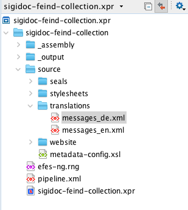

### Build and Inspect

You should see the four new German nodes in the pipeline. Once rebuild is complete, navigate to `🌎 /de/seals/Feind_Kr1/` (notice the  `de/` in the prefix instead of `en/`. The seal content is now in German, with German UI labels (the seal title and website shell is still in English – we will fix this later):

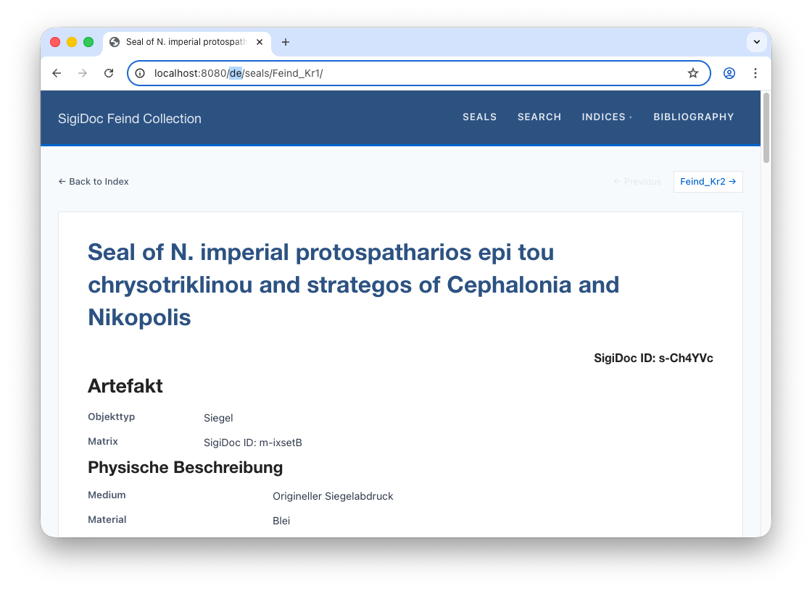

Here's what happens to a single source file now:

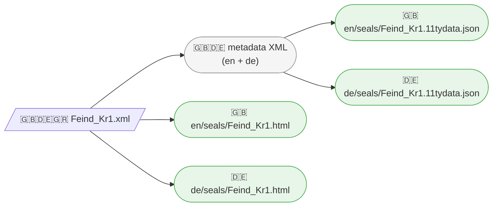

One source file produces four outputs: an HTML page and a sidecar JSON for each language.

## Step 3: Language Switcher

In the preview, navigate to an English seal page like `🌎 /en/seals/Feind_Kr1/`. You have seen the German version exists at `🌎 /de/seals/Feind_Kr1/` and you can navigate to it by entering the URL path manually, but how does a user switch between them? Let's add a language switcher to the header.

The website templates from the project scaffold has a language switcher included that can be enabled. Because it needs to know which languages are available (to know which language buttons it should show), it requires a `languages.json` file in the `source/website/_data/` folder. The scaffold already includes this file, but it only has English configured. Open `source/website/_data/languages.json` and add German in two places:

```json
// [!code word:, \"de\"]
// [!code word:\"de\"\: \"DE\"]
{
    "codes": ["en", "de"],
    "labels": { "en": "EN", "de": "DE" }
}
```

The `codes`  list specifies which languages are available, and the `labels` list controls what labels appear on the respective language switcher buttons for each language code (it could also be "German" and "English" instead of "EN" and "DE").

Then find the commented-out language switcher block in `source/website/_includes/header.njk` and uncomment it (it is around line 30):

```njk
<nav class="language-switcher">
    
        
            <span class="lang-current">{{ languages.labels[lang] }}</span>
        
            <a href="{{ page.url | replace('/' + page.lang + '/', '/' + lang + '/') }}" class="lang-link">{{ languages.labels[lang] }}</a>
        
    
</nav>
```

This loops over the configured languages and shows the current one highlighted, with links to switch to the others. The URL replacement swaps the language prefix, so clicking "DE" on `🌎 /en/seals/Feind_Kr1/` takes you to `🌎 /de/seals/Feind_Kr1/`:

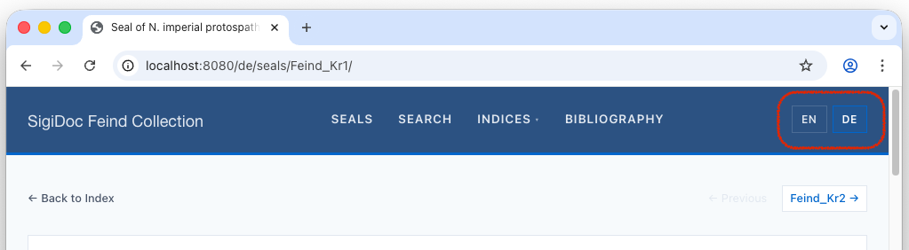

However, seal list at `/de/seals/` won't work yet. That's a website shell concern, which we'll handle next.

## Step 4: German Seal List

### Add the German Seal List page

The German seal pages work, but the seal list at `🌎 /de/seals/` doesn't exist yet. Let's fix that.

> [!info] We're switching to: Website Templates (source/website/)

The simplest approach: copy the English seal list template. Create a `source/website/de/seals/` directory (mirroring the `en/seals/` structure) and copy `source/website/en/seals/index.njk` into it.

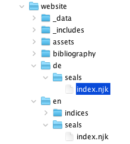

Then open the file and make two changes:

1. Change the title to "Siegel"
2. Change the collection to `collections["seals-de"]`, which matches the `tags: "seals-de"` we set in the German pipeline node

`source/website/de/seals/index.njk`:
```njk{4}
<!-- [!code word:Siegel] -->
---
layout: layouts/base.njk
title: Siegel
---
<!-- [!code word:[\"seals-de\"\]] -->
 <!-- [!code highlight] -->
```

Because we used language-suffixed tags (`seals-en`, `seals-de`), each language has its own collection. No filtering needed, because `collections["seals-de"]` contains only German seals.

You also need to update the **document layout** at `source/website/_includes/layouts/document.njk`. This is a shared layout (not inside `en/` or `de/`), used by both English and German seal pages. It provides the prev/next navigation between seals. Change its collection reference from `collections.seals` to `collections["seals-" + page.lang]`:

```njk

```

Since `page.lang` is auto-detected from the `/en/` or `/de/` directory, this one change makes the layout work for both languages. It automatically shows prev/next links to seals in the same language.

After rebuild, the German seal list now available at `🌎 /de/seals/`:
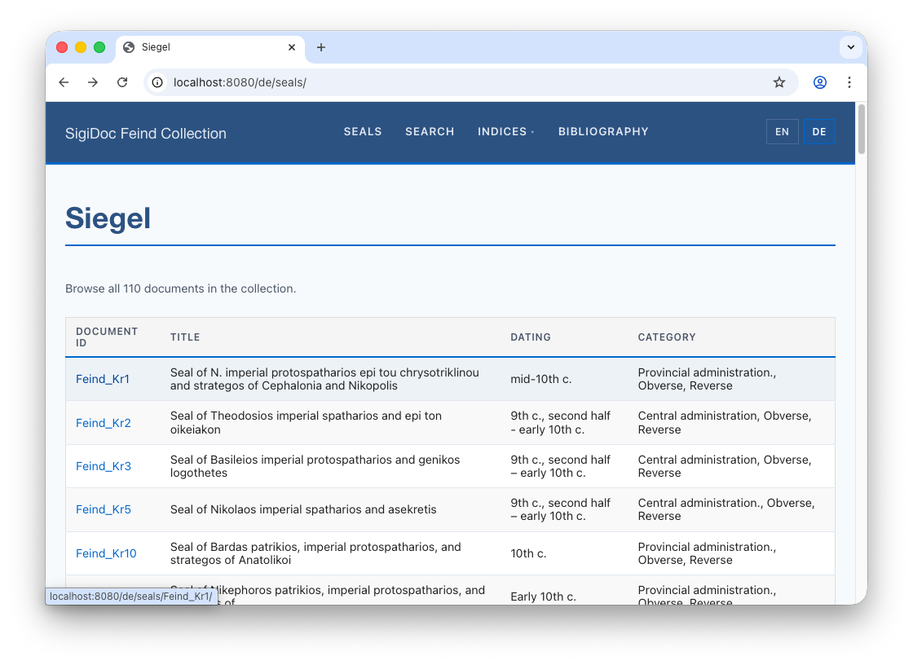
### Translate the seal list

You'll notice that while the links lead to the German seal pages, the seal list still shows English data. Why? Let's trace the data flow through the pipeline to find the cause.

> [!note]
> Read the next section if you'd like a **guided walk-through** on how to investigate problems through the pipeline, e.g., when you see content on the final website that you didn't expect. It's also a good occasion to re-familiarise with the frameworks data flow principles.
> 
> If you want to **skip** it, fast-forward to the solution by reading on from the next section: [Showing German Seal List Data](#showing-german-seal-list-data).


#### Find The problem

<div style="display: flex; gap: 2rem; align-items: flex-start; flex-wrap: wrap;">
<div style="flex: 1 1 300px; min-width: 0;">

In [Customizing the seal list](customize-seal-list.md), we learned how the data flows from the SigiDoc source XML for each seal to the rendered seal list on the website (see the graph on the side). Let's try to find out where the English data in the seal list is coming from by following it backwards.

1. We know that the German seal list is populated with data from the JSON sidecar files (such as `Feind_KR1.11tydata.json`) generated by the `generate-eleventy-data-german`node. Let's inspect this node's output by clicking the **folder icon** next to the node's name in the GUI (which will open the node's configured output path `_assembly/de/seals`) and open `Feind_KR1.11tydata.json`:
	```json
	{  
	...
	"documentId":"Feind_Kr1",  
	"title":"Seal of N. imperial protospatharios epi tou chrysotriklinou and strategos of Cephalonia and Nikopolis",  
	...
	}
	```
	So at this stage, the data is already English. We have to go back a step.


</div>
<div style="min-width: 0;">

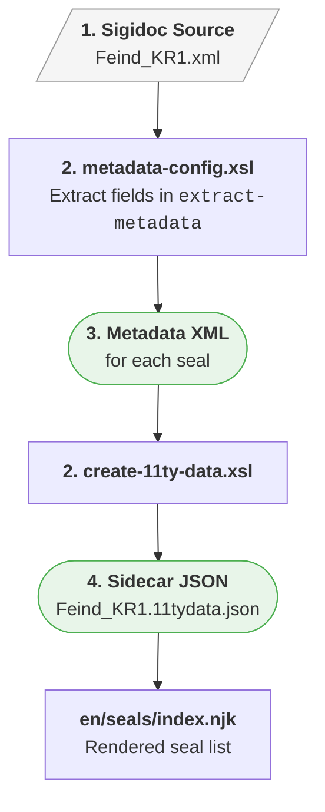

</div>
</div>

2. The data in `Feind_KR1.11tydata.json` is generated from the seal metadata extracted by the `extract-epidoc-metadata` node. Click the **folder icon** next to this node to inspect it's output, go inside the nested `source` and `seals` directory, and open `Feind_KR11.xml`. We would expect a German title there extracted in a `<title xml:lang="de">` element. But we find:
	```xml
	      <title xml:lang="de">Seal of N. imperial protospatharios epi tou chrysotriklinou and strategos of Cephalonia and Nikopolis</title>
	```
	The title has an `xml:lang="de"` attribute so it should be German, but it is in English. We have to go back another step to see where this is coming from.
3. The metadata XML for each seal is generated according to our `extract-metadata` template in `metadata-config.xsl`. Here, we extract the seal titles as follows:

	```xml
	<!-- [!code word:tei\:title[1\]] -->
	<xsl:template match="tei:TEI" mode="extract-search">
	  <title><xsl:value-of select="(//tei:titleStmt/tei:title[1]/normalize-space(.)[.], $filename)[1]"/></title>
	  <!-- ... -->
	</xsl:template>
	```

	This will select the first `titleStmt/title` in the seal XML, normalize spaces, and falls back to the `$filename` if no matching title could be found.

	Let's see how the title is encoded in SigiDoc:

	```xml
	 <titleStmt>
		<title xml:lang="en">Seal of N. ...</title> <!-- [!code highlight] -->
		<title xml:lang="de">Siegel des ...</title>
		<title xml:lang="el">Μολυβδόβουλλο...</title>
	```

	Our XPath selects the first title, but the first title is always English! This is why the English title flows through the pipeline up to the final seal list.

#### Showing German Seal List Data

To fix this and show the German title and other data in the seal list, we need to adapt our extraction XPath to extract the title for each language. Here's how it works:

The framework (or more specifically, the `stylesheets/lib/extract-metadata.xsl`  template provided by the framework that `metadata-config.xsl` imports calls the `extract-metadata` template once per language configured in the `languages` XSLT param passed in the node configuration. 
On each call the currently processed language as passed to the template as the `$language` parameter which we can use to select the right element. To use it, we have to first declare it at the top of the template. The scaffold already includes it, we just have to uncomment it:

`metadata-config.xsl`:
```xml
<xsl:template match="tei:TEI" mode="extract-metadata">
	<!-- ... -->
	
	<!-- This template is evaluated once per configured language ("languages"
         xslt param, e.g. "en de"), with the $language tunnel param set to the
         currently processed language on each pass. -->
	<xsl:param name="language" tunnel="yes"/> <!-- [!code highlight] -->
	
	<!-- ... -->
```

Now that we can access the `$language` parameter passed to the template, we can use it to select and extract the right `title` element:

```xml
<!-- [!code word:[@xml\:lang=$language\]] -->
<xsl:template match="tei:TEI" mode="extract-metadata">
	<!-- ... -->
	<title><xsl:value-of select="(//tei:titleStmt/tei:title[@xml:lang=$language]/normalize-space(.)[.], $filename)[1]"/></title> <!-- [!code highlight] -->
	<!-- ... -->
```
 
Let the pipeline rebuild, switch to the preview, and navigate to the German seal list. German titles are now correctly extracted and shown in the final list:

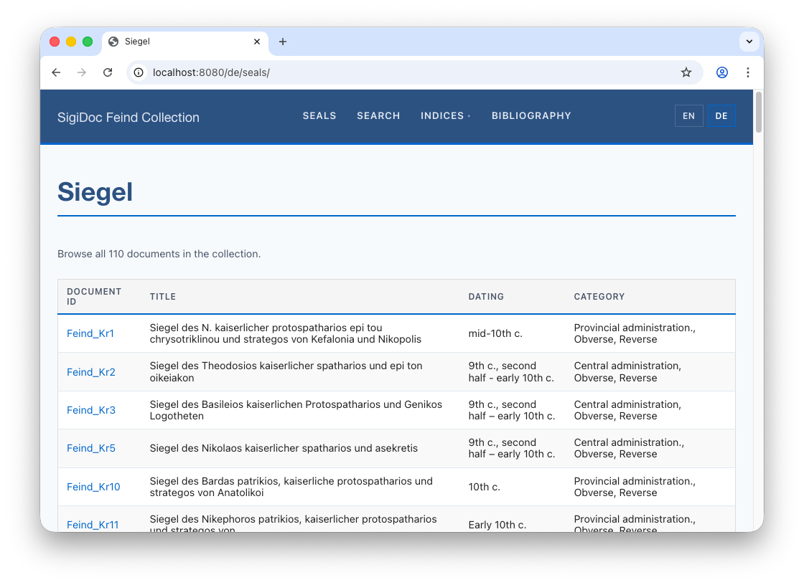

Let's use the same approach to show German data also for the *Dating* and *Category* columns. In `extract-metadata.xsl` select the right `tei:origDate/tei:seg` and `tei:summary/tei:seg` per language using the `$language` parameter by replacing the `[@xml:lang='en']` predicates with `[@xml:lang=$language]`:

```xml
<!-- [!code word:$language] -->
<xsl:template match="tei:TEI" mode="extract-metadata">
	<!-- ... -->
	  <origDate><xsl:value-of select="string-join(//tei:origDate/tei:seg[@xml:lang='en'], ', ')"/></origDate> <!-- [!code rm] -->
	  <origDate><xsl:value-of select="string-join(//tei:origDate/tei:seg[@xml:lang=$language], ', ')"/></origDate> <!-- [!code ++] -->
      <category><xsl:value-of select="string-join(//tei:msContents/tei:summary/tei:seg[@xml:lang='en']/normalize-space(.), ', ')"/></category> <!-- [!code rm] -->
      <category><xsl:value-of select="string-join(//tei:msContents/tei:summary/tei:seg[@xml:lang=$language]/normalize-space(.), ', ')"/></category> <!-- [!code ++] -->
	<!-- ... -->
```

When the German seal list loads, all data is in German now:

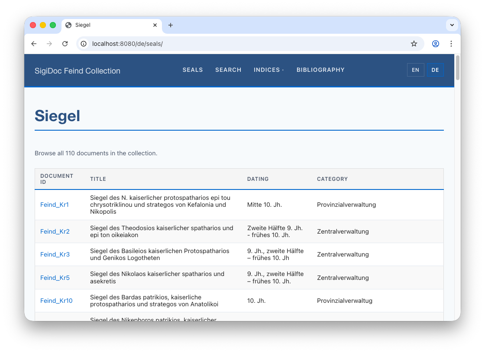

Note that this has also fixed the seal titles on the individual German seal pages, as these are generated from the extracted metadata, too:

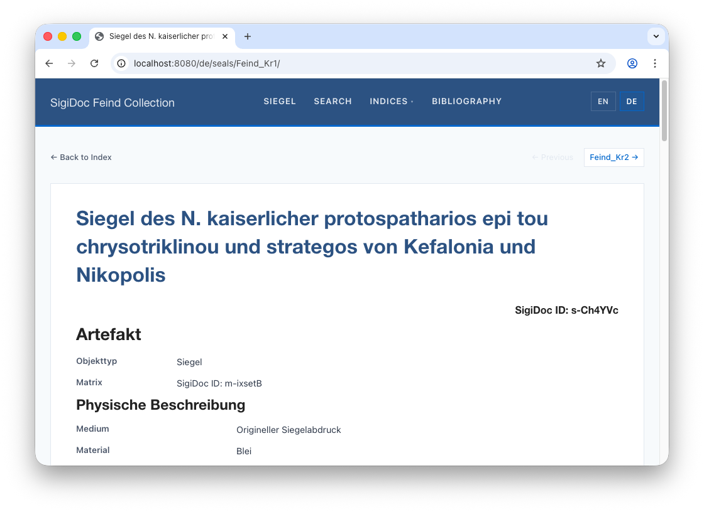

## Step 5: German Homepage

<div style="display: flex; gap: 2rem; align-items: flex-start; flex-wrap: wrap; margin: 1.5rem 0;">
<div style="flex: 1 1 300px; min-width: 0;">
Let's also add a German homepage. This is a pure content page, so just copy `source/website/en/index.njk` to `source/website/de/index.njk` and translate the text by hand (don't forget the `title: ` front matter property which is what appears in the user's browser tab title):
</div>
<div style="min-width: 0;">

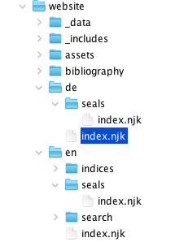

</div>
</div>


```html
---
layout: layouts/base.njk
title: Sammlung Robert Feind
suppressTitle: true
---

<div class="home-hero">
    <h1 class="home-title">Sammlung Robert Feind</h1>
</div>

<div class="home-section">
    <p>Eine digitale Edition byzantinischer Bleisiegel aus der Sammlung Robert Feind,
    kodiert nach dem <a href="https://sigidoc.huma-num.fr/">SigiDoc</a>-Standard.</p>
</div>
```

Navigate to `🌎 /de/`. You now have a German homepage:

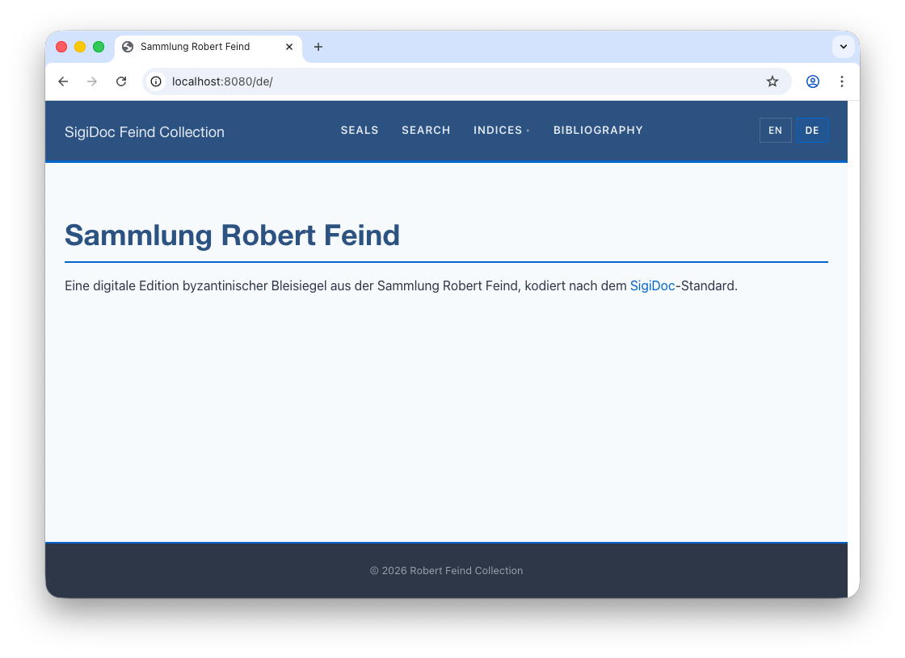

## Step 6: Translating the Website Shell

We now have German seal pages, a German seal list, and a German homepage. But look at the header: the navigation menu still says "Seals", "Search", "Indices" on German pages too. The prev/next links say "Previous" and "Next". All of this text is hardcoded in the templates and needs translating.

<div style="display: flex; gap: 2rem; align-items: flex-start; flex-wrap: wrap; margin: 1.5rem 0;">
<div style="flex: 1 1 300px; min-width: 0;">

Unlike the seal list or homepage, we can't just copy these files per language. The header, footer, and document layout are **shared includes**: one `header.njk` is used by every page on the site, regardless of language. Both `/en/seals/` and `/de/seals/` include the same file. It needs to display "Seals" or "Siegel" depending on which page is using it.

</div>
<div style="min-width: 0;">

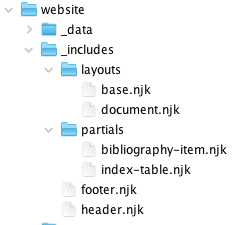

</div>
</div>


Our project's Eleventy configuration file (`source/website/eleventy.config.js`) provides a `| t` filter for this. It reads translation files from `source/website/_data/translations/` (one JSON file per language: `en.json`, `de.json`, etc.) and looks up a key based on the current page's language.

> [!note] 
> The approach is the same one we saw for the SigiDoc XSLT UI labels (`messages_en.xml` with key lookups), but adapted for Eleventy templates: translation files that map keys to translated strings, and a method to look them up.

The language file defines the translation keys and texts like this:

**`source/website/_data/translations/en.json`:**
```json
{
    "seals": "Seals",
    "indices": "Indices",
    "search": "Search",
    "bibliography": "Bibliography",
    "backToIndex": "Back to Index",
    "previous": "Previous",
    "next": "Next"
}
```

In a template, you use it wherever a translated text should appear:

```njk
{{ "seals" | t }}
```

On an English page (`page.lang = "en"`), this looks up `seals` in `en.json` and outputs "Seals". On a German page, it looks up the same key in `de.json` and outputs "Siegel". If a key is missing in the current language, it falls back to English, then to the raw key wrapped in brackets.

<div style="display: flex; gap: 2rem; align-items: flex-start; flex-wrap: wrap; margin: 1.5rem 0;">
<div style="flex: 1 1 300px; min-width: 0;">

The scaffold includes an `en.json.example` file in `source/website/_data/translations/`. Rename it to `en.json` and, and then create a `de.json` alongside it with the German translations:

</div>
<div style="min-width: 0;">

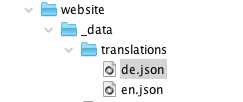

</div>
</div>

**`source/website/_data/translations/de.json`:**
```json
{
    "seals": "Siegel",
    "indices": "Indizes",
    "search": "Suche",
    "bibliography": "Bibliographie",
    "backToIndex": "Zurück zur Übersicht",
    "previous": "Zurück",
    "next": "Weiter"
}
```

Then replace hardcoded strings in your templates with `| t` lookups. For example, the *Seals* main menu entry in `source/website/_includes/header.njk`:

```html
<!-- [!code word:{{ \"seals\" | t }}] -->
<!-- [!code word:Seals] -->
<!-- ... -->
<!-- Navigation Menu -->
<nav class="site-nav">
	<!-- Before -->
	<a href="/{{ page.lang }}/seals/" class="nav-link">Seals</a> <!-- [!code highlight] -->

	<!-- After -->
	<a href="/{{ page.lang }}/seals/" class="nav-link">{{ "seals" | t }}</a> <!-- [!code highlight] -->
```

The `t` filter automatically looks up the key in the translation file matching `page.lang`. If no translation is found, it falls back to English, then to the raw key wrapped in brackets.

Switch to the preview: You should see that the *Seals* main menu entry has changed to *Siegel*:
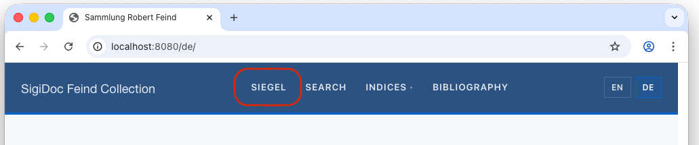


If you like, try it on a few texts across the website. It's a good occasion to explore which template is responsible for what parts of the pages. Then let's go on to internationalise the remaining sections of the site.

::: details How many strings need converting?
About 20 across all templates, mostly in the header (nav labels), document layout (prev/next/back), and the seal list (column headers, intro text). 
:::

## Step 7: German Search Page

As data used for search and search results display extracted as defined `extract-metadata.xsl` (in the `extract-search` template, see [Search](search.md)), we need to make a few changes to make it pick the data for the right language (very similar to how we did it for the seal list above).

Open `extract-metadata.xml` to make the following changes (affected lines highlighted and changes marked with rectangles) to select the right language for each data field:

```xml
<!-- [!code word:[@xml\:lang=$language\]] -->
<!-- [!code word:$language] -->
<xsl:template match="tei:TEI" mode="extract-search">
	<xsl:param name="language" tunnel="yes"/> <!-- add this line! --> <!-- [!code highlight] -->

	<title><xsl:value-of select="(//tei:titleStmt/tei:title[@xml:lang=$language]/normalize-space(.)[.], $filename)[1]"/></title> <!-- [!code highlight] -->
	<sortKey><xsl:value-of select="$sortKey"/></sortKey>

	<origDate><xsl:value-of select="string-join(//tei:origDate/tei:seg[@xml:lang=$language], ', ')"/></origDate> <!-- [!code highlight] -->
 
 <!-- ... -->
</xsl:template>
```


The search page needs one more pipeline change. Currently, only English search data is generated. Add a German search data node to `pipeline.xml`:

> [!info] We're switching to: Pipeline Configuration (pipeline.xml)

```xml
<xsltTransform name="aggregate-search-data-german">
    <stylesheet><files>source/stylesheets/lib/aggregate-search-data.xsl</files></stylesheet>
    <initialTemplate>aggregate</initialTemplate>
    <stylesheetParams>
        <param name="metadata-files">
            <from node="extract-epidoc-metadata" output="transformed"/>
        </param>
        <param name="language">de</param> <!-- [!code highlight] -->
    </stylesheetParams>
    <output to="_assembly/search-data" filename="documents_de.json"/> <!-- [!code highlight] -->
</xsltTransform>
```

This node is basically a copy of the `aggregate-search-data` node for English, with  the `language` stylesheet param and the output `filename` changed from `en` to `de`. This produces `documents_de.json` (filename set in the `output` element) with German titles, dates, and milieu names or the search facets. 


> [!info] We're switching to: Website Templates (source/website/)


<div style="display: flex; gap: 2rem; align-items: flex-start; flex-wrap: wrap; margin: 1.5rem 0;">
<div style="flex: 1 1 300px; min-width: 0;">

Then create the German search page: create the `source/website/de/search` directory, copy the English `source/website/en/search/index.njk` to `source/website/de/search/index.njk`, open it in the editor and change the title in the frontmatter to "Suche":

</div>
<div style="min-width: 0;">

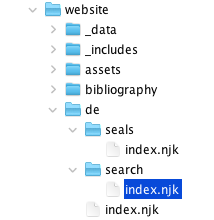 

</div>
</div>

**`source/website/de/search/index.njk`**:
```yaml
---  
layout: layouts/base.njk  
title: Suche # [!code highlight]  
---

```

The search page template already uses `page.lang` to determine the current language from it's path (`/de/` or `/en`), so the German search page automatically loads the German data file and links to German results. Switch to the preview and navigate to the German search page (`🌎 /de/search`):

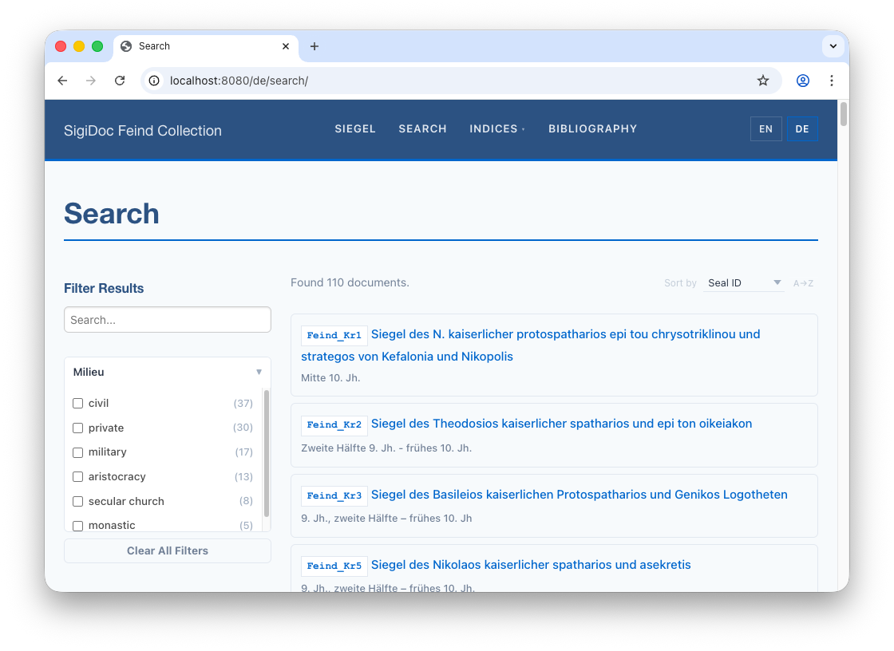

> [!note]
> The facet values for *milieu* are derived from an attribute value in the source XML and SigiDoc does not provide a way to encode them multilingually. To translate them, you could either use authority files or pre-process the values in the `extract-search` template. For an example of this, see the [`metadata-config.xsl`](https://github.com/olvidalo/efes-ng-sigidoc-feind/blob/4aa9e36da31451843dccd1450d6d075c6339fea4/source/metadata-config.xsl#L406-L416) of the full [Feind Collection Example Project](https://github.com/olvidalo/efes-ng-sigidoc-feind/) 

## Step 8: German Entity Index

### Persons Index

#### Metadata Extraction

To get a German persons index page, we first have to adapt `metadata-config.xsl` to extract the persons data for each language, using the same pattern we used for the seal list, and search. 

Open `metadata-config.xsl`  and make the following small change to the `extract-persons` template:
```xml
<!-- [!code word:$language] -->
   <xsl:template match="tei:TEI" mode="extract-persons">
		<xsl:param name="language" tunnel="yes"/>
        <xsl:for-each select=".//tei:listPerson[@type='issuer']/tei:person">
            <xsl:variable name="name" select="(tei:persName[@xml:lang=$language], tei:persName)[1]"/> <!-- [!code highlight] -->
            <xsl:variable name="forename" select="normalize-space($name/tei:forename)"/>
            <xsl:variable name="surname" select="normalize-space($name/tei:surname)"/>
            <xsl:if test="$forename or $surname">
                <entity indexType="persons">
                    <forename><xsl:value-of select="$forename"/></forename>
                    <surname><xsl:value-of select="$surname"/></surname>
                    <sortKey><xsl:value-of select="lower-case(string-join(($forename, $surname)))"/></sortKey>
                </entity>
            </xsl:if>
        </xsl:for-each>
    </xsl:template>
```

This is the only change we need: Changing the `[@xml:lang='en']` predicate to `[@xml:lang=$language]` when we select the `persName` element. 

Copy the remaining index pages to German. The data-driven content (index tables) handles language automatically. You just need to copy the template and translate the title.

#### German Persons Page


<div style="display: flex; gap: 2rem; align-items: flex-start; flex-wrap: wrap; margin: 1.5rem 0;">
<div style="flex: 1 1 300px; min-width: 0;">

Now we need to add the German version of the index to the website templates. Language selection is handled automatically by the included `index-table.njk` partial.

</div>
<div style="min-width: 0;">

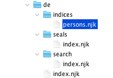

</div>
</div>

Create the `source/website/de/indices/` directory and copy `source/website/en/indices/persons.njk` into it. Open `source/website/de/indices/persons.njk` in the editor and translate the title:


```njk{3}
---  
layout: layouts/base.njk  
title: Personen  
---  
  
  
  


<!-- ... -->
```

Switch to the preview and navigate to the German persons index at `🌎 /de/indices/persons` to see the page working:

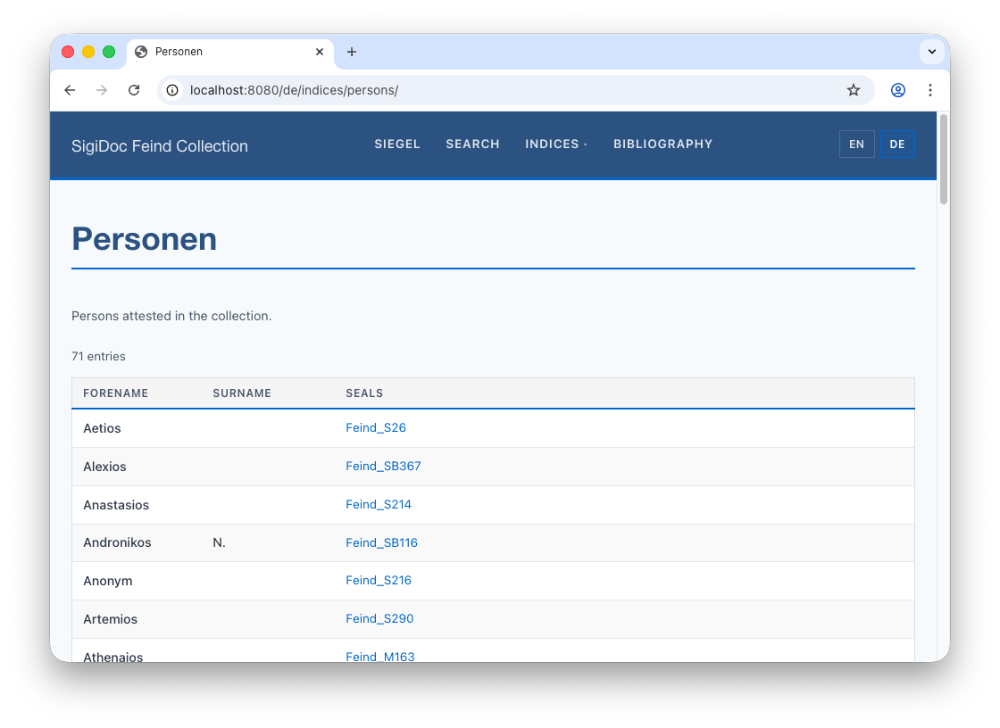

Notice that the index descriptions and the table column headers are still in English. We'll fix this next.

#### Entity Index Description and Table Column Headers

The title, index description and the table column headers are defined in the index definition in `metadata-config.xsl`:

```xml
<idx:index id="persons" nav="indices" order="10">
	<idx:title>Persons</idx:title>
	<idx:description>Persons attested in the collection.</idx:description>
	<idx:columns>
		<idx:column key="forename"><idx:label>Forename</idx:label></idx:column> 
		<idx:column key="surname"><idx:label>Surname</idx:label></idx:column>
		<idx:column key="references" type="references"><idx:label>Seals</idx:label></idx:column>
	</idx:columns>
</idx:index>
```

The `idx:title`, `idx:description`, and `idx:label` elements can take a `xml:lang` attribute specifying the languages. When you provide language variants of them, they are propagated through the pipeline to `_assembly/_data/indices/_summary.json` generated by the `aggregate-indices` node and automatically picked up by the `source/website/_includes/partials/index-table.njk` partial that generates the index tables.

Add `xml:lang="en"` to each of the existing `idx:title`, `idx:description`, and `idx:label` elements, and duplicate them with `xml:lang="de"` and translate to German:

```xml
<!-- [!code word:xml\:lang=\"en\"] -->
<!-- [!code word:xml\:lang=\"de\"] -->
<idx:index id="persons" nav="indices" order="10">
	<idx:title xml:lang="en">Persons</idx:title>
	<idx:title xml:lang="de">Personen</idx:title>
	<idx:description xml:lang="en">Persons attested in the collection.</idx:description>
	<idx:description xml:lang="de">Personen in der Sammlung.</idx:description>
	<idx:columns>
		<idx:column key="forename">
			<idx:label xml:lang="en">Forename</idx:label>
			<idx:label xml:lang="de">Vorname</idx:label>
		</idx:column> 
		<idx:column key="surname">
			<idx:label xml:lang="en">Surname</idx:label>
			<idx:label xml:lang="de">Nachname</idx:label>
		</idx:column>
		<idx:column key="references" type="references">
			<idx:label xml:lang="en">Seals</idx:label>
			<idx:label xml:lang="de">Siegel</idx:label>
		</idx:column>
	</idx:columns>
</idx:index>
```

Switch to the preview. The index description and column headers for the German persons index now correctly show the German translations:

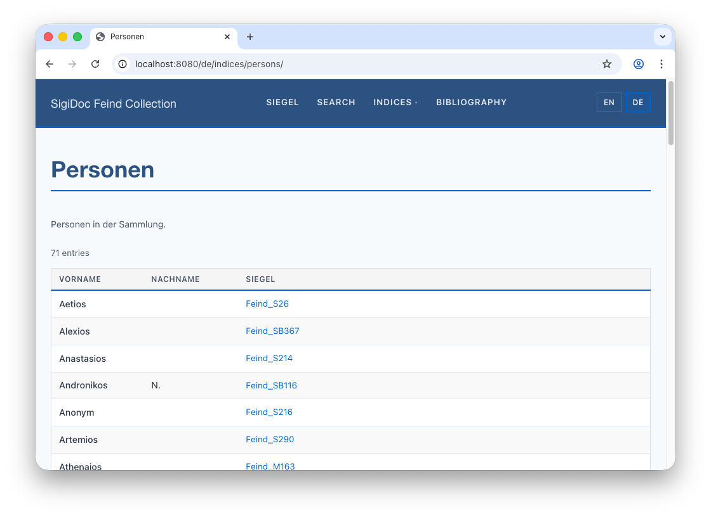

### Entity Indices Landing Page 

Copy the English `source/website/en/indices/index.njk` to `source/website/de/indices/index.njk`, and translate the copy text:

```html
---
layout: layouts/base.njk
title: Indizes
---

<p class="index-intro">Durchsuchen Sie die Indizes der Sammlung.</p>

<!-- ... -->
```

This will make the German indices landing page at `🌎 /de/indices` work:

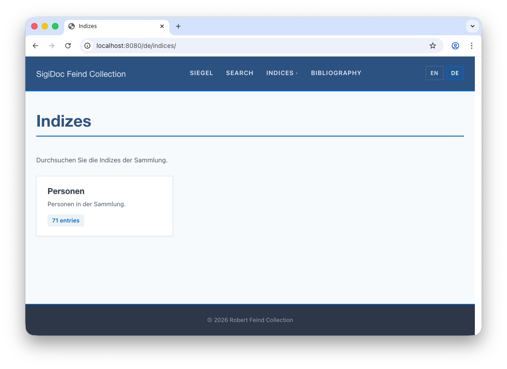

## Step 9: Using Template Pagination

### This Works, But Doesn't Scale

Take a step back and look at what we've done: we copied the seal list, search page, indices landing, and persons index. Those four templates are mostly identical across languages. For content pages like the homepage, copying and translating by hand is fine, because the text is unique to each language. But these data-driven pages are essentially the same template with a different title.

If we add Greek, we copy all four again. Every change to the table layout needs updating in all copies. For three or more languages, this becomes tedious and error-prone.

> [!note]
> While following the steps in this section is not technically required to create working multi-lingual sites, it is recommended to follow it is a good example to apply the [Do Not Repeat Yourself (DRY) principle](https://en.wikipedia.org/wiki/Don%27t_repeat_yourself), a paradigm in software engineering which helps to write maintainable code. Also, the last two tutorial steps will be easier to follow if you have worked through these steps.

### Concept: Template Pagination

Above, we copied four data-driven templates (seal list, search, indices landing, persons index) per language. Eleventy's **pagination** feature lets us replace each pair with a single template that produces pages for all languages automatically. The general steps for each template are:

1. Delete the German copy (`de/seals/index.njk`)
2. Move the English version to the site root and rename it (e.g., `en/seals/index.njk` → `seals.njk`)
3. Add pagination front matter that iterates over `languages.json`

<div style="display: flex; gap: 2rem; align-items: flex-start; flex-wrap: wrap; margin: 1.5rem 0;">
<div style="flex: 1 1 300px; min-width: 0;">

Let's walk through it for the seal list:

1. Delete the German-specific `source/website/de/seals/index.njk` copy
2. Rename `source/website/en/seals/index.njk`  to `seals.njk` and move it to `source/website/seals.njk` (root level, outside any language directory)
3. Open `source/website/seals.njk` and **replace the front matter** (everything including and between the two `---`) with the following pagination configuration (just copy-and-paste it in):
</div>
<div style="min-width: 0;">

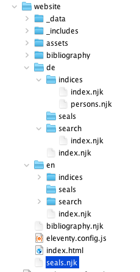

</div>
</div>

`source/website/seals.njk`:
```yaml
---
layout: layouts/base.njk
permalink: "{{ langCode }}/seals/index.html"
pagination:
    data: languages.codes # [!code highlight]
    size: 1 # [!code highlight]
    alias: langCode # [!code highlight]
eleventyComputed:
    title: "{{ 'seals' | t }}" # [!code highlight]
---
```

::: warning
Occasionally, when copy-and-pasting (especially into Oxygen XML editor), the pasted code looses the indentation. For this front matter, correct indentation is necessary or you'll get an error. When pasting, double check the indentation of the lines highlighted above. If it is missing, indent the affected lines with a tab each.
:::

::: info What does each property do?
- **`permalink`**: Tells Eleventy what output file to produce for each language. Uses the `langCode` variable to put each page under its language prefix
- **`pagination.data`**: The data to iterate over. Here it points to `languages.codes` from our `source/website/_data/languages.json` file (`["en", "de"]`)
- **`pagination.size`**: Produce exactly one page per language.
- **`pagination.alias`**: The variable name for the current item. We use `langCode`, which becomes `"en"` or `"de"` in each iteration
- **`eleventyComputed.title`**: The title needs to be different for each language, so we can't just write `title: Seals` (that would be the same for every generated page). `eleventyComputed` tells Eleventy to evaluate the value at render time (like a template expression), so <span v-pre style="white-space: nowrap">`{{ 'seals' | t }}`</span> resolves to "Seals" or "Siegel" depending on the current language
:::

4. Change the collection reference further down to use `page.lang`:
   ```njk
   <!-- [!code word:[\"seals-\" + page.lang\]] -->
   {# Collection name must match the "tags" stylesheet parameter in the generate-eleventy-data pipeline node #}
   
   ```

Eleventy replaces `page.lang` with the current language and appends it to `"seals-"`, so it becomes `"seals-en"` or `"seals-en"`, respectively.


> [!tip]
> If you see a persistent build error after renaming or deleting files, it may be caused by stale files from a previous build. Stop the pipeline, click **Clean** in the GUI (or run `efes-ng clean` on the command line), and rebuild.

Eleventy evaluates the `langCode` variable for each language code and generates a page for each:


The original `en/seals/index.njk` and the copied `de/seals/index.njk` are now replaced by a single `seals.njk`. Adding Greek later is just adding `"el"` to `languages.json`.

Switch to the preview and check the German and English seal list pages: they should work as before. If you sea "\[seals]" as page title, make sure to add translation entries to `source/website/_data/translations/en.json` and `de.json` respectively:
```json
{
   ...
    "resultCountFiltered": "Found {count} of {total} documents.",
    "sortBy": "Sort by" // [!code rm]
    "sortBy": "Sort by", // [!code ++]
    "seals": "Seals" // [!code ++]
}

```

Apply the same pattern to the other copied templates. Each one: move to root, add pagination front matter, delete the `de/` copy.

::: info Walkthrough: Convert remaining pages to pagination

**1. Search page**: Delete `source/website/de/search/index.njk`, move `source/website/en/search/index.njk` to `source/website/search.njk`, change frontmatter to:

```yaml
---
layout: layouts/base.njk
permalink: "{{ langCode }}/search/index.html"
pagination:
    data: languages.codes
    size: 1
    alias: langCode
eleventyComputed:
    title: "{{ 'search' | t }}"
---
```


**2. Indices landing page**: Delete `source/website/de/indices/index.njk`, move `source/website/en/indices/index.njk` to `source/website/indices.njk`, change frontmatter to:

```yaml
---
layout: layouts/base.njk
permalink: "{{ langCode }}/indices/index.html"
pagination:
    data: languages.codes
    size: 1
    alias: langCode
eleventyComputed:
    title: "{{ 'indices' | t }}"
---
```


**3. Persons index page**: Delete `source/website/de/indices/persons.njk`,  move `source/website/en/indices/persons.njk` to `source/website/index-persons.njk`, change frontmatter to:

```yaml
---
layout: layouts/base.njk
permalink: "{{ langCode }}/indices/persons/index.html"
pagination:
    data: languages.codes
    size: 1
    alias: langCode
eleventyComputed:
    title: "{{ 'persons' | t }}"
---
```

4. **Add missing title translations**: For the index titles, we used the translation keys `indices`, `seals`, and `persons`. The `de.json` and `en.json` translation files in `source/website/data/translations` are currently missing these entries. Make sure to add them for both languages, or you will see the keys wrapped in square brackets appear.

5. **Remove stale language directories.** To clean up the website source structure, we can also remove the following now-empty language specific directories:
	- `website/en/indices`
	- `website/en/search`
	- `website/de/indices`
	- `website/de/search`

::: 

> [!tip]
> The *permalink* front matter property that controls where pages generated from this template end up only matters for templates that need to produce multiple outputs. For pipeline-generated content (like the individual seal HTML pages), the output path is determined by the pipeline's `<output>` configuration, so no permalink is needed.

#### Copy vs. Pagination: Which to Choose?

|                                                    | Copy approach                                               | Pagination approach                                                                    |
| -------------------------------------------------- | ----------------------------------------------------------- | -------------------------------------------------------------------------------------- |
| **Initial Setup**                                  | Copy file, translate text in template                       | Move file, add front matter, translate text using key lookup method with `\| t` filter |
| **Adding a language**                              | Copy all templates and make language-specific changes again | Add one code to `languages.json`                                                       |
| **Changing a template**                            | Update every copy                                           | Update one file                                                                        |
| **Content pages** (homepage, about)                | Recommended – content is unique per language                | Not useful – nothing to share                                                          |
| **Data-driven pages** (seal list, indices, search) | Works okay for 2 languages                                  | Recommended for 3 or more languages                                                    |
| **Complexity**                                     | Simple, explicit                                            | Requires understanding pagination front matter                                         |

Both approaches are valid. Use what fits your project. You can mix them: pagination for data-driven pages, copy for content pages.

### Adding More Languages

If you're using the pagination approach, adding a third language (e.g., Greek) is straightforward, because the templates already generate pages for all languages in `languages.json`. You only need to add pipeline nodes and translation files:

1. **Pipeline:** Add `el` to the `languages` param in `extract-epidoc-metadata`: `en de el`
2. **HTML rendering:** Add `prune-epidoc-greek` and `transform-epidoc-greek` nodes, set `language` XSLT parameter to `el` for both, and for `transform-epidoc-greek` make sure it references the `messages_el.xml` translation file in the respective XSLT param
3. **Sidecar data:** Add `generate-eleventy-data-greek` with `tags: "seals-el"` and `language: el`
4. **Search data:** Add `aggregate-search-data-greek` with `language: el` and `filename: documents_el.json`
5. **XSLT UI labels:** Add `messages_el.xml` translation file from the SigiDoc repository
6. **Website shell:** Add `el.json` translation data and `"el"` to `languages.json`

If you're using the copy approach, you also need to duplicate all templates to `el/` paths and adapt them according to the language.

> [!info] The full [SigiDoc Feind Collection](https://github.com/olvidalo/efes-ng-sigidoc-feind) example project's `source/website/` directory has a complete set of multi-language templates that you can use it as a reference.

## What We've Built

### Template Structure

Here's how the website template directory changed from single-language to multi-language (with pagination):

| Before (single-language) | After (multi-language with pagination) | |
|---|---|---|
| `en/index.njk` | `en/index.njk` | Content page (English) |
| | `de/index.njk` | Content page (German) |
| `en/seals/index.njk` | `seals.njk` | Paginated → `/en/seals/`, `/de/seals/` |
| `en/search/index.njk` | `search.njk` | Paginated → `/en/search/`, `/de/search/` |
| `en/indices/index.njk` | `indices.njk` | Paginated → `/en/indices/`, `/de/indices/` |
| `en/indices/persons.njk` | `index-persons.njk` | Paginated → `/en/indices/persons/`, ... |
| `_includes/...` | `_includes/...` | Shared (uses `\| t` filter) |
| `_data/...` | `_data/languages.json` | Language codes + labels |
| | `_data/translations/en.json` | English UI strings |
| | `_data/translations/de.json` | German UI strings |

### Pipeline

The complete multi-language pipeline:

```mermaid
flowchart TD
    seals[/"source/seals/Feind_*.xml"/]
    templates[/"source/website/"/]

    extract["Node: <b>extract-epidoc-metadata</b>\n(languages: en de)"]
    meta(["metadata XML"])
    agg["Node: <b>aggregate-indices</b>"]
    idxjson(["_data/indices/*.json"])
    copy["Node: <b>copy-eleventy-site</b>"]
    site(["templates, CSS, ..."])

    subgraph "English"
        prune_en["Node: <b>prune-epidoc-english</b>"]
        pruned_en(["English-only SigiDoc XML"])
        transform_en["Node: <b>transform-epidoc</b>"]
        html_en(["en/Feind_*.html"])
        data_en["Node: <b>generate-eleventy-data</b>"]
        json_en(["en/Feind_*.11tydata.json"])
        search_en["Node: <b>aggregate-search-data</b>"]
        searchjson_en(["documents_en.json"])
        prune_en --> pruned_en --> transform_en --> html_en
        data_en --> json_en
        search_en --> searchjson_en
    end

    subgraph "German"
        prune_de["Node: <b>prune-epidoc-german</b>"]
        pruned_de(["German-only SigiDoc XML"])
        transform_de["Node: <b>transform-epidoc-german</b>"]
        html_de(["de/Feind_*.html"])
        data_de["Node: <b>generate-eleventy-data-german</b>"]
        json_de(["de/Feind_*.11tydata.json"])
        search_de["Node: <b>aggregate-search-data-german</b>"]
        searchjson_de(["documents_de.json"])
        prune_de --> pruned_de --> transform_de --> html_de
        data_de --> json_de
        search_de --> searchjson_de
    end

    assembly(["_assembly/"])
    build["Node: <b>eleventy-build</b>"]
    output(["_output/"])

    seals --> prune_en
    seals --> prune_de
    seals --> extract --> meta
    meta --> data_en
    meta --> data_de
    meta --> agg --> idxjson
    meta --> search_en
    meta --> search_de
    templates --> copy --> site

    html_en --> assembly
    html_de --> assembly
    json_en --> assembly
    json_de --> assembly
    idxjson --> assembly
    searchjson_en --> assembly
    searchjson_de --> assembly
    site --> assembly
    assembly --> build --> output

    style seals fill:#f5f5f5,stroke:#999
    style templates fill:#f5f5f5,stroke:#999

    style pruned_en fill:#e8f5e9,stroke:#4caf50
    style html_en fill:#e8f5e9,stroke:#4caf50
    style meta fill:#e8f5e9,stroke:#4caf50
    style json_en fill:#e8f5e9,stroke:#4caf50
    style idxjson fill:#e8f5e9,stroke:#4caf50
    style searchjson_en fill:#e8f5e9,stroke:#4caf50
    style site fill:#e8f5e9,stroke:#4caf50

    style pruned_de fill:#e8f5e9,stroke:#4caf50
    style html_de fill:#e8f5e9,stroke:#4caf50
    style json_de fill:#e8f5e9,stroke:#4caf50
    style searchjson_de fill:#e8f5e9,stroke:#4caf50

    style assembly fill:#fff3e0,stroke:#ff9800
    style output fill:#fff3e0,stroke:#ff9800

    style prune_de stroke:#2563eb,stroke-width:3px
    style transform_de stroke:#2563eb,stroke-width:3px
    style data_de stroke:#2563eb,stroke-width:3px
    style search_de stroke:#2563eb,stroke-width:3px
    style pruned_de stroke:#2563eb,stroke-width:2px
    style html_de stroke:#2563eb,stroke-width:2px
    style json_de stroke:#2563eb,stroke-width:2px
    style searchjson_de stroke:#2563eb,stroke-width:2px
```

The German nodes (highlighted in blue) add a prune + transform chain for HTML rendering, a sidecar data node, and a search data node. The metadata extraction and index aggregation are **shared**: one node each handles both languages.

Now that we have multi-language support, let's create a genuinely multilingual index: [Authority Files and Places Index →](./places-index)
