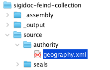
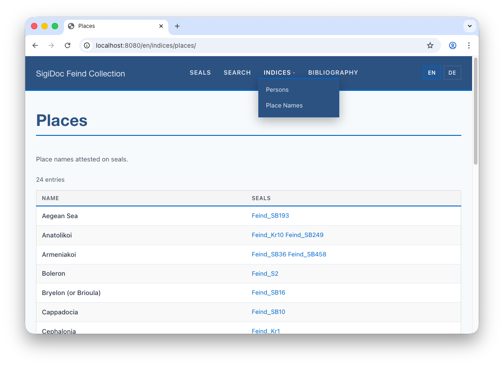
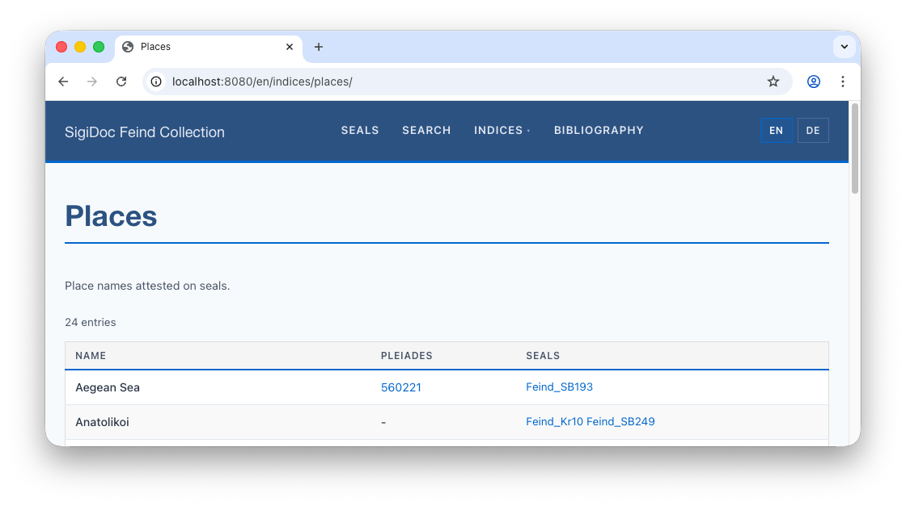
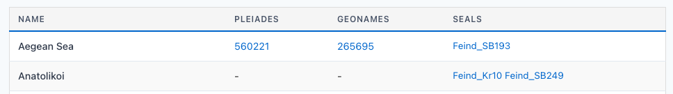
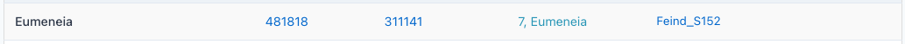

# Authority Files and Places Index

The persons index extracts names directly from each seal's XML. But place names work differently: the seal XML contains a reference (`@ref="#geo0054"`), and the actual name lives in an authority file (`geography.xml`), along with translations. In the following, we build a places index that looks up names from the authority file, with multilingual support.

## What Are Authority Files?

Authority files are shared XML databases of controlled vocabulary, providing standardised entries for places, persons, dignities, etc. Each entry has an ID and names in multiple languages:

```xml
<place xml:id="geo0054">
    <placeName xml:lang="en">Cephalonia</placeName>
    <placeName xml:lang="de">Kephalonia</placeName>
    <placeName xml:lang="el">Κεφαλληνία</placeName>
    <placeName xml:lang="grc">Κεφαλληνία</placeName>
</place>
```

The seal XML references this entry:

```xml
<placeName ref="#geo0054">Cephalonia</placeName>
```

For the index, we will use an extraction template that resolves the reference and picks the name in the current language.

### Getting the Authority Files

In SigiDoc, authority files are maintained per-project. For this tutorial, we use existing authority files for the Robert Feind Collection that are maintained in [their own GitHub repository](https://github.com/byzantinistik-koeln/authority) .


<div style="display: flex; gap: 2rem; align-items: flex-start; flex-wrap: wrap; margin: 1.5rem 0;">
<div style="flex: 1 1 300px; min-width: 0;">

Create a new directory for authority files `source/authority` and download `geography.xml` from the Robert Feind Collection repository into it. 

</div>
<div style="min-width: 0;">



</div>
</div>

::: tip
If you are using `git`, you could add `https://github.com/byzantinistik-koeln/authority` as a submodule of your project repository under `source/authority`.
:::

## Step 1: Add the Authority File as a Dependency

> [!info] We're working with: Pipeline Configuration (pipeline.xml)

> [!warning]
> Make sure you've downloaded `geography.xml` to `source/authority/` before making this change. If the file doesn't exist when the pipeline runs, you'll get an error. If the watcher is running and you see this error, stop the pipeline and restart it after adding the file.

The extraction node needs access to the geography authority file. Open `pipeline.xml` and add it as a new stylesheet parameter named `geography-file` to the `extract-epidoc-metadata` node , wrapped in `<files>` so the pipeline tracks it as a dependency:

```xml
<xsltTransform name="extract-epidoc-metadata">
    <sourceFiles><files>source/seals/*.xml</files></sourceFiles>
    <stylesheet><files>source/metadata-config.xsl</files></stylesheet>
    <stylesheetParams>
        <param name="languages">en de</param>
        <param name="geography-file"> <!-- [!code ++] -->
            <files>source/authority/geography.xml</files> <!-- [!code ++] -->
        </param> <!-- [!code ++] -->
    </stylesheetParams>
</xsltTransform>
```

Wrapping the path in `<files>` registers it as a tracked dependency: If you update `geography.xml`, all affected seals are reprocessed.

## Step 2: Define the Places Index

> [!info] We're switching to: metadata extraction configuration (source/metadata-config.xsl)

In `metadata-config.xsl`, add a parameter declaration so we can access the `geography-file` parameter we added to the pipeline config, and load the authority file. At the top of the `<xsl:stylesheet>` element, below the `xsl:import`, add the following

```xml
<xsl:import href="stylesheets/lib/extract-metadata.xsl"/>

<xsl:param name="geography-file" as="xs:string"/> <!-- [!code ++] -->
<xsl:variable name="geography" select="document('file://' || $geography-file)"/> <!-- [!code ++] -->
```

This will store the content of the geography authority file in the `$geography` variable. 

Then define the index: at the end of the `INDEX DEFINITIONS` section, just below the persons index, add:
```xml
<idx:index id="places" nav="indices" order="20">
    <idx:title xml:lang="en">Place Names</idx:title>
    <idx:title xml:lang="de">Place Names</idx:title>
    <idx:description xml:lang="en">Place names attested on seals.</idx:description>
    <idx:description xml:lang="de">Auf Siegeln belegte Ortsnamen.</idx:description>
    <idx:columns>
        <idx:column key="name">
	        <idx:label xml:lang="en">Name</idx:label>
	        <idx:label xml:lang="de">Name</idx:label>
	    </idx:column>
        <idx:column key="references" type="references">
	        <idx:label xml:lang="en">Seals</idx:label>
	        <idx:label xml:lang="de">Siegel</idx:label>
	    </idx:column>
	</idx:columns>
</idx:index>
```

## Step 3: Write the Extraction Template

The extraction template finds place references in each seal, resolves them via the authority file, and picks the name in the current language:

```xml
<xsl:template match="tei:TEI" mode="extract-places">
    <xsl:param name="language" tunnel="yes"/>
    <xsl:for-each select=".//tei:div[@type='textpart']//tei:placeName[starts-with(@ref, '#geo')]">
        <xsl:variable name="geo-id" select="substring-after(@ref, '#')"/>
        <xsl:variable name="place" select="$geography//tei:place[@xml:id = $geo-id]"/>
        <!-- Extract current language placeName with fallback to English first, then first available -->
        <xsl:variable name="displayName" select="normalize-space(
            ($place/tei:placeName[@xml:lang=$language],
             $place/tei:placeName[@xml:lang='en'],
             $place/tei:placeName)[1]
        )"/>
        <xsl:if test="string-length($displayName) > 0">
            <entity indexType="places" xml:id="{$geo-id}">
                <name><xsl:value-of select="$displayName"/></name>
                <sortKey><xsl:value-of select="lower-case($displayName)"/></sortKey>
            </entity>
        </xsl:if>
    </xsl:for-each>
</xsl:template>
```

Add this template below the index definition we added above. Notice:
- The framework calls this template once per configured language, passing the current language as `$language`
- We use a **fallback chain** for missing translations: `@xml:lang=$language` → English (`@xml:lang='en'`) → first available
- We use an **authority lookup**: `$geography//tei:place[@xml:id = $geo-id]` resolves the reference
- **`xml:id="{$geo-id}"`** tells the framework to merge the same place across documents into one index entry. Without it, each occurrence would be a separate entry

**Register the new index** in `extract-all-entities` further down the file:

```xml
<xsl:template match="tei:TEI" mode="extract-all-entities">
    <xsl:apply-templates select="." mode="extract-persons"/>
    <xsl:apply-templates select="." mode="extract-places"/> <!-- [!code ++] -->
</xsl:template>
```

## The Multilingual Result

Because the framework calls the extraction template once per language, the metadata XML contains language-specific place names. The framework auto-stamps `xml:lang` on your output and merges entities with the same `xml:id`:

```xml
<entities>
    <places>
        <entity indexType="places" xml:id="geo0054">
            <name xml:lang="en">Cephalonia</name>
            <sortKey xml:lang="en">cephalonia</sortKey>
            <name xml:lang="de">Kephalonien</name>
            <sortKey xml:lang="de">kephalonien</sortKey>
        </entity>
    </places>
</entities>
```

The same seal's place reference resolves to "Cephalonia" in English and "Kephalonien" in German, automatically, from the same extraction template. The `xml:id="geo0054"` ensures both language variants are merged into one index entry.

## Step 4: Creating the Index Page

If you're using pagination (as introduced in [Concept: Template Pagination](./multi-language#concept-template-pagination)), create `source/website/index-places.njk`:

```njk{3,9}
---
layout: layouts/base.njk
permalink: "{{ langCode }}/indices/places/index.html"
pagination:
    data: languages.codes
    size: 1
    alias: langCode
eleventyComputed:
    title: "{{ 'places' | t }}"
---


 <!-- [!code highlight] -->

```

:::tip If you create a new index page by copying it from an existing one, the lines highlighted above are the ones in which you have to adapt the index ID.
:::

If you're using the copy approach instead of pagination, create `source/website/en/indices/places.njk` (e. g. by copying from the existing persons index, and `de/indices/places.njk` for German) with the appropriate title.

::: note 
As we have used `"'places' | t "` as the title, make sure to add translation entries for the "places" key to the files in `/source/website/_data/translations`, or you'll see \[places] as the page title  
:::
 
## See It Work

After rebuild, navigate to the Indices page. You should see a "Place Names" card alongside "Persons." Click it to see place names extracted from the seals, with links to the seal pages where each place appears.



### Multilingual Index Display

Because the extraction runs once per language (via the `$languages` parameter), the aggregated index JSON contains language-keyed values:

```json
{
    "name": {"en": "Cephalonia", "de": "Kephalonia"},
    "sortKey": {"en": "geo0054", "de": "geo0054"},
    "references": [{"inscriptionId": "Feind_Kr1"}]
}
```

The index table template automatically resolves the current language: on the English page you see "Cephalonia", on the German page "Kephalonia". This happens because the `index-table.njk` partial uses `entry[col.key][page.lang]` with a fallback to English.

## Step 5: Linking to External Gazetteers

Some places in the authority file have external identifiers linking to gazetteers like [Pleiades](https://pleiades.stoa.org/), [GeoNames](https://www.geonames.org/), or [TIB](https://tib.oeaw.ac.at/) (Tabula Imperii Byzantini). The authority file pairs each identifier with an explicit link:

```xml
<!-- source/authority/geography.xml -->
<place xml:id="geo0053">
    <placeName xml:lang="en">Eumeneia</placeName>
    <placeName xml:lang="de">Eumeneia</placeName>
    ...
    <idno type="pleiades">481818</idno>
    <link target="https://pleiades.stoa.org/places/481818"/>
    <idno type="geonames">311141</idno>
    <link target="https://www.geonames.org/311141/isikli.html"/>
    <idno type="TIB">7, Eumeneia</idno>
    <link target="https://tib.oeaw.ac.at/static/reader/TIB/tib7.html#page/251/mode/1up"/>
</place>
```

Let's add clickable links to these gazetteers in the places index.

### Pleiades

Add a column to the index definition with `type="link"`:
```xml
<idx:index id="places" nav="indices" order="20">
	<idx:title xml:lang="en">Place Names</idx:title>
    <!-- ... -->
	<idx:columns>
		<idx:column key="name">
			<idx:label xml:lang="en">Name</idx:label>
			<idx:label xml:lang="de">Name</idx:label>
		</idx:column>
		<idx:column key="pleiades" type="link"> <!-- [!code ++] -->
			<idx:label>Pleiades</idx:label> <!-- [!code ++] -->
		</idx:column> <!-- [!code ++] -->
		<idx:column key="references" type="references">
			<idx:label xml:lang="en">Seals</idx:label>
			<idx:label xml:lang="de">Siegel</idx:label>
		</idx:column>
	</idx:columns>
</idx:index>
```

> [!note]
> Since the gazetteer names are the same for each language, we don't need to add separate language labels for these columns.


Then extract the Pleiades link in the extraction template. Instead of a plain text value, output a **structured field** with `<url>` and `<label>` child elements:

```xml
<xsl:template match="tei:TEI" mode="extract-places">
    <xsl:param name="language" tunnel="yes"/>
    <xsl:for-each select=".//tei:div[@type='textpart']//tei:placeName[starts-with(@ref, '#geo')]">
        <xsl:variable name="geo-id" select="substring-after(@ref, '#')"/>
        <xsl:variable name="place" select="$geography//tei:place[@xml:id = $geo-id]"/>
        <!-- Extract current language placeName with fallback to English first, then first available -->
        <xsl:variable name="displayName" select="normalize-space(
            ($place/tei:placeName[@xml:lang=$language],
            $place/tei:placeName[@xml:lang='en'],
            $place/tei:placeName)[1]
            )"/>
        <xsl:variable name="pleiades-id" select="string($place/tei:idno[@type='pleiades'])"/> <!-- [!code ++] -->
        <xsl:if test="string-length($displayName) > 0"> 
            <entity indexType="places" xml:id="{$geo-id}">
                <name><xsl:value-of select="$displayName"/></name>
                <sortKey><xsl:value-of select="lower-case($displayName)"/></sortKey>
                <xsl:if test="$pleiades-id != ''"> <!-- [!code ++] -->
				    <pleiades> <!-- [!code ++] -->
				        <url><xsl:value-of select="concat('https://pleiades.stoa.org/places/', $pleiades-id)"/></url> <!-- [!code ++] -->
				        <label><xsl:value-of select="$pleiades-id"/></label> <!-- [!code ++] -->
				    </pleiades> <!-- [!code ++] -->
				</xsl:if> <!-- [!code ++] -->
            </entity>
        </xsl:if>
    </xsl:for-each>
</xsl:template>
```

When the aggregation stylesheet encounters a field with child elements (instead of just text), it serializes them as a JSON object in the index aggregation. The `index-table.njk` partial recognizes `type="link"` columns and renders the `url` and `label` keys as a clickable link.

Notice that Pleiades URLs follow a regular pattern (`https://pleiades.stoa.org/places/{id}`), so we construct the URL from the ID in the extraction template rather than reading the explicit `<link>` from the authority file.

After rebuild, switch to preview and check the places index. Eumeneia now shows a clickable "481818" linking to its Pleiades page. Places without a Pleiades entry show "-".



### GeoNames

The same pattern works for GeoNames. Add the column to the index definition:

```xml
<idx:column key="geonames" type="link">
	<idx:label>GeoNames</idx:label>
</idx:column>
```

Extend the extraction template (GeoNames URLs are also regular):

```xml
<xsl:template match="tei:TEI" mode="extract-places">
    <xsl:param name="language" tunnel="yes"/>
    <xsl:for-each select=".//tei:div[@type='textpart']//tei:placeName[starts-with(@ref, '#geo')]">
        <!-- ... --> 
        <xsl:variable name="pleiades-id" select="string($place/tei:idno[@type='pleiades'])"/> 
        <xsl:variable name="geonames-id" select="string($place/tei:idno[@type='geonames'])"/> <!-- [!code ++] -->
        <xsl:if test="string-length($displayName) > 0"> 
            <entity indexType="places" xml:id="{$geo-id}">
                <!-- ... -->
                <xsl:if test="$pleiades-id != ''"> 
				    <pleiades> 
				        <url><xsl:value-of select="concat('https://pleiades.stoa.org/places/', $pleiades-id)"/></url>
				        <label><xsl:value-of select="$pleiades-id"/></label> 
				    </pleiades> 
				</xsl:if> 
				<xsl:if test="$geonames-id != ''"> <!-- [!code ++] -->
				    <geonames> <!-- [!code ++] -->
				        <url><xsl:value-of select="concat('https://www.geonames.org/', $geonames-id)"/></url> <!-- [!code ++] -->
				        <label><xsl:value-of select="$geonames-id"/></label> <!-- [!code ++] -->
				    </geonames> <!-- [!code ++] -->
				</xsl:if> <!-- [!code ++] -->
            </entity>
        </xsl:if>
    </xsl:for-each>
</xsl:template>
```

Switch to preview to see the GeoNames column appear:



### TIB

TIB (Tabula Imperii Byzantini) is different: the URLs are not regular. They point to specific pages in digitised volumes: `tib7.html#page/251/mode/1up`. We can't construct them from the ID alone.

Instead, read the explicit `<link>` from the authority file. Each `<idno>` in the authority file is followed by a `<link target="...">` sibling with the full URL:

```xsl
<xsl:template match="tei:TEI" mode="extract-places">
    <xsl:param name="language" tunnel="yes"/>
    <xsl:for-each select=".//tei:div[@type='textpart']//tei:placeName[starts-with(@ref, '#geo')]">
        <!-- ... --> 
        <xsl:variable name="pleiades-id" select="string($place/tei:idno[@type='pleiades'])"/> 
        <xsl:variable name="geonames-id" select="string($place/tei:idno[@type='geonames'])"/>
        <xsl:variable name="tib-id" select="string($place/tei:idno[@type='TIB'])"/>  <!-- [!code ++] -->
        <xsl:variable name="tib-url" select="string($place/tei:idno[@type='TIB']/following-sibling::tei:link[1]/@target)"/> <!-- [!code ++] -->
        <xsl:if test="string-length($displayName) > 0"> 
            <entity indexType="places" xml:id="{$geo-id}">
                <!-- ... -->
                <xsl:if test="$pleiades-id != ''"> 
				    <pleiades> 
				        <url><xsl:value-of select="concat('https://pleiades.stoa.org/places/', $pleiades-id)"/></url>
				        <label><xsl:value-of select="$pleiades-id"/></label> 
				    </pleiades> 
				</xsl:if> 
				<xsl:if test="$geonames-id != ''">
				    <geonames>
				        <url><xsl:value-of select="concat('https://www.geonames.org/', $geonames-id)"/></url> 
				        <label><xsl:value-of select="$geonames-id"/></label> 
				    </geonames>
				</xsl:if>
				<xsl:if test="$tib-id != ''"> <!-- [!code ++] -->
				    <tib> <!-- [!code ++] -->
				        <url><xsl:value-of select="$tib-url"/></url> <!-- [!code ++] -->
				        <label><xsl:value-of select="$tib-id"/></label> <!-- [!code ++] -->
				    </tib> <!-- [!code ++] -->
				</xsl:if> <!-- [!code ++] -->
            </entity>
        </xsl:if>
    </xsl:for-each>
</xsl:template>
```

The `following-sibling::tei:link[1]/@target` picks the `<link>` element immediately after the `<idno>`. This is the convention used in the SigiDoc authority files.

Add the column to the index definition:

```xml
<idx:column key="tib" type="link">
	<idx:label>TIB</idx:label>
</idx:column>
```

Places with TIB references in their authority entry will now show them in the index table:



### The Complete Index Definition

For reference (or copy-pasting): with all three gazetteers, the places index definition looks like this:

```xsl
<idx:index id="places" nav="indices" order="20">
    <idx:title xml:lang="en">Place Names</idx:title>
    <idx:title xml:lang="de">Place Names</idx:title>
    <idx:description xml:lang="en">Place names attested on seals.</idx:description>
    <idx:description xml:lang="de">Auf Siegeln belegte Ortsnamen.</idx:description>
    <idx:columns>
        <idx:column key="name">
            <idx:label xml:lang="en">Name</idx:label>
            <idx:label xml:lang="de">Name</idx:label>
        </idx:column>
        <idx:column key="pleiades" type="link"> 
            <idx:label>Pleiades</idx:label> 
        </idx:column> 
        <idx:column key="geonames" type="link">
            <idx:label>GeoNames</idx:label>
        </idx:column>
        <idx:column key="tib" type="link">
            <idx:label>TIB</idx:label>
        </idx:column>
        <idx:column key="references" type="references">
            <idx:label xml:lang="en">Seals</idx:label>
            <idx:label xml:lang="de">Siegel</idx:label>
        </idx:column>
    </idx:columns>
</idx:index>
```

And the full extraction template:

```xsl
<xsl:template match="**tei:TEI**" mode="extract-places">  
    <xsl:param name="language" tunnel="yes"/>  
    <xsl:for-each select=".//**tei:div**[**_@type_**='textpart']//**tei:placeName**[_starts-with_(**_@ref_**, '#geo')]">  
        <xsl:variable name="geo-id" select="_substring-after_(**_@ref_**, '#')"/>  
        <xsl:variable name="place" select="**$geography**//**tei:place**[**_@xml:id_** = **$geo-id**]"/>  
        <!-- Extract current language placeName with fallback to English first, then first available -->  
        <xsl:variable name="displayName" select="_normalize-space_(  
            (**$place**/**tei:placeName**[**_@xml:lang_**=**$language**],  
            **$place**/**tei:placeName**[**_@xml:lang_**='en'],  
            **$place**/**tei:placeName**)[1]  
            )"/>  
        <xsl:variable name="pleiades-id" select="_string_(**$place**/**tei:idno**[**_@type_**='pleiades'])"/>  
        <xsl:variable name="geonames-id" select="_string_(**$place**/**tei:idno**[**_@type_**='geonames'])"/>  
        <xsl:variable name="tib-id" select="_string_(**$place**/**tei:idno**[**_@type_**='TIB'])"/>   
        <xsl:variable name="tib-url" select="_string_(**$place**/**tei:idno**[**_@type_**='TIB']/following-sibling::**tei:link**[1]/**_@target_**)"/>  
         
        <xsl:if test="_string-length_(**$displayName**) > 0">  
            <entity indexType="places" xml:id="{**$geo-id**}">  
                <name><xsl:value-of select="**$displayName**"/></name>  
                <sortKey><xsl:value-of select="_lower-case_(**$displayName**)"/></sortKey>  
                <xsl:if test="**$pleiades-id** != ''">  
                    <pleiades>  
                        <url><xsl:value-of select="_concat_('https://pleiades.stoa.org/places/', **$pleiades-id**)"/></url>  
                        <label><xsl:value-of select="**$pleiades-id**"/></label>  
                    </pleiades>  
                </xsl:if>  
                <xsl:if test="**$geonames-id** != ''">  
                    <geonames>  
                        <url><xsl:value-of select="_concat_('https://www.geonames.org/', **$geonames-id**)"/></url>  
                        <label><xsl:value-of select="**$geonames-id**"/></label>  
                    </geonames>  
                </xsl:if>  
                <xsl:if test="**$tib-id** != ''">  
                    <tib>  
                        <url><xsl:value-of select="**$tib-url**"/></url>  
                        <label><xsl:value-of select="**$tib-id**"/></label>  
                    </tib>  
                </xsl:if>  
            </entity>  
        </xsl:if>  
    </xsl:for-each>  
</xsl:template>
```

The places index now has clickable links to external gazetteers where available, with "-" for places without entries.

## What's Next

In the next section, we will make the bibliography work: [Bibliography →](./bibliography)
