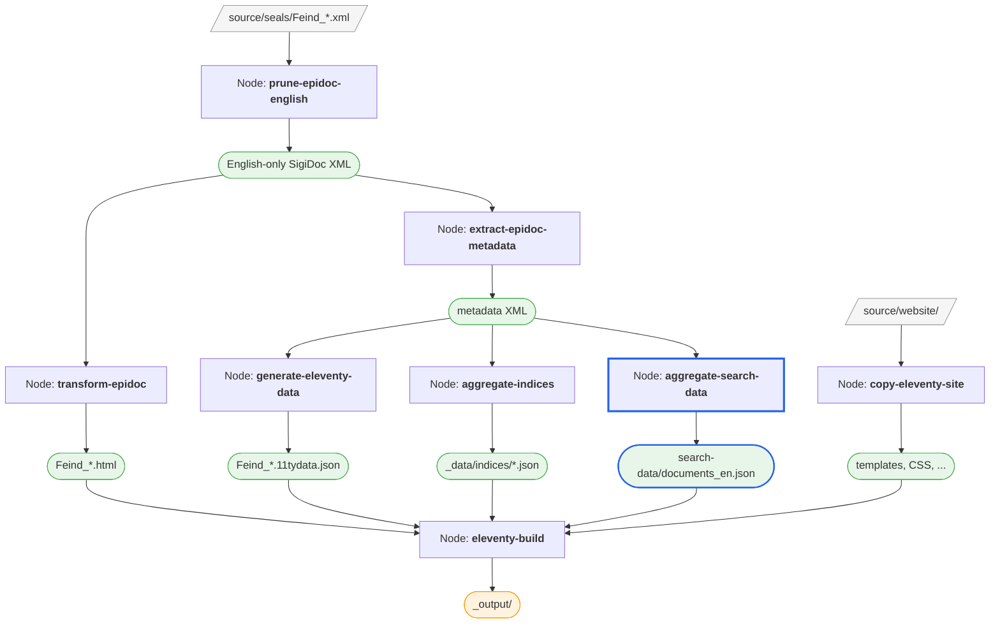

# Search

The indices let readers browse entities by category, but what if they want to find a specific seal by keyword? Let's add full-text search.

## How Search Works

The search follows the same extract-then-aggregate pattern as indices:

1. The `extract-epidoc-metadata` node already extracts search fields — they go into the `<search>` section of the metadata XML
2. A new `aggregate-search-data` pipeline node combines all search data into a `documents_en.json` file
3. The search page uses a client-side search component that loads the language-specific file and builds a full-text index in the browser

No server needed — the search runs entirely in the reader's browser.

The scaffold already provides a working `extract-search` template in `indices-config.xsl` with default fields (`title`, `material`, `fullText`), so the search data is already being extracted. We just need to enable the aggregation node and update the search page.

## Adding the Aggregation Node

> [!info] We're working with: Pipeline Configuration (pipeline.xml)

Uncomment the `aggregate-search-data` node in `pipeline.xml`:

```xml
<xsltTransform name="aggregate-search-data">
    <stylesheet>
        <files>source/stylesheets/lib/aggregate-search-data.xsl</files>
    </stylesheet>
    <initialTemplate>aggregate</initialTemplate>
    <stylesheetParams>
        <param name="metadata-files">
            <from node="extract-epidoc-metadata" output="transformed"/>
        </param>
        <param name="language">en</param>
    </stylesheetParams>
    <output to="_assembly/search-data" filename="documents_en.json"/>
</xsltTransform>
```

This works just like `aggregate-indices` — it uses `<initialTemplate>` to process all metadata files at once and produces a single output file.

> [!tip] Data flow
> The same pattern we've seen throughout the tutorial:
>
> 1. The `extract-search` template in `indices-config.xsl` outputs `<title>`, `<material>`, `<fullText>` etc. for each document
> 2. These end up in the `<search>` section of each metadata XML file (inspect them via `extract-epidoc-metadata`'s folder icon):
>    ```xml
>    <search xml:lang="en">
>        <title>Seal of Manouel Mandromenos ...</title>
>        <material>Lead</material>
>        <fullText>Κύριε βοήθει τῷ σῷ δούλῳ Μανουὴλ ...</fullText>
>    </search>
>    ```
> 3. `aggregate-search-data` reads all metadata files and combines the `<search>` sections into a `documents_en.json` array
> 4. The search page loads `documents_en.json` in the browser and builds a search index from it

## Updating the Search Page

> [!info] We're switching to: Website Templates (source/website/)

The scaffold already includes a search page at `source/website/en/search/index.njk` with the search component set up. Open it and update the `result-url` on `<efes-results>` to point to your seal pages:

```html
<efes-search data-url="/search-data/documents_{{ page.lang }}.json" text-fields="fullText,title" match-mode="prefix">
    <efes-search-input placeholder="Search..."></efes-search-input>
    <efes-results result-url="/en/seals/{documentId}/">
        <template>
            <a>
                <div class="efes-result-title">
                    <span class="doc-id" data-field="documentId"></span>
                    <span data-field="title"></span>
                </div>
            </a>
        </template>
    </efes-results>
</efes-search>
```

The `{documentId}` placeholder is replaced with each result's `documentId` field to create the link to the seal page for each result.

Three attributes on `<efes-search>` configure the component:
- **`data-url`** — where to load the search data from (the `documents_en.json` our pipeline produces). The `page.lang` variable in the URL ensures the correct language file is loaded when multi-language support is added
- **`text-fields`** — which fields to index for full-text search (comma-separated). Here, searching matches against `fullText` (the edition text) and `title`
- **`match-mode`** — how search terms are matched: `exact` (whole words only), `prefix` (matches from the start of a word, e.g., "bar" finds "Bardas"), or `substring` (matches anywhere, e.g., "tospa" finds "protospatharios").

> [!IMPORTANT] Note: Substring matching could get slow and memory-hungry for larger corpora.


::: details How does the search component work?
The `<efes-search>` component is a set of Web Components that run entirely in the browser:

1. On page load, it fetches the search data JSON
2. It builds a [FlexSearch](https://github.com/nextapps-de/flexsearch) full-text index from the fields specified in `text-fields`
3. As the user types, it searches the index and filters results in real-time
4. No server is needed — everything runs client-side
:::

## See It Work

Rebuild and navigate to the Search page. Type a search term — results appear instantly, showing the title of matching seals with links to their pages.

## Customizing the Search

Now that search works, let's improve it: add the dating to the results display and a material filter facet.

### Adding More Info to Results

> [!info] We're switching to: XSLT Configuration (source/indices-config.xsl)

The search results currently show only the title. Let's add the dating so readers can see when a seal is from. Open `source/indices-config.xsl` and find the `extract-search` template. Uncomment the `origDate` line:

```xml
<origDate><xsl:value-of select="string-join(//tei:origDate, ', ')"/></origDate>
```

After rebuilding, inspect the search data (click the **folder icon** next to `aggregate-search-data`). Each document in `documents_en.json` now includes the dating:

```json
{
    "documentId": "Feind_Kr12",
    "title": "Seal of Manouel Mandromenos ...",
    "material": "Lead",
    "origDate": "11th c., second half",
    "fullText": "Κύριε βοήθει τῷ σῷ δούλῳ Μανουὴλ ..."
}
```

To display `origDate` in the search results, open `source/website/en/search/index.njk` and find the commented-out `<div class="efes-result-details">` block inside `<template>`. Uncomment it:

```html
<template>
    <a>
        <div class="efes-result-title">
            <span class="doc-id" data-field="documentId"></span>
            <span data-field="title"></span>
        </div>
        <div class="efes-result-details">
            <span data-field="origDate"></span>
            <span data-field="milieu"></span>
        </div>
    </a>
</template>
```

The entire result box is clickable. The `efes-result-title` row shows the document ID and title, and `efes-result-details` adds secondary information below in a smaller font. Each `<span data-field="...">` maps to a field in the search data JSON — the search component fills in the values automatically.

### Adding a Filter Facet

The scaffold includes a commented-out `material` facet, but since all our seals are lead, that's not very useful. Let's add a `milieu` facet instead — this shows the social context of each seal issuer (military, aristocracy, civil, etc.) and has a nice distribution of values.

First, add the `milieu` field to `extract-search` in `indices-config.xsl`:

```xml
<milieu>
    <xsl:for-each select="//tei:listPerson[@type='issuer']/tei:person/@role">
        <xsl:for-each select="tokenize(normalize-space(.), ' ')">
            <item><xsl:value-of select="translate(., '-', ' ')"/></item>
        </xsl:for-each>
    </xsl:for-each>
</milieu>
```

This is a multi-valued field — a seal can have multiple issuers with different roles, so each role becomes an `<item>`. The `@role` attribute can contain multiple space-separated values (e.g., `"monastic secular-church"`), so we `tokenize` by space first, then `translate` hyphens to spaces for cleaner display.

Then add the facet to the search page (`source/website/en/search/index.njk`):

```html
<efes-facet field="milieu" label="Milieu"></efes-facet>
```

The `field="milieu"` must match the element name in `extract-search`. The search component reads the values from `documents.json` and renders them as a clickable list with counts. Clicking one filters the results — for example, clicking "military" shows only seals issued by military officials.

<!-- TODO: Document the `expanded` attribute on efes-facet (facets are collapsed by default, add `expanded` to start open) — mention in reference docs or a "search component" concept page -->

::: details How do I add more facets?
To add a facet, you need two things: a field in `extract-search` (in `indices-config.xsl`) and an `<efes-facet>` element on the search page.

For single-valued fields, the extraction is straightforward:

```xml
<objectType><xsl:value-of select="normalize-space(//tei:objectType)"/></objectType>
```

For multi-valued fields (like our `milieu` example), use `<item>` children — the search component automatically treats these as multi-select facets.

The SigiDoc FEIND project includes facets for object type, language, personal names, place names, dignities, offices, and more — see its `indices-config.xsl` for reference.
:::

## What We've Built So Far



The `aggregate-search-data` node (highlighted in blue) completes the pipeline. All three consumers of the extracted metadata are now in place: sidecar data files, index aggregation, and search data.

This is the complete pipeline for a single-language edition. Next, we'll look at adding multi-language support — [Multi-Language Support →](./multi-language)

<!-- TODO: Continue tutorial with:
  - Multi-language support
-->
