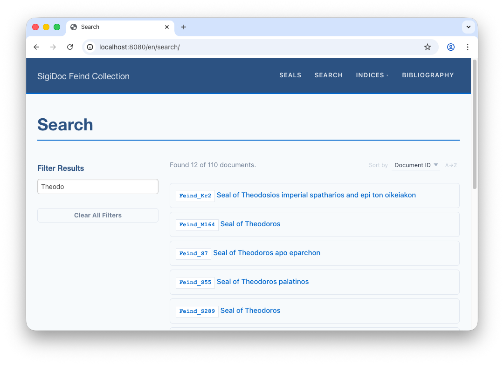
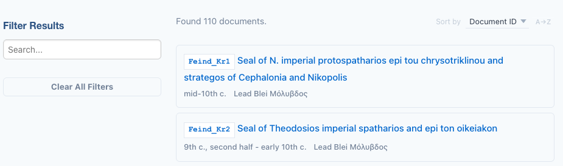
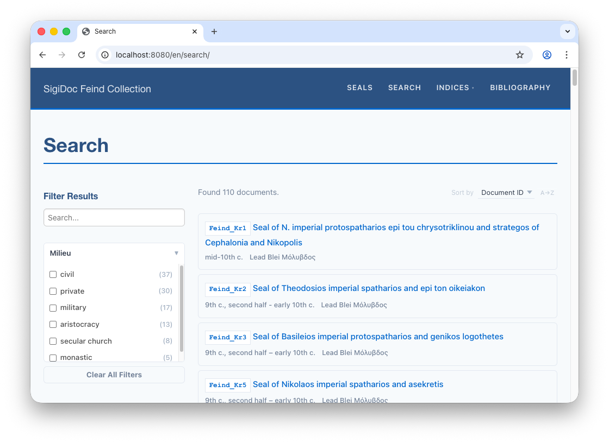
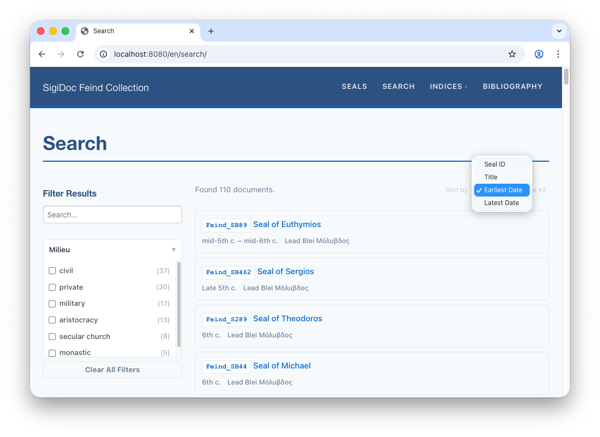
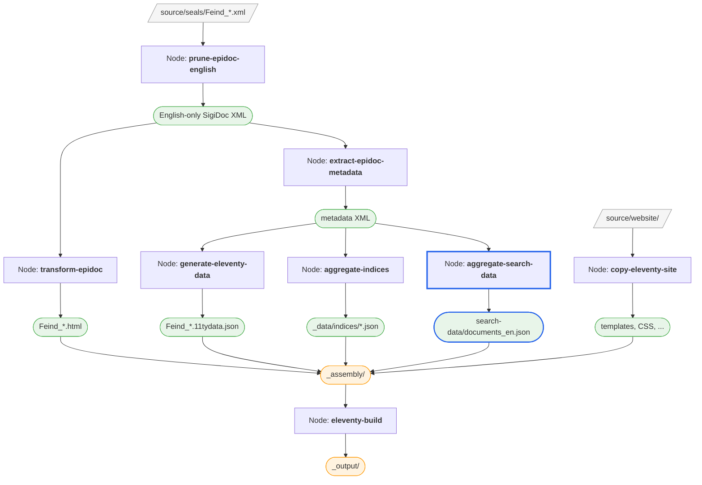

# Search

Currently, the *Search* page is still empty. Let's get it working.

## How Search Works

The search follows the same extract-then-aggregate pattern as indices:

1. The `extract-epidoc-metadata` node already extracts search fields, which go into the `<search>` section of the metadata XML
2. A new `aggregate-search-data` pipeline node combines all search data into a `documents_en.json` file
3. The search page uses a client-side search component that loads the language-specific file and builds a full-text index in the browser

The scaffold already provides a working `extract-search` template in `metadata-config.xsl` with default fields (`title`, `material`, `fullText`), so the search data is already being extracted. We just need to enable the aggregation node and update the search page.

## Step 1: Add the Aggregation Node

> [!info] We're working with: Pipeline Configuration (pipeline.xml)

Uncomment the `aggregate-search-data` node in `pipeline.xml`:

```xml
<xsltTransform name="aggregate-search-data">
    <stylesheet>
        <files>source/stylesheets/lib/aggregate-search-data.xsl</files>
    </stylesheet>
    <initialTemplate>aggregate</initialTemplate>
    <stylesheetParams>
        <param name="metadata-files">
            <from node="extract-epidoc-metadata" output="transformed"/>
        </param>
        <param name="language">en</param>
    </stylesheetParams>
    <output to="_assembly/search-data" filename="documents_en.json"/>
</xsltTransform>
```

This works just like `aggregate-indices`: it uses `<initialTemplate>` to process all metadata files at once and produces a single output file.

> [!tip] Data flow
> The same pattern we've seen throughout the tutorial:
>
> 1. The `extract-search` template in `metadata-config.xsl` outputs `<title>`, `<material>`, `<fullText>` etc. for each document
> 2. These end up in the `<search>` section of each metadata XML file (inspect them via `extract-epidoc-metadata`'s folder icon):
>    ```xml
>    <search>
>        <title xml:lang="en">Seal of Manouel Mandromenos ...</title>
>        <material xml:lang="en">Lead</material>
>        <fullText xml:lang="en">Κύριε βοήθει τῷ σῷ δούλῳ Μανουὴλ ...</fullText>
>    </search>
>    ```
> 3. `aggregate-search-data` reads all metadata files and selects the fields matching the requested language into a `documents_en.json` array
> 4. The search page loads `documents_en.json` in the browser and builds a search index from it

## Step 2: Update the Search Page

> [!info] We're switching to: Website Templates (source/website/)

The scaffold already includes a search page at `source/website/en/search/index.njk` with the `efes-search` component set up which provides the user interface for the search feature. Open it and update the `result-url` on `<efes-results>` to point to your `seals` pages instead of `inscriptions` (you'll find it around line 40):

```njk
<efes-search data-url="{{ searchDataUrl | url }}" text-fields="fullText,title" match-mode="prefix">
	<!-- ... -->
	
	<!-- The template below is displayed for each search result -->  
	<!-- [!code word:seals] -->
	 <!-- [!code highlight] --> 
	<efes-results result-url="{{ resultUrl | url }}">
	
	<!-- ... -->
```

The `{documentId}` placeholder is replaced with each result's `documentId` field to create the link to the seal page for each result.

The search page wires up a handful of Web Components to provide the user interface: the sidebar holds the search input and filter facets, the main area shows the active filters, a result count, a sort dropdown, and the results list. See the [Search](/guide/search) guide for the full page structure and how the components fit together, and the [efes-search reference](/reference/efes-search) for the complete component API.

### Search Configuration

Three attributes on `<efes-search>` configure the component:
- **`data-url`**: where to load the search data from (the `documents_en.json` our pipeline produces). The `page.lang` variable in the URL ensures the correct language file is loaded when multi-language support is added
- **`text-fields`**: which fields to index for full-text search (comma-separated). Here, searching matches against `fullText` (the edition text) and `title`
- **`match-mode`**: how search terms are matched: `exact` (whole words only), `prefix` (matches from the start of a word, e.g., "bar" finds "Bardas"), or `substring` (matches anywhere, e.g., "tospa" finds "protospatharios").

> [!IMPORTANT] Note: Substring matching could get slow and memory-hungry for larger corpora.


::: details How does the search component work?
The `<efes-search>` component is a set of Web Components that run entirely in the browser:

1. On page load, it fetches the search data JSON
2. It builds a [FlexSearch](https://github.com/nextapps-de/flexsearch) full-text index from the fields specified in `text-fields`
3. As the user types, it searches the index and filters results in real-time
4. No server is needed; everything runs client-side
:::

## See It Work

After rebuild, switch to the preview navigate to the Search page (`🌎 /en/search`). When you type a search term, results appear instantly, showing the title of matching seals with links to their pages.


## Step 3: Customise Result Display


> [!info] We're switching to: metadata extraction configuration (source/metadata-config.xsl)

The search results currently show only the title. Let's add the dating so readers can see when a seal is from. Open `source/metadata-config.xsl` and find the `extract-search` template. Uncomment the `origDate` line, and adapt it for SigiDoc encoding:

```xml
<xsl:template match="tei:TEI" mode="extract-search">
    <!-- ... -->
    
	<!-- [!code word:tei\:seg[@xml\:lang='en'\]] -->
	<origDate><xsl:value-of select="string-join(//tei:origDate/tei:seg[@xml:lang='en'], ', ')"/></origDate> <!-- [!code highlight] -->
	
	<!-- ... -->
</xsl:template>
```

After rebuilding, inspect the search data (click the **folder icon** next to `aggregate-search-data`). Each document in `documents_en.json` now includes the dating:

```json
{
    "documentId": "Feind_Kr12",
    "title": "Seal of Manouel Mandromenos ...",
    "material": "Lead Blei Μόλυβδος",
    "origDate": "11th c., second half",
    "fullText": "Κύριε βοήθει τῷ σῷ δούλῳ Μανουὴλ ..."
}
```

To display `origDate` in the search results, open `source/website/en/search/index.njk` and find the commented-out `<div class="efes-result-details">` block inside `<template>`. 

> [!info] We're switching to: Website Templates (source/website/)

Uncomment it:

```html{7-10}
<template>
    <a>
        <div class="efes-result-title">
            <span class="doc-id" data-field="documentId"></span>
            <span data-field="title"></span>
        </div>
        <div class="efes-result-details">
            <span data-field="origDate"></span>
            <span data-field="material"></span>
        </div>
    </a>
</template>
```

The entire result box is clickable. The `efes-result-title` row shows the document ID and title, and `efes-result-details` adds secondary information below in a smaller font. Each `<span data-field="...">` maps to a field in the extracted search metadata through the search data JSON, and the search component fills in the values automatically.

When you reload the search page, the details will now appear for each result:



> [!note]
> You'll notice the *material* field which is included in the scaffold as an example detail. Since it is not useful for a collection consisting only of lead seals, you can remove it or comment it out in `metadata-config.xsl` as well as in the result template in `source/website/en/search/index.njk`.


## Step 4: Add a Filter Facet

The scaffold includes a commented-out `material` facet, but since all the seals are lead, that's not very useful. Let's add a `milieu` facet instead, which shows the social context of each seal issuer (military, aristocracy, civil, etc.) and has a nice distribution of values.

First, add the `milieu` field to `extract-search` in `metadata-config.xsl`:

```xml
<xsl:template match="**tei:TEI**" mode="extract-search">
	<!-- ... -->
	
	<milieu>
	    <xsl:for-each select="//tei:listPerson[@type='issuer']/tei:person/@role">
	        <xsl:for-each select="tokenize(normalize-space(.), ' ')">
	            <item><xsl:value-of select="translate(., '-', ' ')"/></item>
	        </xsl:for-each>
	    </xsl:for-each>
	</milieu>
</xsl:template>
```

This is a multi-valued field: a seal can have multiple issuers with different roles, so each role becomes an `<item>`. The `@role` attribute can contain multiple space-separated values (e.g., `"monastic secular-church"`), so we `tokenize` by space first, then `translate` hyphens to spaces for cleaner display.

Then add the facet to the search page (`source/website/en/search/index.njk`):

```html
<efes-search data-url="{{ searchDataUrl | url }}" text-fields="fullText,title" match-mode="prefix">
    <aside class="efes-facet-sidebar">
        <h2>Filter Results</h2>
        <efes-search-input placeholder="Search..."></efes-search-input>
		<!-- ... -->
		
		<efes-facet field="milieu" label="Milieu" expanded></efes-facet> <!-- [!code highlight] -->
		
		<!-- ... -->
```

The `field="milieu"` must match the element name in `extract-search`. The search component reads the values from `documents.json` and renders them as a clickable list with counts. Clicking one filters the results. For example, clicking "military" shows only seals issued by military officials.

::: details How do I add more facets?
To add a facet, you need two things: a field in `extract-search` (in `metadata-config.xsl`) and an `<efes-facet>` element on the search page.

For single-valued fields, the extraction is straightforward:

```xml
<objectType><xsl:value-of select="normalize-space(//tei:objectType)"/></objectType>
```

For multi-valued fields (like our `milieu` example), use `<item>` children. The search component automatically treats these as multi-select facets.

The full [SigiDoc example project](../guide/example-projects.md) project includes facets for object type, language, personal names, place names, dignities, and offices. See its [`metadata-config.xsl`](https://github.com/olvidalo/efes-ng-sigidoc-feind/blob/main/source/metadata-config.xsl) for reference.
:::

Switch to the preview: After the search page reloads, the *Millieu* facet appears in the sidebar.


## Step 5: Add Sort Options

The scaffold provides two default sort fields (Document ID through the `sortKey` field and Title) defined in `source/website/en/search/index.njk`.

```xml
<efes-sort>  
	<field key="sortKey">ID</field>  
	<field key="title">Title</field>  
</efes-sort>
```

Let's add sorting by date. Add `dateNotBefore` and `dateNotAfter` to `extract-search` in `metadata-config.xsl`:

```xml
<xsl:template match="tei:TEI" mode="extract-search">
	<!-- ... -->

	<dateNotBefore><xsl:value-of select="//tei:origDate/@notBefore"/></dateNotBefore> <!-- [!code highlight] -->
	<dateNotAfter><xsl:value-of select="//tei:origDate/@notAfter"/></dateNotAfter> <!-- [!code highlight] -->

	<!-- ... -->
</xsl:template>
```

Then add the sort fields to `<efes-sort>` in the search page (`source/website/en/search/index.njk`):

```html
<efes-sort>
    <field key="sortKey">Seal ID</field>
    <field key="dateNotBefore" numeric>Earliest Date</field> <!-- [!code highlight] -->
    <field key="dateNotAfter" numeric>Latest Date</field> <!-- [!code highlight] -->
    <field key="title">Title</field>
</efes-sort>
```

The `numeric` attribute tells the sort component to compare values as numbers rather than alphabetically. Readers can toggle between ascending and descending order with the direction button next to the dropdown. Note that we also changed the label of the *ID* sort option to *Seal ID*.

When the search page reloads, the new search options can be used from the dropdown menu:



::: details Sorting Mixed Alphanumeric Identifiers

If your document IDs mix letters and numbers (like `Feind_Kr1`, `Feind_Kr2`, ... `Feind_Kr12`), alphabetical sorting will put `Feind_Kr10` before `Feind_Kr2`. The scaffold already handles this: at the top of `metadata-config.xsl`, a `$sortKey` variable zero-pads the trailing number:

```xml
<xsl:variable name="sortKey" select="
    replace($filename, '\d+$', '')
    || format-number(xs:integer(replace($filename, '^\D+', '')), '00000')
"/>
```

This turns `Feind_Kr12` into `Feind_Kr00012`, so alphabetical sort gives the expected order. Both `extract-metadata` and `extract-search` output it as `<sortKey>`:

```xml
<sortKey><xsl:value-of select="$sortKey"/></sortKey>
```

In the search page, the default sort already uses `sortKey`:

```html
<field key="sortKey">Seal ID</field>
```

The dropdown label says "Seal ID", but the sort uses the zero-padded value behind the scenes. The `documentId` displayed in each result is unaffected.
:::
## What We've Built So Far



The `aggregate-search-data` node (highlighted in blue) completes the pipeline. All three consumers of the extracted metadata are now in place: sidecar data files, index aggregation, and search data.

This is the complete pipeline for a single-language edition. Next, we'll look at adding multi-language support: [Multi-Language Support →](./multi-language)
